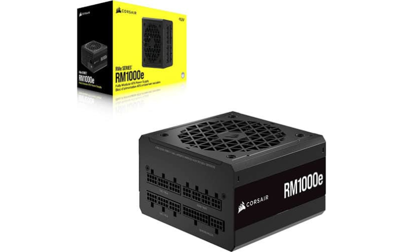
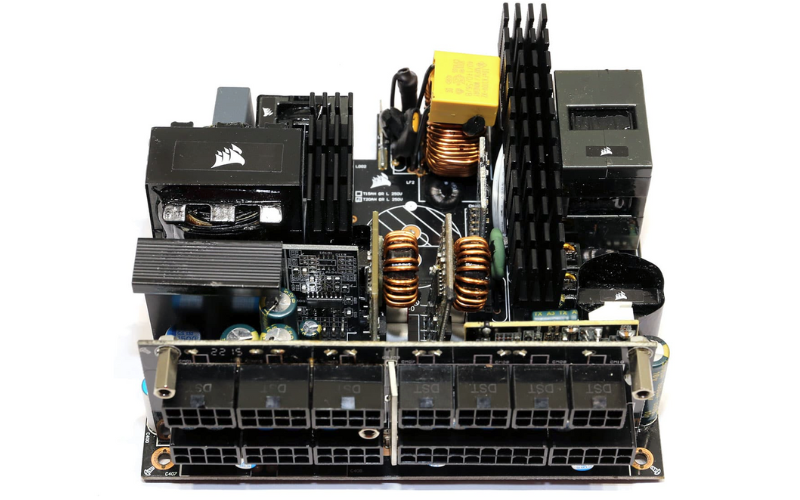
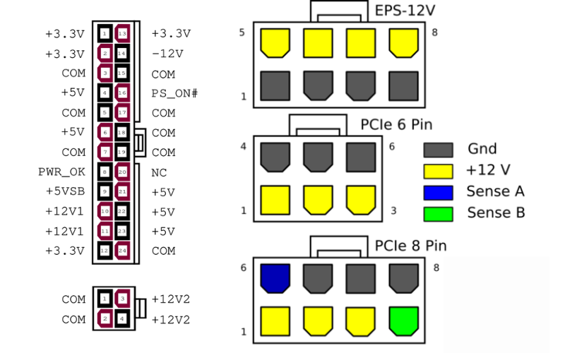
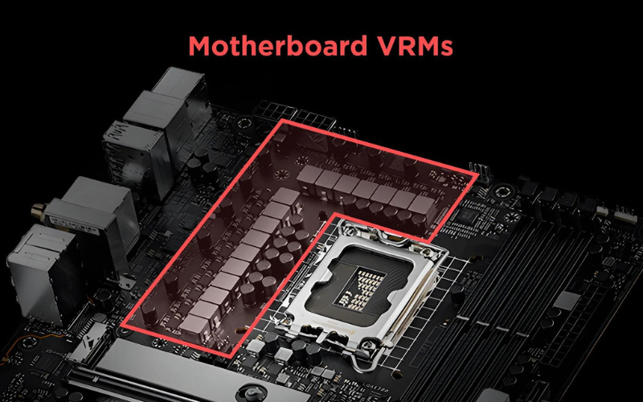
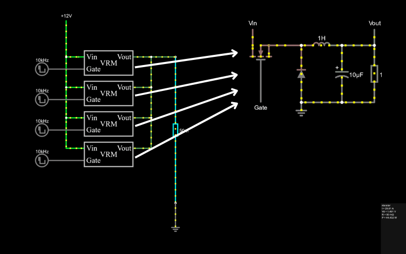

import ArticleHeader from "../../../components/header.astro";
import HardwareModule from "../../../components/module.astro";
import Step from "../../../components/step.astro";
import { Tabs, TabItem } from "@astrojs/starlight/components";
import { Card, CardGrid } from "@astrojs/starlight/components";

<ArticleHeader tomlPath="articles/Alimentations-et-vrm/alims.toml" />

  **Un PC rapide c'est bien, un PC bien alimenté c'est mieux**

Hey !

Aujourd'hui, gros pavé sur un élément essentiel d'un PC : Les alimentations. Où sont-elles ?
Comment marchent-elles ? À quel point faire attention ?

Aller, c'est parti !

:::danger[disclaimer]
Malgré le fait que nous parlons d'alimentation, il reste très fortement déconseillé de
bidouiller (démonter son alimentation...) sans comprendre.

Autrement, un risque de dégâts matériels (Courts-circuits...) voire blessures est encouru.
:::

## Pour commencer, à quoi ça sert une alimentation ?

Comme vous le savez (ou pas !), un PC ça fonctionne avec de l'électricité, et beaucoup. Mais
cette électricité, elle vient d'où ?

Au début, l'électricité, c'est EDF qui gère ça, et on ne va pas regarder cette partie-là.

Mais à un moment, elle arrive dans votre setup, sous la forme d'une prise murale,
d'une tension de 230VAC. C'est beaucoup beaucoup trop pour votre PC !

En effet, "dans" le mur, la tension oscille entre +325V et -325V. ($\sqrt{2} \times 230$)

À titre d'information, à ce ne serait-ce que 3V, votre processeur, RAM ou GPU est déjà
bon pour la poubelle depuis longtemps.

Nous avons besoin d'appareils qui convertissent la tension d'entrée en
version acceptable pour nos composants.

Et pour cela, nous avons ce que nous appelons : Alimentation. Généralement standard
ATX (ou SFX - SFX-L), ces dernières ont une mission cruciale :

Transformer le 230VAC entrant en une tension bien inférieure (entre 3.3 V et 12V).

Mais ? 3.3 V, c'est déjà trop ? Et oui, malgré son nom évident, elle n'est loin d'être
la seule à être en charge des alimentations dans le PC !

Une grosse partie est même faite à proximité immédiate des composants cruciaux,
pour une raison très simple : La chauffe.

En effet, un câble, ou n'importe quel élément conducteur, produit de la chaleur selon la formule :

$$P = R \times I^2$$

Ainsi, chaque ampère (I) de plus nous revient au carré en puissance dissipée par le fil,
ce qui peut rapidement devenir problématique.

À l'opposé, chaque volt de plus n'augmente en rien la dissipation des conducteurs.

C'est donc pour ça qu'un bloc d'alimentation, ça produit des tensions entre 3.3 V et 12V
(en produisant la majorité de la puissance sur le 12V).

\*Et cette tension de 12V tends de plus à plus à être insuffisante, les puissances en jeu
impliquent de trop forts courants.

Un bloc d'alimentation, c'est un circuit très spécialisé, en charge de produire de fortes
puissances (de 400W à plusieurs milliers de watts).

Leur fonctionnement est très complexe.

À titre d'information, une alimentation repose sur l'usage d'un transformateur abaisseur, ainsi
que sur divers composants, avant et après le transformateur, afin de réguler et sécuriser les sorties.

Voici une image d'une RM1000e démontée.

Ainsi, sur les câbles que vous branchez, la tension est de 12V à l'exception du câble ATX24
pins qui lui regroupe un mélange de tensions.

On peut donc rapidement deviner qu'il y a un élément entre cette alimentation et votre processeur.

## Et cet élément, ce sont les VRM !

Ce sont donc ça les blocs gris pas loin du processeur, généralement bien cachés derrière
des gros radiateurs.

Et ce sont eux qui ont pour missions de convertir le 12V en entrée en une tension acceptable
pour le processeur, aux alentours de 1.3V (Coucou Intel).

Leur fonctionnement est relativement complexe, cependant pour les plus intéressés voilà un
petit schéma simulé avec falstad. [Une simulation de ce circuit est disponible ici](https://www.falstad.com/circuit/circuitjs.html?ctz=CQAgjCAMB0l3BWKsAsCDMkAcBOSYB2AJi3wDYcQj0QkFJaBTAWjDAChoQA1AJQFlwIFFRA0A4gEMALoyEQiPAJYA7UQ0XcA9gFdpwqGJD8tAZwBmjaQFEANgFsAOqbDOiz9I4BOAESVaAE0Y7J1NID28AYUkAB0kAYyVpLS8Q53DTFG8ASRUAnXjk1IcIzLF3ZzBoBEd02HdTCtMg80kdW2l02rDYeFcuurhXMO7+kfT2FDAGLHRFIgQycEgiERQ4IT5BOcrqwfnnFraOqEG+51ZqyHRMLAIUAhwUZ5vhmCHTl2cCarAyRaIODACxW6CwCwmUxmczE6CWTxEYJEEC25V2NR6Kyoh0YrXa+gy73Opku9Bu2Huj2eKFeZwgGWGPwQfwBQKIZBQOCwYE8YUm0xAs0UU3hJGEKCwmwEaJce0xB2auOOBLOQwuVTJt0pCJp6DevXplW+v3+ZEBwI5XJ5kIFQuEOHhwNozyl2waGv22MVeJOhN6apJGuuWoeOtpmPwn0ZJtZFs53N5kHYAHcQDgcPNFstVlQs0nU+nFDcltMc8WoCm0xnhH9s2ta-mq8KHXX7UtG6W1i3OzX25WeyLW+WOytEXDWws+6m7ZPBRtZ427eXSAxh5W7YOV72K9OYZyllv9zu5wwj4eG+uNpuNmvpzfx1uF5eNFmt2Bq0neCfwNW3y6GKeDBOgByAIOwX4zlgkoEOOJCShoyzwLQyEAbAHAQXuEogDBSzPPBojTEhdBiNAYBTAgGb-OgCC4I8NDvOhgownC0HjixhiKIRGzERqBCQI8ZBzGQVK4GQ7ZoeBTGKAgYo4bQYoIVxDDESg0AEMCYK4KQSIUMg+DsF4yxQbmJbYJKHIge8YGptMxmzj2T4AOZGeZ6wudhkAiAB7BAA).

Le principe est de découper le 12V en entrée, pour en générer des pulses assez peu larges
(de l'ordre de 1/10 de la durée totale de découpe).

Ensuite, nous mettons derrière cela une série de composants passifs permettant de lisser
ces pics en une tension stable et propre.

Au vu des très fort besoin en courant de nos processeurs (253W sous 1.5 V, ça fait la bagatelle de 170A...),
nous sommes obligés de mettre en parallèle un bon nombre de ces circuits.

Et ces VRM, on en retrouve à toutes les sauces dans un PC !

Les plus connues sont celles du processeur et de la carte graphique, mais elles sont
aussi présentes pour :

La mémoire, sur la carte mère jusqu'à la DDR4, et intégrée en plus sur la barrette depuis
la DDR5 ! (pour réduire les pertes et affiner la régulation)
Pour les divers circuits : USB, Contrôleurs PCIe, Circuits Ethernet, et même dans vos SSD !

Il y en a aussi dans vos périphériques, bref, partout ou il est nécessaire de générer une
tension d'alimentation à partir d'une autre.

Cette omniprésence est due à leur rendement, bien meilleur que les autres solutions existantes.

Mais comment choisir ses VRM ? En effet, les carte mère proposent X phases (X circuits en parallèle,
je vous ai donc montré un schéma avec quatre phases), chacune disposant d'une capacité en courant.

Ainsi, une carte mère possédant 16 phases de 60A chacune sera en théorie capable de fournir
960W de puissance au processeur.

Attention donc au marketing, une carte mère avec 16 phases 60A et une avec 12 phases 80A seront
donc équivalentes au niveau VRM. Plus de phases ne veut pas dire meilleur.

Afin de garantir un rendement et une chauffe acceptable, il est conseillé de choisir cette puissance de
manière à être 4 à 5 fois supérieure à la puissance moyenne consommée.

Cela n'est généralement pas difficile, et il est alors préférable de choisir une carte mère mieux
équipée au niveau des USB et autres connectiques.

## Sécurités

Diverses sécurités sont présentes dans votre PC, pour protéger en priorité votre maison. On ne souhaite pas
un incendie à chaque erreur ! Les alimentations protègent aussi votre PC en cas de panne.

<Tabs>
    <TabItem label="OCP">

       Protège d'un courant trop élevé, indiquant donc un défaut matériel (1.1 x la puissance maximale par exemple).

       OCP = Over Current Protection

    </TabItem>
    <TabItem label="OVP">

        Protège d'une tension trop élevée en sortie.

        OVP = Over Voltage Protection

    </TabItem>
    <TabItem label="UVP">

        Protège d'une tension trop faible en sortie.

        UVP = Under Voltage Protection

    </TabItem>

    <TabItem label="SCP">

        Protège d'un court-circuit (10 x le courant maximal)

        SCP = Short Circuit Protection

    </TabItem>

    <TabItem label="SCP">

        Protège d'un court-circuit (10 x le courant maximal)

        SCP = Short Circuit Protection

    </TabItem>

</Tabs>

:::note
Petit rappel : Ces sécurités agissent contre un défaut du matériel, et éventuellement une erreur humaine.

Elles ne sont pas conçues, et ne fonctionnement pas si vous faites n'importe quoi avec votre PC.
:::

## Coil whine

Et dernier point : le Coil Whine ! Eh oui, cet affreux sifflement, qui fait mal aux oreilles,
et qui n'est pas pris en garantie bien souvent.

Il prend son origine des bobines (coil en anglais). Ces bobines sont soumises à des fréquences de
commutation élevées, de l'ordre de quelques dizaines de kHz.

Cependant, dans certains cas, la bobine présente un défaut matériel, et viendra alors
résonner (= vibrer), à une fréquence audible.

La puissance traversée par la bobine influe sur le volume sonore. C'est donc pour ça qu'une
carte graphique peut se mettre à émettre son grincement lorsque soumise à forte charge.

Il est nécéssaire de noter que le coil whine n'est en aucun cas dangereux ni pour la bobine,
ni pour les composants derrière. Il n'est que chiant.

Et malheureusement, contre le coil whine, il n'y a pas de solution magique. L'origine vient
directement du choix des composants par le fabricant, et est donc lié au prix et à la gamme du produit.

Un modèle haut de gamme sera moins sujet au coil whine, puisque le choix des composants a
été fait de manière plus rigoureuse, et intégère des bobines triées pour ne pas présenter
ce défaut, et / ou un composant à base de silicone / caoutchouc pour absorber ces vibrations.

ATTENTION : Les modèles entrées de gammes peuvent aussi y échapper, non pas par la qualité
des composants, mais par le faible stress qui leur est imposé.

## Conclusion

Et c'est la fin de cette rapide présentation des alimentations, le sujet est bien plus
complexe en réalité...

Tchuss !

Et pour ceux qui veulent lire plus :

- https://i.sstatic.net/Spsgx.png
- https://en.wikipedia.org/wiki/ATX#Power_supply
- https://www.cgdirector.com/motherboard-vrm-guide/
- https://hwbusters.com/psus/corsair-rm1000e-gen5-psu-review/3/
- https://www.hwcooling.net/en/in-depth-analysis-of-coil-whine-of-30-graphic-cards/
