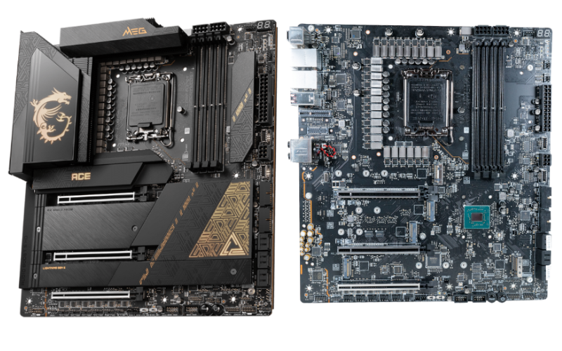
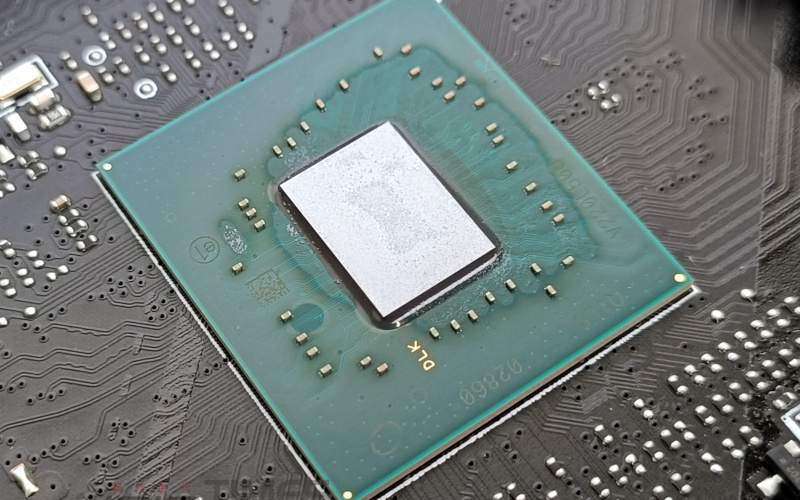
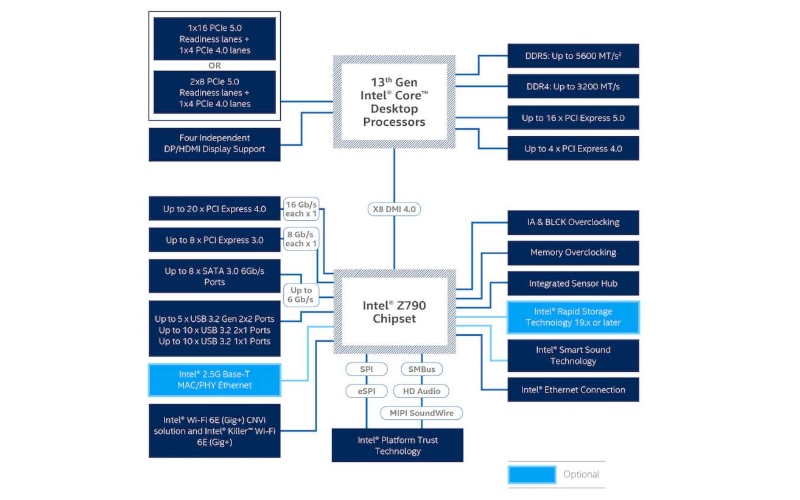
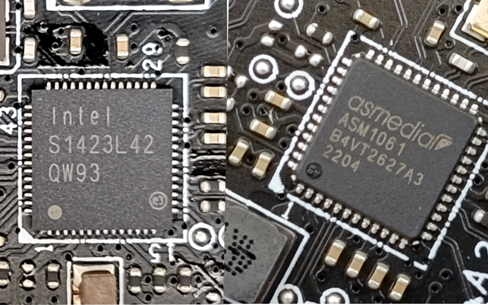
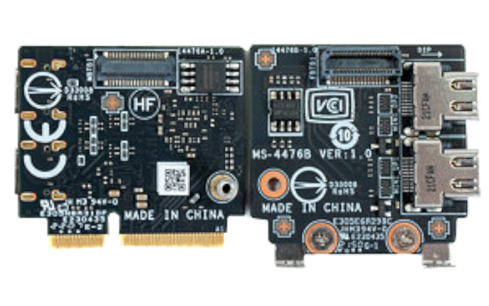
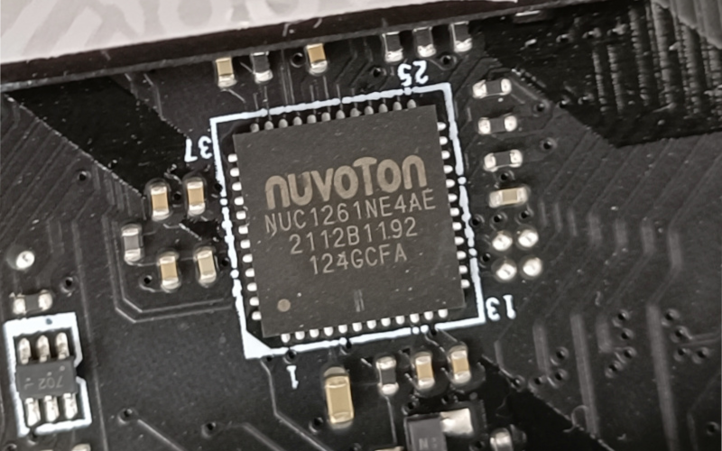
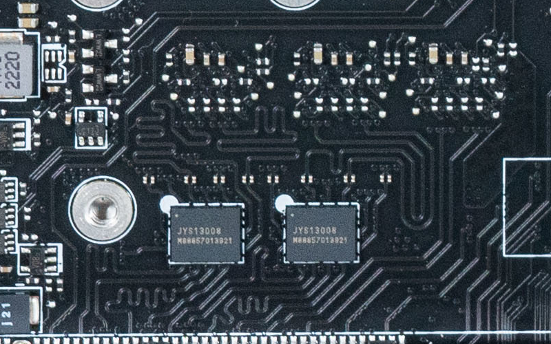

import ArticleHeader from "../../../components/header.astro";
import HardwareModule from "../../../components/module.astro";

import { Tabs, TabItem } from "@astrojs/starlight/components";
import { Card, CardGrid } from "@astrojs/starlight/components";

<ArticleHeader tomlPath="articles/Cartes-mères/motherboard.toml" />

  **Une carte mère est un composant méconnu mais essentiel sur un PC !
  Regardons-la de plus près !**

---

Hello !

Je lance une "série", dans laquelle nous allons découvrir un peu plus en détail le fonctionnement de certains composants ou technologiques couramment utilisées dans vos PC !
Pensez à me faire un retour sur le [discord](https://discord.gg/R9HNVnBs6s)

Le premier article traitera de vos cartes mères, souvent méconnues. Il y a un socket, un chipset, et puis quelques connecteurs (USB, PCIe...).
Mais comment tout ça fonctionne ?

Afin de conserver une logique dans cette visite, nous allons commencer par les éléments les plus connus, ceux que vous utilisez, puis, peu à peu, creuser vers ceux qui vous sont totalement inconnus.

Tout au long de cet article, la carte mère qui servira de base est la MSI Z790 ACE. Cette dernière, un modèle haut de gamme, et donc plus intéressante au niveau de la conception.
Cependant, elle reste suffisamment accessible pour conserver des technologies nettement plus répandues dans les modèles milieu et entrée de gamme

Allez, c'est parti, on visite !

## Radiateurs

Pour commencer, et si on enlevait tous les caches et radiateurs ?

Eh oui, c'est la même ! Ça change une fois toute l'esthétique retirée !
On peut donc commencer à la regarder en détails. Vous pouvez retrouver sur la source la photo non comprimée, et donc profiter de tous les petits détails.
J'ai pu compter au moins 63 circuits intégrés, chacun ayant un rôle précis dans l'ensemble qu'est une carte mère. Nous allons en regarder quelques-uns de plus près !

## Elements

<HardwareModule idNum="01" nom="Socket" tag="Interface Principale" bus="LGA 1700 / AM5">
   
    En premier, le socket. C'est là où l'on pose sur le processeur, sur les fameux pins à ne pas tordre.

    

    Voilà pour le fun un petit schématique de ses branchements. En noir : La masse électrique. En rouge et en orange (bas) : Les alimentations.
    Donc avec ses deux fonctions, une bonne partie des pins sont occupés ! Eh oui, il en faut pour assumer les 300W de certains modèles !
    Ensuite, nous retrouvons d'autres fonctions : En Bleu foncé, en violet, c'est le PCIe. En orange (droite) et en rose, le DMI (nous y reviendront plus tard).
    Et en haut, la gestion de la RAM. On comprend donc l'orientation du processeur sur la carte mère, et le positionnement des autres composants : PCIe, Alimentations...
    En bas, on peut encore retrouver les pistes liées à la gestion HDMI / DP... Mais, sur ce schéma : Aucune traces d'USB ou autres bus "lents".

    

    
<strong>Pour aller plus loin : Pins redondants</strong>

    Certains de ces pins, essentiellement les alimentation sont redondants. En casser un de ceux-là est donc totalement inofensif pour le processeur.
    Votre machine continuera à fonctionner de la même façon qu'avant !

</HardwareModule>

<HardwareModule idNum="02" nom="Chipset" tag="Chipset" bus="Z790">

    En effet, ces dernières sont toutes gérées par le chipset (ex Z790 ici), qui communique avec le bus DMI. Ce bus permet de sortir toutes les informations
    utiles du processeur, et destinées aux fonctions secondaires. Il se rapproche physiquement du PCIe. (Pour l'anecdote : sur les plateformes AM5, c'est du PCIe qui
    est utilisé entre le processeur et le chipset).

    Le chipset est donc de l'autre côté de ce bus, et c'est lui qui gère toutes les interfaces rapides du PC (PCIe supplémentaires, Ethernet...).

    

    Une petite photo de ce composant particulièrement important, étant donné de son rôle d'interface processeur et le reste des périphériques.

    

    Effectivement, comme le montre le petit schéma Intel : le chipset est connecté entre le processeur, et un grand nombre d'interfaces :
    Ethernet, Wifi, Audio, SATA, USB, ainsi que les horloges de la carte mère.

    Aller, on creuse encore plus !

</HardwareModule>

<HardwareModule idNum="03" nom="PCIe" tag="Bus rapides" bus="PCIe">

    Commençons par tous les périphériques connectés en PCIe, et il y en a un bon petit nombre.

    

    On peut commencer par trouver un contrôleur SATA (à droite), caché dans le coin inférieur droit de la carte mère. Il génère deux ports SATA à
    partir d'une ligne PCIe 1.0x1. Du côté de l'IO arrière, on commence avec deux exemplaires, l'Intel S1423L42 (à gauche). Derrière ce doux nom se
    cache un contrôleur Ethernet 2.5 Gbps. Ils profitent d'une ligne PCIe 3.0x1 chacun. Très proche, on retrouve la carte Wifi, une Intel AX211,
    elle aussi alimentée en PCIe 3.0x1. Et maintenant, de l'USB un peu rapide avec le double port thunderbolt 4 : Lui, c'est carrément 4 lignes PCIe 4.0 qui
    lui sont dédiées pour encaisser les 2x 40 Gbps de chaque port.

    

    Petit détail technique sur le module ci-dessus, celui du thunderbolt 4 : On remarque deux entrées Mini-DP, utiles pour connecter des écrans en USB-C.

    Avec tout ça, votre I/O arrière, c'est beaucoup de PCIe sous différentes formes. Les autres connectiques sont dérivées de l'USB. Derrière chaque ports,
    qui sont tous reliés au chipset se cache un jeu de hubs et switchs. Mais attention, il n'y a pas que des ports USB branchés derrière ces composants :
    l'USB est aussi utilisé en interne, par exemple pour le chipset audio. Ce dernier, dans le coin inférieur gauche, est en charge de tout le son de la carte
    mère. Sur la Z790, ils sont deux : Une interface USB, qui gère les entrées audio et la sortie digitale, et un chipset audio pur, connecté à l'interface.
    Fabriqué par ESS, il gère les sorties audio (avec, sur le papier, une qualité bien meilleure...).

    Bon, c'est bien beau de communiquer, et vite, mais il faut aussi alimenter tout ce petit monde. En effet, tout ce jeu de composants consomme certes peu,
    mais mis bout à bout, on arrive à quelques dizaines de watts. Et c'est sans compter votre processeur, ou carte graphique qui tire un peu de la carte mère...

</HardwareModule>

<HardwareModule idNum="04" nom="Alimentations" tag="Alimentations" bus="">

    Pour cela, la Z790 dispose d'un étage d'alimentation très solide... Cette partie est appelée VRM (pour Voltage Regulator Module)

    

    Il s'agit de ces petits carrés gris clair, et leur petit composant à côté. Ce sont eux qui depuis le 12V de l'alimentation fabriquant le 1,2 V nécessaire
    pour le processeur. Leur fonctionnement pourrait faire un article dédié, mais pour expliquer très rapidement : On appelle ça une alimentation à découpage,
    on vient en effet découper le 12V pour en fabriquer 1,2 V. Pour cela, on charge un composant (ce fameux gris clair) jusqu'à 1,2 V, puis on le laisse se
    décharger dans le processeur. Si on le fait assez rapidement, on a une tension de 1,2 V stable.

    Le composant qui découpe le 12V est le petit carré noir à côté du carré gris clair. Il s'agit basiquement d'un "interrupteur" commandé.
    Mais, qui dit commande dit chef...

    Et c'est là qu'intervient un composant dont vous ignorez l'existence, puisqu'il est invisible : Le contrôleur de VRM. C'est lui qui envoie les commandes
    aux interrupteurs. Il est placé en haut à gauche. D'autres blocs de VRM sont aussi implémentés pour alimenter la RAM, ainsi que les alimentations auxiliaires du processeur.

    Mais, ces contrôleurs, il leur faut aussi un chef ? Eh oui, et c'est là que l'on rentre dans le monde inconnu. En effet, votre processeur cohabite avec
    un deuxième processeur sur la carte mère. Ce dernier, nommé microcontrôleur de carte mère, et d'une puissance de calcul à faire pâlir votre micro-ondes,
    est chargé de gérer la carte dans son entièreté.

</HardwareModule>

<HardwareModule idNum="05" nom="Contrôle" tag="MCU" bus="SPI">
    
    

    Et voilà ce fameux chef, c'est en réalité lui qui gère toutes les fonctions "automatiques" de votre carte mère. Il profite d'une communication directe
    avec le processeur, les VRM, et les contrôleurs ventilateurs et RGB / aRGB. C'est donc lui qui vous donne de faux espoirs quand votre pc s'allume,
    clignote de partout, mais n'affiche rien...

    Dans le cas de la Z790 ACE, il est secondé par un deuxième contrôleur du même type qui est dédié à la gestion des ventilateurs. Sur les cartes plus
    simples, il aurait rempli toutes les missions.

    Il est rare de croiser des interfaces avec lui, même si certaines cartes les proposent (Par exemple la B550 NZXT, qui propose un port UART0 :
    (Coucou TED) Ce port est inutilisable, mais utilisé pour déboguer la carte lors du développement électronique). Il peut communiquer avec d'autres composants
    via plusieurs bus tels que le SPI, I2C ou le PMBus... Ces bus, inconnus des grand public, sont pourtant très répandus :

    

    
<strong>Pour aller plus loin : Le bus de communication SPI</strong>

    Le SPI permet de communiquer avec le BIOS (une simple mémoire, exécutée par le contrôleur de carte mère puis le processeur). Flasher un BIOS revient à
    réécrire cette mémoire, ce qui explique l'impossibilité de revenir en arrière par exemple, ou les gros soucis si cette mémoire est corrompue.
    L'I2C permet la communication avec la majorité des capteurs de température, trackpads pour les pc portables et les câbles HDMI / DP. En effet, c'est
    ce bus qui permet à Windows de venir récupérer la résolution et la fréquence d'un écran nouvellement branché. (Désole, il ne le devine pas).
    Le PMBUs est lui dédié au VRM et circuits de puissance (VRM...)

    

</HardwareModule>

<HardwareModule idNum="06" nom="Communications" tag="IO" bus="">
    
    Et en parlant communications, on arrive sur la dernière famille de composants : Les ReTimers. Ces composants, actifs, mais n'ayant aucun rôle de conversion,
    sont pourtant très importants :

    

    <Tabs>
    <TabItem label="En clair">
        Pensez aux lignes rapides (PCIe) comme une route : Il faut du temps pour
        aller d'un bout à l'autre. Certains signaux faisant une distance un peu plus
        longue, ces composants sont placés pour compenser cet effet.
    </TabItem>
    <TabItem label="Sous le capot (détail technique)">
        Ils agissent en effet sur la synchronisation des signaux rapides : Ces
        derniers doivent arriver en même temps sur parfois plusieurs voies en
        parallèles (ex : PCIe x16). Ces puces permettent de rattraper un potentiel
        retard entre deux lignes. Ils sont placés en grands nombres sur toutes les
        interfaces rapides : PCIe, HDMI, DP... Pour l'anecdote, l'HDMI 2.1 à une
        fréquence de signal d'environ 2 GHz, le DP monte lui à 10 GHz, et le PCIe
        5.0 à 16 GHz (c'est très très très rapide ça)
    </TabItem>
    </Tabs>

</HardwareModule>

## Conclusion

Et voilà, c'est la fin de la visite de la carte mère. J'ai essayé de rester le plus clair possible, mais, traitant d'un sujet particulièrement complexe, et
dont c'est mon métier, c'est une mission difficile.

PS : Cette visite a été loin d'être exhaustive, il est en effet impossible de tout détailler dans un article raisonnable. Mais, pour la majorité des
composants restants, il s'agit essentiellement de mémoires, ou d'alimentations locales pour un composant en particulier.

N'hésitez pas à me faire des retours, ou envies pour les prochains composants.

Jeff
