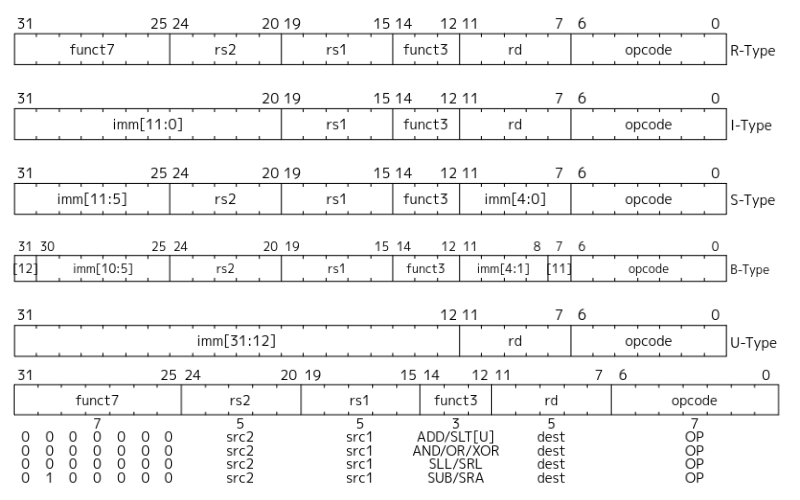
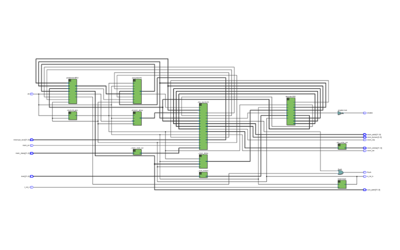
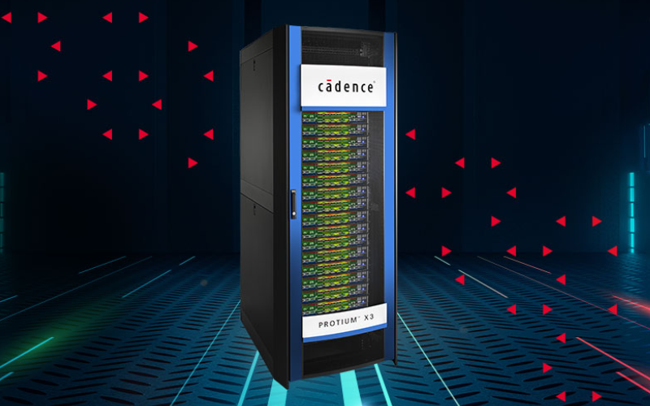
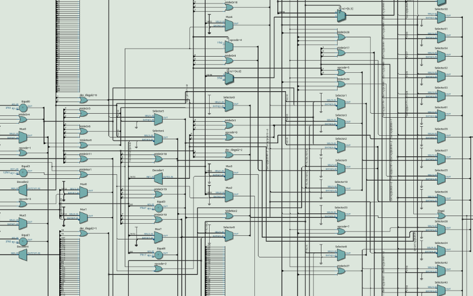
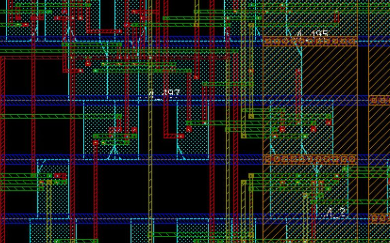

import ArticleHeader from "../../../components/header.astro";
import HardwareModule from "../../../components/module.astro";
import Step from "../../../components/step.astro";
import { Tabs, TabItem } from "@astrojs/starlight/components";
import { Card, CardGrid } from "@astrojs/starlight/components";

<ArticleHeader tomlPath="articles/De-texte-a-processeur/rtl.toml" />

**Dis moi, on conçois comment un processeur ?**

Hey !

Vous vous être probablement déjà demandé (ou pas), comment on conçois un processeur
(ou toute autre pièce majeure d’un PC) ?!?

C’est une démarche pas forcément évidente, et, dont il est difficile de trouver des infos !
Donc, on y va ! Et pour ça, quoi de mieux que de suivre un flow de conception réel ?

Déjà, tout commence par se fixer une carte de navigation. On ne va pas concevoir notre processeur
au hasard. Pour cela, on utilise une spécification, dénommée “ISA” (Instruction Set Architecture").
C’est un grand document qui dit comment on fait quoi en gros. Ces documents intègrent des années
d’expérience et de retours, afin de produire les caractéristiques idéales.

Prenons exemple sur les processeur “RiscV”, puisqu’ils sont suffisamment simples pour être évoqués ici,
et en plus, open source, donc, vous aussi pouvez accéder aux [documents](https://riscv.org/specifications/ratified/) ! .
Il faut noter que ces specs "ratifiées" sont figées, et ne changeront pas. C'est pour garantir que le
système reste fixe à un moment, et, que si changement il y a, il s'agira d'une version 2.

Sur cette page, nous avons donc les ratified specifications, et dedans, un immense PDF. Ce dernier va
définir comment est encodée chaque instruction, pourquoi, et comment l’exécuter !

Par exemple, sur cette première image, la façon de stocker différentes données.

Et, ce que l’on peut dire, c’est que ça pique les yeux ! On pourrait croire qu’ils ont découpés les
différents champs de donnée de manière aléatoire, mais, une fois la conception entamée, cette organisation
va se retrouver idéale !

Donc, nous savons comment lire une instruction en entrée, et quoi en faire. Passons à la suite !

Ensuite, quels outils utiliser ? Un processeur moderne, c’est plusieurs milliards de transistors, il semble
évident que nous n’allons pas les tracer à la main. Mais, comment alors ?

Pour cela, on utilise… du code ! Du code qui va exécuter du code, c’est assez rigolo. Sauf que ce code à une
particularité : C’est du code dit de “description matérielle”. Quand on essaye de le compiler, nous n’avons
pas un executable (.exe) comme habituellement, mais… un schéma électrique ! Et c’est justement là toute la
puissance.

Donc, pour cet article, nous utiliserons un de ces languages, le SystemVerilog, le plus moderne et adapté à
des projets de cette ampleur. La syntaxe / particularité ne sera pas mise en avant, étant bien trop complexe
(et demandant de solides bases d’électronique !). Mais, on peut toujours regarder ça de plus loin.

Donc, on y va. On commence à coder ! Pour les plus téméraires, je vous laisse le code source, sur [github](https://github.com/lheywang/RV32/tree/main).
Tout se trouve dans le dossier rtl/.

Une petite image de ce gros bloc de code, tel qu'un logiciel (Intel Quartus Prime) l'a lu, et compris. Ce que
l'on peut dire (au moins moi), c'est que ça a bien la tête d'un processeur ce schéma.

Comme souvent, sur ces projets là, on travaille avec des blocs. On en avait déjà parlé dans un article précédent,
nous avons donc plusieurs blocs : Fetch, Decode, Execute, Store. Naturellement, l’ensemble du processeur ne sera
pas conçu en un seul bloc, mais en plusieurs dizaines voire centaines de plus petits. Par exemple, sur l'image
précente, au milieu, la partie calculatoire (elle même composée de dizaines de blocs !). Et, autour, le bloc
decodeur (qui comprends les instructions !), des compteurs... Des blocs en général plus simples. Le gros de la
logique est au milieu.

Puis, toujours avec le même language, nous allons les brancher entre eux, etc etc, jusqu’à finir avec un système
complet. La particularité de ces languages est qu’ils permettent de rester à des niveau assez élevés (ex : Je peux
faire A + B, il comprend, pas besoin de faire le circuit logique associé !).

Pour chaque bloc, nous n’oublions pas de le tester : C’est bien beau d’écrire de la logique, mais, il faut être
sur qu’elle soit parfaite ! Donc, nous y ajoutons aussi un gros noyau de code pour tester le premier. Et, c’est
logique ! Sur du logiciel, vous poussez une mise à jour, et, le problème est réglé. Une fois votre processeur
fabriqué, il sera IMPOSSIBLE de le modifier ! Donc, il faut en être sur. Dans l’industrie de la conception,
environ la moitié des équipes sont dédiées aux tests. Pour cela, divers outils de simulation, etc.

Mais, rapidement, ces tests deviendront long. Très long. Pour donner un ordre d’idée, il n’est pas rare de trouver
des tests dont la durée de calcul se compte en jours, voire semaines. Donc, il nous faut un système plus gros,
plus rapide. Et là, quoi de mieux que… le monde réel ?

Nous retrouvons donc ici des armoires dédiées à ça, et dont le prix, privé dépasse les millions. Quelques clients
sont connus : Nvidia, ARM, Intel, AMD. Et, ces appareils vont utiliser des système pour physiquement cabler le
processeur à tester dans leur circuits, et tester. Ils sont capable de faire démarrer une machine sous Windows
en moins de 2h, ce qui représente une performance folle (sur un système qui… n’existe pas !). En voici une, c'est
beau hein ?!?

:::note
Ce type de machine est capable de faire démarrer Windows en... 20mn ! Considérant qu'il faudrait plusieurs jours
au meilleur PC que vous pourriez imaginer, ces chiffres sont exceptionnels.
:::

Et, maintenant que nous avons notre code tout mignon, qui marche bien, on en fait quoi ? C’est pas qu’une armoire
de 2m de haut m’embête, mais, je préfère mon pc portable, qui démarre en 10s moi… C’est donc là qu’on passe à
l’étape suivante : La synthèse.

Rappelez vous, nous n’avons pour le moment qu’un code. Et, nous voulons du silicium… Déjà, on passe tout ce code
dans des logiciels, qui vont le lire, le comprendre, et générer un grand nombre de portes logiques correspondantes.
Ces logiciels vont aussi optimiser grandement notre logique, ils ne vont pas juste traduire. Il n’est pas rare de
retrouver une logique différente au premier abord, mais strictement identique en fonctionnalité ! Par exemple, en
voilà une représentation :

C'est déjà moins propre que le joli schéma bloc d'avant non ? Et, je n'ai fait "que" zoomer !

Et ensuite, un autre logiciel va traduire ces portes en motifs physiques, gravés sur la puce. Et pour cela, il utilise
des “standard cells”, des blocs pré-définis, communs. Par exemple, une porte “AND”, une “OR”, ou alors un registre.
Et, il itère. Des milliards de fois.

Et, une fois fini, on fait une dernière simulation, qui va durer plusieurs jours, pour vérifier que tout fonctionne
correctement, et qu’il n’y a pas eu d’erreur de traduction au passage. Bien que rares, elles arrivent !

Et, maintenant, on tire la gâchette, on commande. C’est figé. Et, si jamais on venait à trouver une erreur (comme
c’est TOUJOURS le cas), on va soit modifier l’erreur pour une série suivante, soit… jamais. Et simplement propager
le changement en logiciel, pour ne pas utiliser la fonction. C’est d’ailleurs un aspect méconnu des compilateurs
récents, ils connaissent les failles, et les évites. [Petite histoire ici](https://en.wikipedia.org/wiki/Pentium_FDIV_bug)
sur un processeur plus tout jeune, mais dont la division était… fausse.

## Conclusion

Et voilà voilà ! Bon dimanche !

C’est la fin de cet article qui est resté “généraliste”, pour ne pas en perdre la moitié.

Tchuss !
