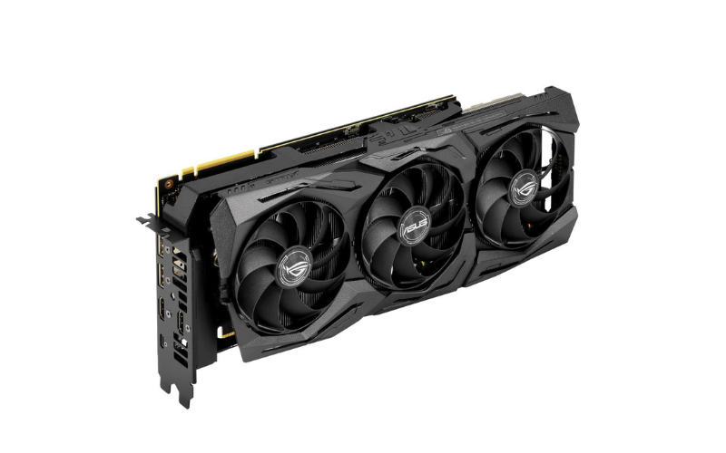
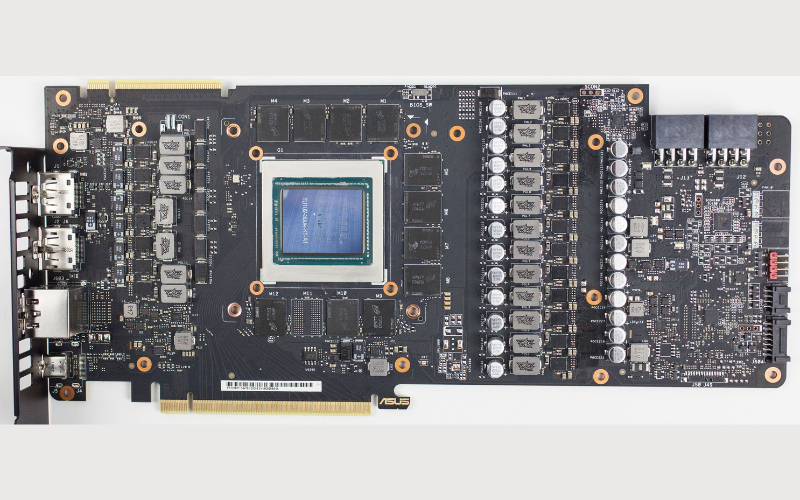
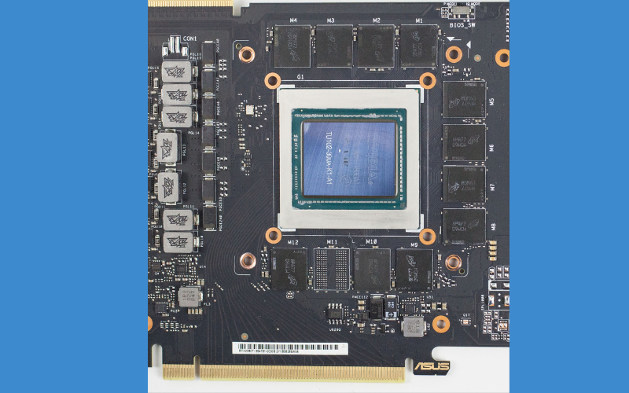

import ArticleHeader from "../../../components/header.astro";
import HardwareModule from "../../../components/module.astro";
import Step from "../../../components/step.astro";
import { Tabs, TabItem } from "@astrojs/starlight/components";
import { Card, CardGrid } from "@astrojs/starlight/components";

<ArticleHeader tomlPath="articles/Explorons-nos-gpu/gpu.toml" />

**Une carte graphique, c'est quoi ?**

Hello !

Aujourd'hui, article technique et attendu par certains ! Il fait un peu suite au premier
article de ma part, qui parlait de l'architecture d'une carte mère.

Et pour cause ! Aujourd'hui, on va regarder ce qu'il y a dans une carte graphique !

Pour cet article, je n'ai pas choisi le modèle le plus récent, en raison de leurs formes de
cartes novatrices. Je me suis arrêté à la RTX 2080 TI Strix de chez Asus.

Aller, c'est parti, creusons !

## Démontons

Et virons cet **affreux** ventirad (bruit de tournevis intensifié)

Et hop !

Mon âme d'électronicien se sent déjà bien mieux !

Aller, regardons de plus près cette carte.

On y distingue assez rapidement trois ou quatre zones, selon les personnes.

1. Les ports vidéos, ainsi qu'une petite circuiterie pour les manager, ainsi que les protéger. (en bleu)
2. Le GPU accompagné de ses fidèles VRAM (en vert)
3. es alimentations. De part et d'autres du GPU, nous en retrouvons la plus grosse partie à droite, et une petite partie
   sur la partie droite au bord (en rouge)

Et maintenant, regardons ces zones de plus près.

## Alimentations

Cette partie, très complexe, fera l'objet d'un article [dédié](/articles/alimentations-et-vrm/alims/). C'est ce que l'on
appelle des VRM, si ce terme vous rappelle les cartes mères, c'est normal ! VRM, ça n'est que
l'acronyme pour _Voltage Regulator Module_, ce sont eux qui fournissent le courant à la bonne tension
pour le GPU.

Nous en retrouvons un très grand nombre en parallèle, plus de 10 ! D'autres sont dédiés à la
mémoire RAM, et pour finir, certains sont cachés ! Ils se cachent sur la droite de la carte électronique,
près des ports pour ventilateurs et leds et fournissent non plus la tension de ~1V pour le GPU,
mais 5V par exemple. Ils fonctionnent cependant de la même façon !

## Vidéos

Cette partie est bien plus facile (ou pas), mais est heureusement gérée en très grande partie par le
GPU en lui-même. Très peu de composants y sont dédiés, et les rares n'ont souvent qu'une fonction de
nettoyage du signal, et / ou protection vis-à-vis de vous (eh oui !) qui branchez des câbles chargés,
à parfois à l'envers, forcez etc...

## Le GPU

Et maintenant, le plat de résistance, la pièce maitresse : Le GPU. Ici, tout se passe rapidement, et
très ! Les débits de données atteignent par endroit le Tbps ! Pour donner un ordre d'idée :

Un réseau Ethernet très rapide, soit 130 Mo/s (~1Gbps), et c'est déjà très bien.

Un port HDMI, c'est capable de produire ~18 Gbps. Ainsi, cette RTX 2080 Ti est capable d'exporter en
même temps ~60 Gbps de vidéo, soit 7.5 Go/s.

Mais ce n'est pas tout, il y a aussi une interface PCIe. Cette dernière, avec ses 16 lignes, est capable
de communiquer 128 Gbps, soit 16 Go/s

Et tout ça, c'est lent par rapport à la VRAM !

Cette RTX 2080 Ti, avec ses 11 Go de GDDR6, est capable d'échanger 5 000 Gbps de données, soit 616 Go/s.

### Mais à quoi sert la VRAM ?

La VRAM, de son nom Vidéo RAM, est le penchant de la RAM à votre CPU pour votre GPU, en étant optimisé pour.
Elle est dédiée au stockage des textures et autres informations utiles au rendu graphique. Attention, la
révision de la VRAM, souvent GDDRx ne sont pas corrélées à la DDRx, il n'y a AUCUNE compatibilité entre
l'une et l'autre. Vous pouvez simplement retenir, à titre anecdotique, que la GDDR6(x) est un dérivé de la
DDR4, là où la GDDR5 est un dérivé de la DDR3.

Aller, reprenons notre visite, et oh !

Les fils entre le PCIe et le GPU, ils ont tête bizarre non ? Effectivement, on pourrait presque croire à un
mauvais coup d'un enfant en maternelle, mais non ! Tout cela est PARFAITEMENT normal et maitrisé !

Mais pourquoi ?

Les signaux ici sont très très rapides (~4 GHz), et peuvent être perturbés par à peu près tout (y compris la
radio pour les plus vieux sniff), et il est nécessaire de s'assurer de leur bonne transmission. Pour cela,
nous faisons attention à leur tracé, leur longueur et leurs voisins. Bien évidemment, les raisons exactes
sont biiiieeeennn plus complexes, et ne seront pas détaillées ici.

Les signaux vers et depuis la VRAM respectent les mêmes règles, mais il est plus difficile de les observer,
en raison de leur longueur bien plus courte.

## Conclusion

Et voilà pour cet article, plus petit (en effet, une carte graphique à bien moins de fonctions qu'une carte
mère, qui elle propose plusieurs bus, plusieurs ports etc.).

En espérant que ça vous plaise toujours (et au passage, si un sujet vous intéresse, n'hésitez pas à le suggérer en MP).

Tchuss !
