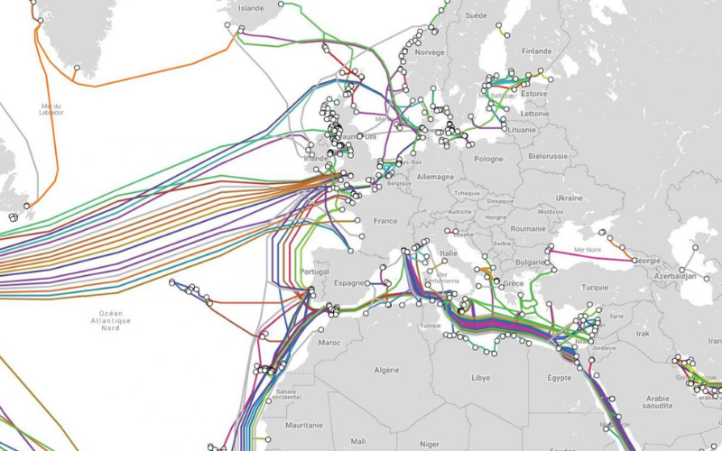
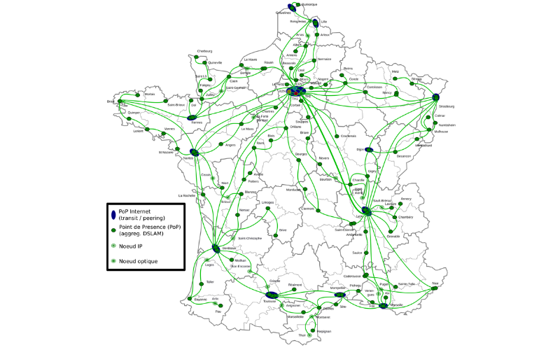
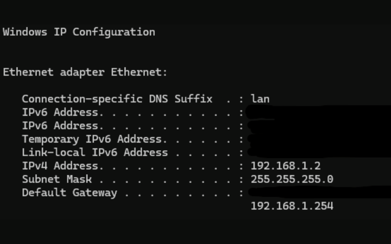

import ArticleHeader from "../../../components/header.astro";
import HardwareModule from "../../../components/module.astro";
import Step from "../../../components/step.astro";
import { Tabs, TabItem } from "@astrojs/starlight/components";
import { Card, CardGrid } from "@astrojs/starlight/components";

<ArticleHeader tomlPath="articles/Internet-et-ips/internet.toml" />

  **Comment on apporter cette page web sur votre PC ?**

Hello !

Aujourd'hui, on va parler Internet :

- Comment ça marche ?
- Qu'est-ce qu'une adresse IP ?
- Qu'est-ce qu'un serveur ?

Aller, zou, on commence !

## Comment Internet marche ?

Je ne vais pas détailler [l'histoire complète d'Internet, pour les plus intéressés voici la page
Wikipédia](https://fr.wikipedia.org/wiki/Internet).

Internet, par définition, ça implique une communication de données entre plusieurs ordinateurs,
séparés par parfois plusieurs kilomètres (voire milliers de kilomètres).

### Mais comment on communique ?

Pour cela, il faut un moyen efficace de transmettre une information sur de longues distances, et pour ça,
l'Homme n'a pas trouvé mieux qu'un câble. Nous avons donc plusieurs câbles qui font le tour de la planète
pour connecter continents à continents.

Pour donner une idée des débits possibles, le dernier câble posé (~2021) est capable de déplacer environs 300 Tb/s
de données. Cela correspond à approximativement 125 copies du dernier Call Of Duty Black Ops 6 par seconde !

Et, il ne faut pas oublier que plusieurs de ces câbles sont en parallèles depuis plusieurs années, le débit réel
est donc bien supérieur.

### Mais c'est bien, mais mon PC, ce n'est pas un continent ?

C'est maintenant que rentre un autre réseau, au niveau du pays. Une série de fibres optiques parcourt le pays de
long en larges pour arriver dans les grandes villes, puis ça part de ces grandes villes, puis chez nous !

### Et comment ont réparti à chaque nœud le trafic ?

Pour chaque grande étape, on est utile un jeu de switches (le même type d'appareils que l'on a dans sa box internet,
ou achetés à part, mais en BEAUCOUP plus rapide !). Ces appareils utilisent le système IP pour adresser les bonnes
informations à la bonne personne.

Ce système, je le détaillerai un peu plus bas.

### Et au final, l'information, comment passe-t-elle ?

Historiquement, ce sont des câbles en cuivres qui ont été utilisés. Cependant, ces câbles ne permettent pas un
débit très élevé. Dès 1990, la fibre optique s'est généralisée.

La liaison cuivre (ADSL / VDSL) existe encore. Elle est peu à peu mise hors service partout en France.

### Et dans la maison, ça communique comment ?

<Tabs>
    <TabItem label="Wi-Fi">

       Soumis à un équipement dédié : Une carte Wi-Fi, soit en extension sur la carte mère,
        soit directement intégré dessus. Il permet un accès sans fil à Internet, sous réserve d'être dans la portée.
        Le débit n'est pas forcément stable.

    </TabItem>
    <TabItem label="Ethernet">

        Toujours intégré à la carte mère, mais nécessite alors un accès câblé à la box (l'entrée d'internet dans la maison).
        C'est ce moyen qui permet le débit le plus grand et la meilleure stabilité.

    </TabItem>
    <TabItem label="CPL">

        Cette technique permet de faire passer un câble Ethernet via le réseau électrique de la maison.
        Cela résout donc le problème de l'accès câble à la box, mais cela arrive aussi avec une forte limitation
        de débit : Il n'est pas possible de réellement dépasser la centaine de Mb/s.

    </TabItem>

    <TabItem label="Fibre">

        Dans certains cas, il est possible de poser une fibre optique entre la box et les appareils, afin de
        par exemple profiter de débits très importants, ou sur des distances très longues.

    </TabItem>

</Tabs>

## Qu'est-ce qu'une adresse IP ?

Et maintenant, un sujet un poil plus complexe, que j'avais évoqué avant : l'adressage. Étant donné qu'il n'est pas possible
de tirer un câble de chaque ordinateur vers chaque ordinateur dans le monde, nous avons mis en place un système d'adresses :
Le protocole TCP/IP.

À l'origine, cette adresse, sous la forme AAA.BBB.CCC.DDD permet d'identifier chaque ordinateur dans le monde. Cependant,
cette limite a été depuis bien longtemps dépassée. Il a donc été mis en place des astuces pour réduire virtuellement ces adresses.

Ainsi, nous avons chacun une adresse locale (dans notre maison), et une adresse extérieure (notre box). Et ce système se
répète au niveau de l'opérateur...

Ainsi, mon adresse locale est :

Eh oui, je vous montre ça ! Et vous ne pouvez rien en faire, puisque vous ne savez pas où je suis ! Si vous tentez
de communiquer avec cette adresse, vous parlerez à un de vos équipements... Si vous vouliez m'attaquer, il faudrait
que vous connaissiez

Ainsi, lorsque je navigue sur Internet, mon pc effectue une requête à ma box (n'ayant trouvé la cible localement).
La box passe la requête de swiches en switches, éventuellement sous un océan et ainsi de suite jusqu'à la cible. Et
on fait pareil en sens inverse au retour.

Il n'est donc pas possible d'identifier de quel appareil provient la requête via le jeu IP.

## Mais c'est quoi une box ?

Comme détaillé, la box est l'appareil réseau qui fait l'interface entre votre réseau, et le réseau internet "mondial".
Cet equipement est fourni par votre fournisseur d'accès Internet, et il n'est que rarement possible de le remplacer
par un autre. Cet equipement embarque généralement un switch (pour les quelques ports ethernet au dos), ainsi qu'un
modem pour communiquer via fibre optique / ADSL.

Petite remarque : Cet exemple s'appuie sur le mécanisme IPv4, un plus récent IPv6 identifie lui directement chaque
ordinateur dans le monde directement ! Pour donner une idée, cette méthode d'adressage, plus complexe, permet
d'adresser chaque cellule de chaque humain sur terre, individuellement !

Remarque 2 : En pratique, il est tout de même possible d'identifier un appareil via la requête IP, puisque d'autres
informations sont transmises avec. Cela inclut l'adresse MAC (une adresse matérielle de la carte réseau, un pc peut
donc en avoir 2, voire plus !).

Les dernières informations (Gateway / Mask) concernent des parties de l'adresse plus avancées.

La première, c'est l'adresse de votre box, mais vue du côté réseau privé.

Vous effectuez une requête à votre box à cette adresse, qui prend ensuite on adresse publique !

Le masque, c'est un usage avancé du réseau IP qui permet d'isoler différents appareils pourtant électriquement
connectés entre eux. Cela permet donc un management plus poussé, que nous n'aborderons pas ici.

## Qu'est-ce qu'un serveur ?

Et maintenant, la dernière partie !
Un serveur, qu'est-ce ?

C'est un terme que l'on voit passer partout, étant donné que l'immense proportion de nos usages en font
usage (jeu en ligne, discord, cette page internet, Steam...).

Mais ça marche comment un serveur ?

Un serveur, ce n'est ni plus ni moins qu'un PC, en effet, il est parfaitement possible de transformer un pc
en serveur, et même d'en conserver la fonctionnalité de base (ex : hébergement d'une partie multijoueurs).

Ce qui différencie les serveurs mentionnés plus haut d'un serveur "domestique", c'est notamment le système
d'exploitation / la configuration matérielle. Un serveur pour un service est souvent une machine adaptée à
un usage spécifique (téléchargement, site web, gaming en ligne...), et dont le logiciel a, lui aussi, adapté.
Généralement, un serveur tourne sous un OS de type Linux, étant plus économe en ressources et plus adapté à
ce type de fonctions.

Par exemple, un serveur de téléchargement va exploiter des processeurs très rapides afin de pouvoir envoyer
de gros volumes de données. Un serveur de cloud gaming va ajouter plusieurs cartes graphiques pour ce type
d'usage.

L'ensemble des serveurs ont des interfaces réseaux très rapides (de l'ordre de 10 Gb/s à 100 Gb/s). C'est
ce qui leur permet de répondre rapidement au grand nombre de demandes.

En règle générale, un service important n'est pas basé sur un seul serveur, mais sur plusieurs dizaines,
réparties dans le monde, pour assurer une continuité de service.

Et c'est aussi grâce à ça qu'en changeant de serveur, on peut parfois profiter de meilleures performances,
ce serveur étant peut-être plus performant, ou moins occupé actuellement.

:::note
À titre d'exemple, je possède mon propre serveur pour un cloud personnel. La configuration est très modeste
(i7 6700, 16 GB, 12 TB) mais suffit amplement à mon usage. L'interface réseau est de 1 Gb/s, ce qui
est standard dans un pc actuel. Il tourne bien évidemment sous Linux, comme la majorité des [serveurs](/articles/les-os/os/)
:::

Grâce à un jeu de configuration réseau (dont je ne vais pas trop détailler ici, pour ma sécurité, mais aussi pour
la vôtre, ceci n'est pas un tuto ni une incitation à faire n'importe quoi), je bénéficie d'un accès à ce
cloud privé, partout dans le monde !

Et voilà, c'est tout pour aujourd'hui !

Tchuss !
