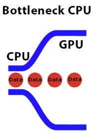
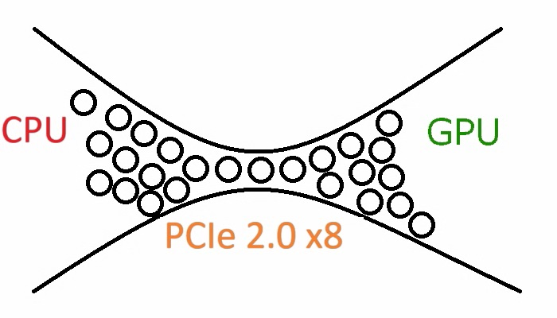
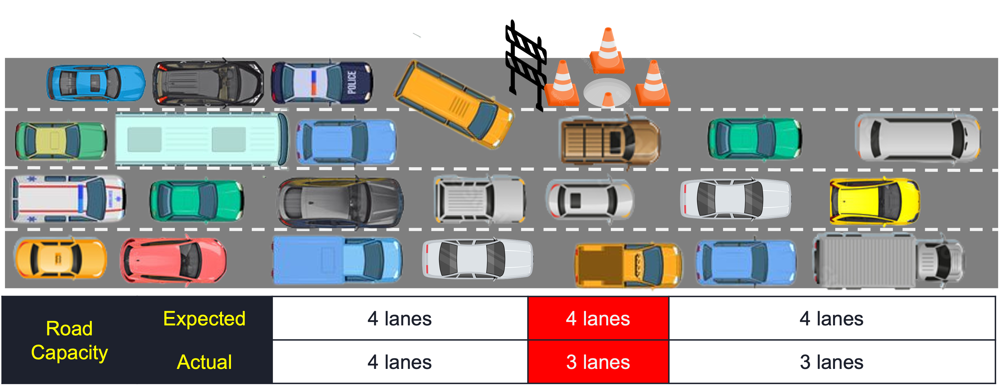

import ArticleHeader from "../../../components/header.astro";
import HardwareModule from "../../../components/module.astro";
import Step from "../../../components/step.astro";
import { Tabs, TabItem } from "@astrojs/starlight/components";
import { Card, CardGrid } from "@astrojs/starlight/components";

<ArticleHeader tomlPath="articles/Le-bottleneck/bottleneck.toml" />

  **On voit souvent le bottleneck comme un démon maléfique, mais qui-est-il ?**

Hello !

S'il y a bien un mot que l'on voit passer (trop) souvent, c'est celui du bottleneck. Mais de quoi s'agit-il réellement ?
Pour beaucoup, ce n'est qu'un CPU insuffisant par rapport au GPU. Cette définition est certes juste, mais terriblement incomplète.

Pour bien comprendre les tenants et aboutissants de ce phénomène, il faut avoir une idée du fonctionnement global d'un ordinateur.

Un PC, ce n'est rien de plus que plusieurs composants qui échangent de la donnée entre eux. Votre processeur envoie une requête
(et donc de la donnée) à votre SSD, qui lui renvoie, ici aussi, de la donnée. Ce fonctionnement est aussi valide avec votre carte
graphique, votre RAM... Mais aussi en dehors de votre PC, avec une clé USB, votre box internet, un serveur... Bref, il y en a partout
de ces transferts, qu'ils soient rapides, lents, long, courts... Ces transferts ont lieu sur différents supports, appelés Bus (PCIe, SATA, USB, Ethernet...)

Naturellement, chaque composant sera capable de fournir ou recevoir, traiter, un nombre de données finies par secondes (Généralement en Go/s).
De même pour les bus, qui sont capables de déplacer un nombre fini de données par seconde, là aussi en Go/s généralement.

La traduction du bottleneck en français, c'est goulot d'étranglement. On peut désigner trois situations distinctes :

## Le bottleneck par un composant :

Ici, c'est un composant qui n'est pas capable de fournir suffisamment de donnée pour exploiter correctement le composant associé. On peut
citer le classique exemple du CPU qui n'arrive pas à alimenter le GPU, mais cela peut être bien plus large. Cela peut aussi se produire
lorsque vous copier un fichier d'un disque SSD à un disque HDD : Quand votre disque HDD sera à fond, le disque SSD sera lui à faible utilisation.

Dans ce cas, une amélioration matérielle peut apporter une solution.

## Le bottleneck par un bus

Dans ce deuxième cas, le bottleneck n'est non pas causé par les composants, qui sont tous deux capables de fournir et/ou recevoir suffisamment
de donnée, mais pas le moyen de communication employé. Dans l'image ci-dessus, c'est le bus PCIe 2.0 x8, relativement vieux qui limite les
transferts, et donc les performances du système.

Cette situation existe aussi en dehors du PC, dont voici deux exemples : Un disque SSD NVMe branché en USB, vous aurez les performances de
l'USB et non de votre SSD au maximum. Autre exemple : Un téléchargement depuis un serveur, local ou distant. Vous serez certainement limité
par les capacités de votre box internet, vos installations réseau ou votre abonnement avant votre PC ou le serveur (sauf cas spécifiques).

Dans ce cas, la solution sera plus complexe à mettre en place, puisque qu'il faut dans un premier temps l'identifier. Pour reprendre
le cas du PCIe, dans un premier temps il va être nécessaire de regarder la configuration de la carte mère !

## Le bottleneck software

Ici, c'est un cas bien plus complexe à comprendre : Le problème ne vient ni des composants, ni du bus. Comme sur cet exemple, nous avons quatre
voies en entrée, en sortie et tout du long. Normalement, rien ne viendrait limiter les performances du transfert, hors des travaux viennent ici
perturber le transfert.

Cela s'applique parfaitement au monde du pc, ou les travaux seraient un logiciel, un moteur de rendu ou autre outil vieux, qui n'arrive pas à
traiter suffisamment de données, en dépit de la capacité de traitement.

Cela se traduit le plus souvent par un nombre de fps limité, tout en étant incapable de monter plus haut, même si la configuration le permet.

Par exemple, Elden Ring n'est pas nativement capable de produire plus de 60 images par secondes, Quelle que soit la config. Attention, cet
exemple est loin d'être isolé : Tous les moteurs ont une limite, plus ou moins haute. Ainsi, GTA V est incapable de tourner à plus de 188 fps.

## Conclusion

Ces trois cas sont bel et bien du bottleneck ! Bien évidemment, il est nécessaire de distinguer un bottleneck normal d'un anormal.
Certains peuvent être aisément supprimés, par l'amélioration d'un composant, la modification d'un paramètre pour autoriser de meilleurs transferts,
la mise à jour d'un logiciel...

Mais il faut garder en tête quelque chose : il y aura TOUJOURS du bottleneck. En effet, il est dans tous les cas possibles de trouver un composant
qui va limiter les performances du pc (eh oui, sinon vous auriez des fps infinis ...), dans un cas ou un autre. Et tant que cette limitation est
suffisamment légère pour ne pas déranger, à l'usage, inutile d'agir.

Et voilà pour le bottleneck,

Tchuss !
