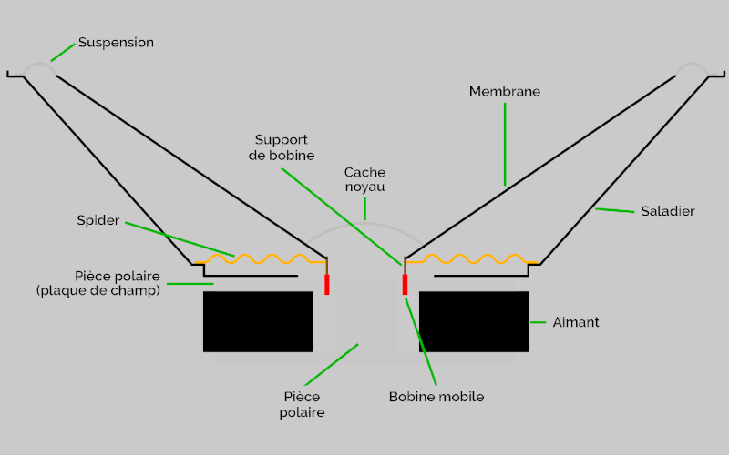
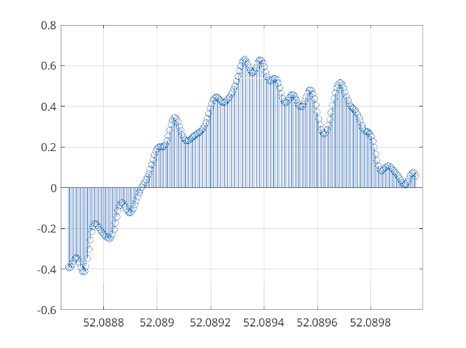
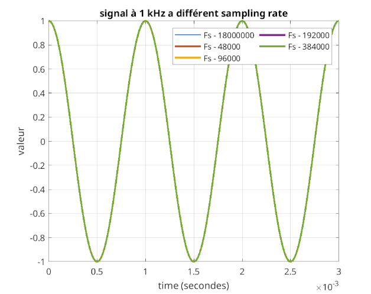
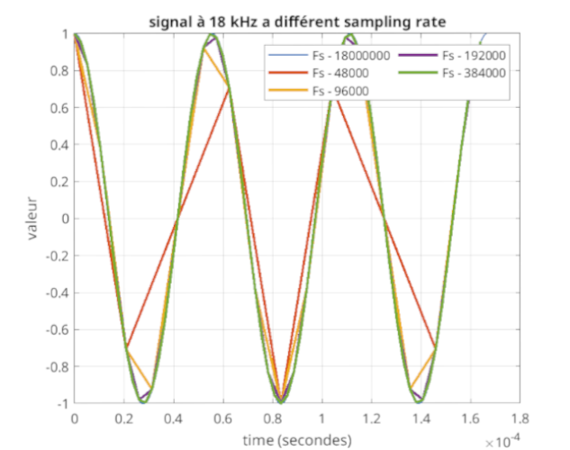
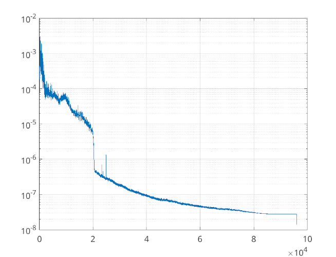
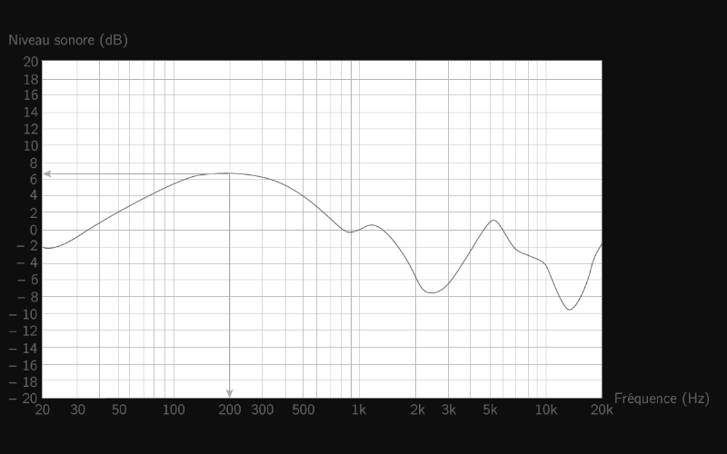

import ArticleHeader from "../../../components/header.astro";
import HardwareModule from "../../../components/module.astro";
import Step from "../../../components/step.astro";
import { Tabs, TabItem } from "@astrojs/starlight/components";
import { Card, CardGrid } from "@astrojs/starlight/components";

<ArticleHeader tomlPath="articles/Le-gros-son-de-nos-pc/audio.toml" />

  **Comment et pourquoi le son de pc est-il produit ? Avec quelle qualité ?**

Hello à tous !

Aujourd'hui, gros articles, assez complexe sur un sujet bien unique : L'audio. Et cette fois-ci, notre cher Deto à
participé à la rédaction de cet article, en vous compilant des recommandations en fin de page !

En effet, l'audio repose sur des principes bien différents !

Eh oui, l'audio, c'est de l'électronique analogique, à l'opposé de l'électronique numérique, majoritaire dans les
systèmes informatiques. En numérique, un son uniquement est basé sur des 0 et des 1, or, ce n'est pas ce que l'on
entend quand on lance du son, en effet, c'est moche. Très moche, puisque pas naturel ! (type buzzer ...)

Comme un ordinateur ne sait lire que ça, des 0 et des 1. On fait comment ?

C'est là qu'interviennent des process complexes de conversions, dont nous allons justement parler aujourd'hui !

Mais en premier, quelques petites infos "générales".

Aller, on y va (et promis, je vais essayer de pas vous tuer avec les maths)

## Le haut parleur

Un haut parleur, c'est une membrane mobile, contrôlée par un aimant. Et cet aimant, il est justement contrôlé par
un système électrique.

Et malheureusement pour nous, un aimant ça répond avec un courant, et non une simple tension. Pour déplacer un
haut parleur, il faut lui imposer un courant ! Et ça, ça va justement nous poser quelques problèmes plus tard...

(source = Audiophonics)

Et, tant qu'on y est : Un micro, c'est EXACTEMENT la même chose, dans l'autre sens. C'est une membrane qui entraîne
un aimant, et induit un courant électrique. C'est d'ailleurs pour ça qu'il est possible de capter du son avec un
haut parleur ! (mais l'inverse est complexe, en raison de la petite taille).

Bien évidemment, pour ces deux éléments il existe diverses variations, mais nous n'allons pas nous y attarder.

Il nous faut donc appliquer (ou lire) un courant pour que notre haut parleur nous délivre le son que l'on désire,
et ce avec des ordres de grandeurs importantes. Un haut parleur, ça demande de la puissance (qui varie d'un modèle
à un autre), il faut donc beaucoup de courant. A l'opposé, un microphone produit un courant très très faible, il
est donc nécessaire de ruser pour le rendre exploitable.

Ces éléments exposent des données, dont deux courantes et très importantes :

- l'impédance (en Ohm ($\Omega$))
- la sensibilité. (en dB)

Ce sont des nombres, dont les noms pourraient être barbares sont en réalité plus facile qu'on le pense (ouais non
en fait...).

Pour vulgariser, l'impédance peut être vue comme la résistance une résistance du système au signal, en sachant que
cette dernière varie selon la fréquence, elle n'est pas constante, même si les fabricant indiquent une valeur, et
non une fourchette. Par exemple, un haut parleur n'aura pas la même impédance à 1kHz ou a 10 kHz ! Et ça, c'est
une donnée très importante !

Pour la sensibilité, ça représente le "rendement" du montage, autrement dit : La puissance acoustique délivrée pour
une puissance donnée en entrée, plus cette valeur sera haute, moins la puissance nécessaire pour atteindre un niveau
sonore souhaité sera élevée.

Et pour finir, parlons de la puissance. C'est quoi ? La puissance, ça correspond au produit tension \* courant dans
le haut parleur. Rapidement, on arrive à s'en douter : Un haut parleur avec une forte impédance demandera plus de
tension pour fonctionner à puissance égale, et donc... un amplificateur de plus grande puissance ! Une forte sensibilité
permettrait de compenser en partie cette effet, mais ça ne reste pas magique.

C'est bien ici la source de soucis avec certains casques exposant une forte impédance (coucou les DT770/990 PRO, ou
certains modèles de Sennheiser), qui ne sont clairement pas gérables avec une simple carte mère. La puissance de
sortie de ces dernière étant trop limitée, le courant circulant dans le haut parleur est trop faible, et introduit
donc un très petit déplacement, synonyme d'un volume très faible. Dommage ! Vous avez un super casque, et... bah ça
marche pas.

## Conversions

Deuxième gros segment : On fait comment pour passer d'un format audio compatible PC (mp3, flac, wav...) aux signaux
voulus pour nos haut parleurs ? Et dans l'autre sens ?

Pour cela, on a besoin de puces spécifiques : Les DAC et ADC, pour Digital to Analog Converter, et vice-versa.

Ces puces, des chef d'œuvres d'ingénierie électroniques, assurent le gros du travail pour nous. Mais attention, on
ne peut pas faire n'importe quoi, sous peine de voir nos signaux audio fortement déformés.

De manière numérique, on stocke l'audio sous forme d'échantillons. Chaque échantillon correspond à la valeur du signal
d'entrée, en un instant défini.

Ici, l'audio est échantillonné à 192 kHz. Il y a donc 5.208 microsecondes entre chaque points. Cela explique la durée
faible de l'ensemble (environ une milliseconde !). Nous y retrouvons donc la forme de du signal audio.

Pour assurer que le fichier, une fois joué reproduise de manière fidèle l'entrée nous avons besoin de définir plusieurs
paramètres : Le format, et la vitesse.

Le premier, le format défini sous quelle forme est représentée la valeur. En général, c'est une valeur codée sur 16 bits,
donc entre -32768 et 32767, mais il existe aussi d'autres formats, tels que le 24 bits, généralement présent sur des
plateformes hautes résolutions.

Ce format influe sur le nombre de valeurs possibles, et donc sur la finesse d'enregistrement. Plus la valeur est grande,
plus il y aura d'intervalles, et donc plus ils seront petits. Cela permet de détecter des variations plus fines !

:::note
Au delà de 22 bits, cela devient inutile : Pour réduire suffisament le bruit induit par le circuit, vous devriez utiliser
de l'azote liquide !

Bref, les deux derniers bits d'un échantillon 24 bits sont bien présents dans le fichiers, mais que ce soit leur valeur
ou leur représentation physique à l'écoute tient plus des probabilités que de la physique.
:::

La seconde, la vitesse d'enregistrement, qui défini à quel intervalle temporel nous mesurons chaque valeur. En général,
cette varie se situe autour de 44.1 kHz ou 48 kHz, mais peut monter bien plus haut, toujours en multiples de 44,1khz et
48khz (88,2khz ou 96khz par exemple) ! Il est possible de trouver, sans grande difficulté des fichiers jusqu’à 192 kHz !

La sélection de cette fréquence cache des mathématiques très complexes, seulement effleurées ici.

L'une des principale se cache dans le repliement spectral, mais kesako ? C'est un effet physique complexe, mais fréquemment
rencontré, qui se traduit par l'apparition de signal fantôme dans votre enregistrement.

:::note
Un bon exemple serait élément tournant à haute vitesse, votre œil à un moment le voit s'arrêter (vous êtes à cette
fréquence de rupture), puis partir en arrière (vous êtes au dessus). C'est la visualisation d'un effet fantôme
(la roue en arrière) alors que cette dernière tourne bien dans son sens original !
:::

Cette fréquence de rupture est située à exactement la moitié de la fréquence d’échantillonnage (celle à laquelle on regarde
notre élement), soit 22.050 kHz pour un échantillonnage à 44.1 kHz, 48 kHz pour un échantillonnage à 96 kHz, etc...
Pour les plus téméraires, vous pouvez rechercher sur internet "Théorème de Shannon / Nyquist"

Pour revenir à l'audio, cela se traduirait par la présence d'une fréquence audio supérieure à 22.050 kHz (la moitié de 44.1 kHz,
fréquence d'échantillonnage standard). Bon, ouf, l'oreille ne peut pas entendre jusque là, donc on est à priori tranquille, et
il est relativement aisé, grâce à divers montages électroniques de s'en débarrasser. Mais donc pourquoi les audiophiles aiment
tant monter en échantillonnage, à 96 kHz voire plus ? A cause d'un effet secondaire, la distorsion harmonique.

Pour la comprendre, il faut regarder un peu comment nous convertissons de l'audio : Nous prenons une valeur à des instants donnés,
et... c'est tout. Entre deux échantillons, nous ne pouvons pas savoir ce qui se passe. Nous utilisons donc une interpolation,
c'est à dire que nous essayons de le "deviner". En général, il est considéré que la valeur n'a pas bougée. Dès lors, excepté au
moments ou nous connaissons la valeur, notre valeur sera fausse. Si nous mesurons suffisamment rapidement, il est possible d'en
déduire que cette valeur ne sera jamais trop éloignée, et suffisante pour coller à la réalité.

Bien que cette méthode soit particulièrement adaptée à des signaux "lents" (0-4 kHz), soit la voix humaine, pour les fréquences
plus hautes, cela devient critique : Le signal bouge alors trop vite, et le signal enregistre devient alors... totalement faux !
Et c'est justement ce taux d'erreur qui est mesuré par la distorsion harmonique !

Nous pouvons ici remarquer que quelques soit la fréquence d’échantillonnage choisie, le signal réel colle parfaitement à la
réalité. L'audio est donc fidèle. C'est pour cela que ces fréquences d’échantillonnages sont si utilisées : Elles suffisent pour
la majorité des usages.

Accélérons un peu notre signal :

Et la, patatra ! Seuls les échantillonages les plus rapides arrivent à reproduire le signal de manière fidèle. Les deux plus
lents (44.1 kHz et 48 kHz) essaient tant bien que mal, mais le résultat ne reproduit pas particulièrement l'entrée !

Si nous accélérions encore notre signal, nous verrons alors le fameux repliement spectral, expliqué plus haut.

Cette différence entre le signal d'entrée et le signal effectivement reproduits, on peut la mesurer ! Pour cela, on regarde la
valeur du THD, taux de distorsion harmonique (Cf : Séries de Fourrier). Pour cela, on compare les deux compositions fréquentielles
des signaux. Plus elles sont grandes, plus le THD devient grand !

Mais, dis donc, la distorsion, ça nous impacte en quoi ?

Pour cela, il faut regarder ce que l'on appelle le timbre : Ce qui nous permet d'identifier un élément sonore, un instrument en
particulier, une voix... Ces caractéristiques sont nombreuses, mais il y en a une qui nous intéresse fortement ici : Le spectre
(il est vraiment partout lui...)

En électronique, quand on parle de spectre on fait référence aux différentes fréquences au sein d'un signal (Cf : Transformation
de Fourrier). Et, si nous regardons une voix humaine, et bien, on y retrouve la fréquence principale (celle que l'on émet), mais
aussi des harmoniques (cette même fréquence, multipliée par un facteur entier : 2, 4, 6, 8 ...). Et c'est justement ces harmoniques
qui permettent à l'oreille de différencier une personne d'une autre, chacun ayant sa "signature", en effet, nous entendrons deux
personnes, chacune avec une voix différente. Ces harmoniques vont, en réalité sculpter le signal pour le déformer !

Et justement, la distorsion harmonique ayant une forte influence à "haute" fréquence, elle déforme ces harmoniques, et modifie
donc le timbre de la voix et des différent instruments. Et à ce petit jeu, l'oreille humaine est particulièrement efficace. Un
audiophile entraîné fera sans soucis la différence entre deux enregistrements, rien qu'avec cet élément !

A titre d'exemple, voici le spectre audio d'un enregistrement audio :

Ici, il s'agit d'un enregistrement standard. Nous y remarquons une plus grande proportions de basses et moyennes fréquences, là
ou les aiguës sont moins présent. Cela est fait exprès, l'oreille humaine étant plus sensible à ces derniers, ils sont moins
présents dans les enregistrements, afin de conserver une réponse finale standard.

Pour l'anecdote, c'est cet représentation de la donnée qui est utilisée par Shazam et autres outils pour reconnaitre une musique
d'une autre. Il agit donc vraiment comme une signature !

A la sortie d'un DAC, nous avons donc un signal analogique, c'est à dire qui varie en tension (ou en courant), et non un signal
digital. A l'opposé, quand vous parlez dans un micro par exemple, pour un ADC, le fonctionnement est inverse, mais les problèmes
restent les mêmes !

## Bruits et perturbations

Dès lors que nous sommes dans un domaine analogique, de nombreux problèmes nous sautent dessus, dont un majoritaire : le bruit.

Eh oui, c'est la dure réalité physique que nous arrivions à garder éloignée de nous jusqu'à présent, avec le monde numérique,
résistant à la majorité de ces phénomènes. Et malheureusement : Un signal numérique pollue fortement un signal analogique, il faut
donc y rester le plus éloigné possible !

Dès lors, une alimentation de mauvaise qualité induira un bruit dans notre signal audio. Le meilleur exemple ? Un petit "hummmmm",
de fond dès lors que vous écouter votre musique avec un système filaire et alimenté par un bloc mural de qualité douteuse. Faites
le tests un jour avec un pc portable : Dès qu'il est débranché, ce bruit disparaît.

Et c'est justement ce phénomène nous embête : Tout fait du bruit, et nous n'avons pas de solution miracle pour le supprimer. On
doit donc se contenter de l'atténuer au mieux.

Et ces méthodes, elles sont souvent complexes : isolations, conceptions très méticuleuses, sélection des composants. Bref, c'est
cher, très cher. Et si en plus, vous placez ces éléments dans un milieu défavorable (comme par exemple, sur votre carte mère),
vous partez avec un sérieux handicap !

C'est pour cette raison que l'audio d'une carte mère n'est pas réputée, vous avez une tonne de signaux numériques proche, et des
alimentations pas conçue pour de l'analogique ! De plus, comme expliqué, c'est quelque chose de complexe et coûteux à développer,
les fabricants n'ont pas envie d’alourdir la facture de façon significative pour quelque chose qui n'intéressera presque aucun
client. Et quand ils le font, cela tient plus du marketing que de la réalité !

Et le pire avec ces problèmes de bruits ? Si on amplifie le signal, on amplifie le bruit avec !

Le vrai problème se pose pour les micros, qui, comme dit dans le premier paragraphe ont un signal très petit (~ 0.1 mV), et donc...
ont besoin d'une très grande amplification (un facteur de 10 000 n'est pas forcément rare). Dès lors, le moindre bruit en entrée
sortira très grand, et dégradera fortement le son. Il est alors nécessaire d'utiliser du matériel particulièrement bien conçu si
on souhaite une expérience optimale !

Chaque composant de votre chaîne audio ne pourra que dégrader le signal. Un câble de mauvaise qualité ? hop, des perturbations qui
vont être captées. Une interface audio entrée de gamme ? Vous aurez un amplificateur mal conçu, qui apportera trop de bruit.

Et tout cela, c'est en supposant que votre système marche ! Si vous avez des composants exigeants (forte impédance et sensibilité
faible), il se pourrait que votre système ne marche juste... pas. Vous entendrez un vague son faible, qui distord énormément et n'a
rien d'agréable.

Si vous souhaitez maîtriser au mieux la chaîne analogique, sans monter un setup audio professionnel, tournez vous vers des systèmes
intégrés (qui incluent une sortie numérique, par exemple un micro USB, qui suffit très largement à avoir une qualité très élevée dans
le contexte d'une utilisation de gamer ou de streamer). Ces derniers maîtrisent au mieux les perturbations (en réduisant notamment
la longueur, et donc leur exposition !), et permettent dans la majorité des cas un rendu plus propre que ce que vous auriez pu
atteindre autrement. Il n'est donc pas nécessaire d'imiter les professionnels en achetant par exemple du matériel XLR. En effet, il
faut se demander pourquoi ils font ces choix, et si ces raisons s'appliquent aussi à vous.

Pour les casques, le problème est moins rare, puisqu'une sortie Jack présente un signal déjà suffisamment grand pour dominer la
majorité bruit.

Dans ce cas, on conseille plutôt d'éliminer le bruit généré par votre carte mère en remplaçant le DAC intégré par un dongle externe
ou un DAC/ampli, ce qui améliorera considérablement le son.

Ce matériel peut aller d'une dizaine d'euros à plusieurs milliers. Il est important de mettre le budget que vous souhaitez/pouvez,
le problème étant qu'en montant en prix, on trouvera toujours mieux, c'est sans fin. Il est donc important de choisir un budget en
premier lieu.

Quelques recommandations se trouvent en fin d'article !

## Réponse en fréquence

Pour finir, dernière notion : La réponse en fréquence.

Elle traduit la façon dont votre système audio répondra à une fréquence donnée, et ce, en incluant l'ensemble de vos composants, de
la source (DAC ou microphone) à la fin (vos oreilles ou la puce ADC). Cette réponse est tracée en fonction de la fréquence, et
expose donc une mesure de la puissance reçue / produite par le système audio.

Sur le plan théorique, une réponse parfaitement plate serait idéale : Vous entendriez alors exactement ce qui a été joué dans le
studio ou la salle d'enregistrement. Mais, c'est aussi une réponse ennuyeuse : L'audio sonne alors très plat, sans vie.

Dès lors, il est en général conseillé de "colorer" cette réponse : En mettant en avant certaines gammes de fréquence, vous pouvez
accentuer certains instruments, et rendre donc le son plus amusant.

Cette courbe est majoritairement influencée par votre casque, et votre equalizer, si vous en utilisez un.

Mais, attention ici : A trop mettre en avant certains éléments, vous allez en cacher d'autres. Et cela peut se révéler mauvais,
quelque soit l'usage !

En voici un exemple (pas bon du tout !)

(source = Kartable.fr)

Il est généralement admis que la courbe Harmann représente un "idéal", mais cela est fortement remis en question. Cette dernière
accentue les basses puis les voix humaines. Certains styles musicaux communs y sont donc favorisés, là ou d'autres subissent.

Cette réponse étant donc totalement subjective à vos sensibilités, et étant majoritairement influencée par le casque, il est conseillé
d'essayer ces derniers avant un achat. Seul cette étape permettra de vous projeter.

Il est a noter aussi qu'une catégorie de casque, les casques "gaming" sont particulièrement mauvais à ce jeu. En ayant une conception
douteuse, ils sont souvent incapable de respecter l'audio. Dès lors, dépassé leur usage cible, ils deviennent de mauvais casques.
Notre recommandation est donc donc choisir un casque adapté à l'ensemble de vos usages, pour ensuite le modifier, via le logiciel
pour peaufiner vos réglages.

## Recommandations

Et pour finir, comme promis : Une petite sélection de produits audios pour tout budgets !

<Tabs>
    <TabItem label="Casques">

        **Fermés** (apportent une isolation passive des bruits ambiants, au détriment de la précision absolue)
        - Audio Technica ATH-M40X (125€, plutôt neutre)
        - Meze 99 (entre 200 et 300€, neo ou classic, classic étant mieux) : beaucoup de basses et écoute funky
        - Sennheiser HD620S (295€, plutôt axé sur les mediums, avec des voix bien en avant et des basses dynamiques, impédance assez élevée)

        **Ouverts** (n'apportent aucune isolation passive, mais sont en général plus précis)
        - Sennheiser HD560S (équilibré, impédance un peu élevée)
        - Fiio FT3 350ohms (pas le 32ohms, 279€, très équilibré, confortable, aéré, beaucoup d'accessoires fournis)
        - Hifiman Edition XS (300€, Planar à plutôt faible sensi, modèle de neutralité et d'équilibre dans cette gamme de prix)
        - Meze 105 AER (400€, facile à driver, très dynamique, son vivant et entrainant)

    </TabItem>
    <TabItem label="DAC">

        **Dongles** (petits modules USB)
        - Apple Dongle (10€)
        - Fiio KA11 (35€)

        **DAC/Amp** (appareils de bureau, moins nomades)
        - Fiio K11 (120€ version delta sigma)
        - XDUOO MH-02 (pour ceux qui veulent du tubes, 150€)
        - SHANLING EH1 (plus sophistiqué, plus modulable, EQ avec des potentiomètres, mais une puissance pas colossale qui sera limite pour des planar à faible sensibilité)

    </TabItem>
    <TabItem label="Micros">

        - Bird UM1 (50€)
        - Rode NT USB mini (100€, bon compromis)
        - Elgato Wave 3 (150€, le meilleur de cette gamme de prix à mon sens)

    </TabItem>

</Tabs>

Aller, tchuss !
