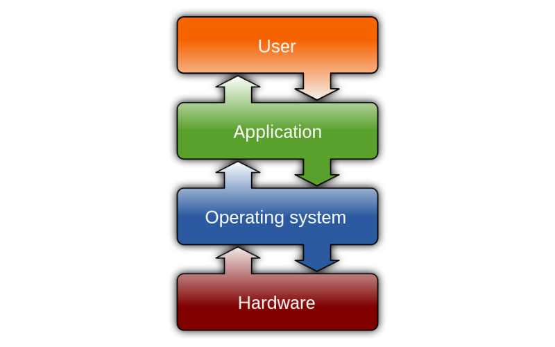
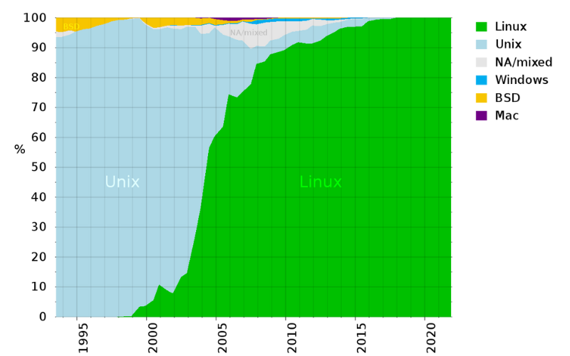
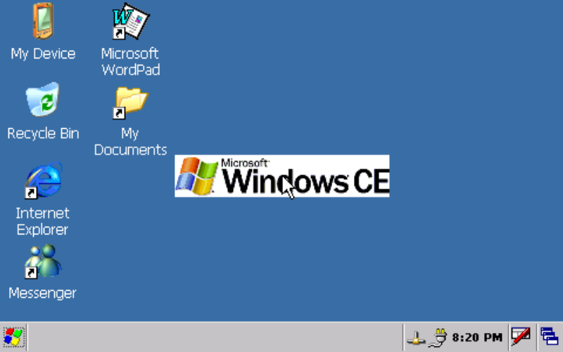

import ArticleHeader from "../../../components/header.astro";
import HardwareModule from "../../../components/module.astro";
import Step from "../../../components/step.astro";
import { Tabs, TabItem } from "@astrojs/starlight/components";
import { Card, CardGrid } from "@astrojs/starlight/components";

<ArticleHeader tomlPath="articles/Les-os/os.toml" />

  **Un OS, on en utilise tous plusieurs tout les jours, mais c'est quoi ?**

## OS :

C'est un petit terme que l'on croise régulièrement dans le monde informatique, mais on ne sait jamais de quoi
il s'agit... Explications !

Un OS, pour Operating System, ou en français, Système d'Exploitation, représente la couche logicielle la plus
proche du matériel. En effet, passé la carte Arduino, il devient compliqué et peu envisageable de manager l'entièreté
des fonctions soi-même, et nous déléguons donc ce travail à un logiciel pré-défini. Ce logiciel est d'autant plus
intéressant que la majorité du temps, lors du développement en low level, nous réinventons la roue : Gestion du timing,
des I/Os, etc. ça serait très cool d'avoir un outil qui le fait à notre place !

À l'origine, un OS c'est un logiciel qui vient manager donc le matériel pour le rendre plus simple à utiliser ! Mais
ça, c'était au début (ou sur les systèmes très légers...).

## Ça ressemble à quoi un OS ?

On peut donc résumer un OS selon la pile suivante : En bas, le matériel, qui est exploité par le système d'exploitation.
Ensuite, l'application, qui exploite le système d'exploitation. Et par-dessus, il y a l'utilisateur( vous), qui utilisez
des applications.

Cette pile présente plusieurs avantages : Avec une conception adaptée, et des drivers (Cf [drivers](/articles/pilotes-et-matériel/drivers/)),
vous pouvez faire varier le matériel sans vous soucier particulièrement du logiciel. L'inverse est aussi possible, en
faisant varier le logiciel sans toucher le matériel !

Ce sont ces avantages qui ont rendu l'utilisation d'un système d'exploitation de plus en plus commune depuis les
années 1960 !

## De quoi est fait un OS ?

Mais concrètement, ça se présente comment un OS ? Il ne s'agit ni plus ni moins que d'un logiciel. Seulement, ce logiciel
est accompagné d'un autre outil, nommé le bootloader, qui, appelé automatiquement par le bios au démarrage par votre
processeur, va venir charger ce logiciel. Et ce logiciel va ensuite vous donner la possibilité de lancer vos applications
préférées...

Mais un OS, c'est composé de quoi ? Eh bien de code, généralement en bas niveau (par exemple Assembleur ou C), qui regroupe
plusieurs fonctionnalités. La raison du développement des OS avec des langages de bas niveau sont principalement historiques :
Nous réutilisons du code fonctionnel déjà écrit.

Et s'il y a bien un bout de code que nous ne codons pas tous les jours, c'est le kernel. Mais qu'est-ce donc ? Le kernel est
l'outil qui se charge de la gestion matérielle la plus basse, en y incluant la gestion du système de fichier, mais nous y
trouverons aussi : Les drivers, les interruptions, etc.

Pour l'anecdote, pour la majorité d'entre vous sur Windows, vous utilisez le kernel Windows NT. Ce dernier est présent depuis
Windows XP (2001). Pour nos amis pingouins (référence à Linux, que nous aborderons plus bas), votre kernel évolue plus vite,
et est moins figé.

## Les nouveautés d'un OS !

Depuis longtemps maintenant, les OS ont développé des fonctionnalités plus avancées, par exemple :

<Tabs>
    <TabItem label="multitâches">

        À l'origine, un ordinateur ne pouvait exécuter qu'une seule tache en même temps, rendant donc l'utilisation
        peu pratique. Il fallait se synchroniser avec les collègues pour accéder à l'ordinateur. La gestion de plusieurs programmes
        en simultané à permis de réduire ces inconvénients (au prix de performances réduites, puisque partagées entre plusieurs process).

    </TabItem>
    <TabItem label="multiuser">

        Toujours à l'origine, il n'y avait qu'un utilisateur. Cela pouvait poser un problème pour séparer les droits
        et accès. La gestion de plusieurs utilisateurs, en incluant un administrateur, a permis de résoudre ces soucis, en permettant
        l'accès simultané à plusieurs personnes, avec des droits différents. (Attention, on ne parle pas d'accéder à plusieurs en même
        temps au pc, mais de laisser une session ouverte).

    </TabItem>
    <TabItem label="Protection de la mémoire">

        Ah, un sujet bien complexe ! La mémoire, c'est un immense tableau, avec des cases. Et on peut
        écrire dans ces cases, mais attention : Si elle est déjà occupée, on risque la corruption (et donc le crash / erreurs). Sur
        les premiers systèmes, nous définissions à la main les cases ou écrire, il fallait donc prendre en compte une compatibilité
        logicielle (Deux logiciels pouvaient ne pas pouvoir fonctionner ensemble ; les développeurs ayant assigné les mêmes cases
        mémoires). Mais cela a bien changé ! Pour ceux ayant déjà programmé un peu, vous êtes vous amusé à afficher l'emplacement
        d'une variable ? L'adresse est presque toujours différente, et le nombre est très grand, et sorti de "nulle part". C'est
        l'OS qui vous a attribué un espace mémoire, et vous vous contentez d'y écrire. Il attribue lui la mémoire, et fait donc
        disparaitre l'entièreté des erreurs de compatibilité logicielles d'autant. Tant que la mémoire est disponible en suffisamment
        grandes quantités, il fera ce qu'il peut pour vous trouver ce que vous demandez.

    </TabItem>

</Tabs>

## Et dans le monde réel ?

Mais c'est bien gentil de parler OS, mais ça se présente comment dans la vraie vie ?

Et bah, il y a plusieurs dizaines, voire centaines d'OS, réparti en plusieurs branches :

<Tabs>
    <TabItem label="MS-DOS / NT">

        Le noyau du grand classique, Windows, développé par Microsoft.

        Originellement MS-DOS jusqu'a l'arrivée en NT avec Windows XP. Garanti une compatibilité montante parfaite,
        au prix d'évolutions plus lentes et complexes (coucou explorer.exe, le processus qui gère LITTERALEMENT
        tout ce que vous voyez de Windows !)

    </TabItem>
    <TabItem label="Unix">

        Une famille d'OS, utilisé principalement par les utilisateurs Apple (sous sa version BSD), et plus rarement par
        certains pc portables, vendu avec FreeBSD pour économiser le cout d'une licence Windows.

    </TabItem>
    <TabItem label="Unix-Like">

        D'autres versions, nommées Unix-Like, reprennent certains principes, mais peuvent se comporter différemment.

        Nous trouvons ici un représentant de poids, ou que dis-je, une famille de représentant : Linux. Linux, c'est un kernel,
        et pas exactement un OS, puisque qu'il n'intègre que très peu de fonctionnalités orientées utilisateur.

        Une fois ces fonctionnalités ajoutées, nous parlons alors de distribution, par exemple : Fedora, Ubuntu, Debian,
        Raspian, Android... ! Présent aux dernières nouvelles (plus très dernières d'ailleurs) sur 2.81% des PC, il pourrait
        passer pour le petit OS dont personne ne veut. Mais ça, c'est coté PC. Si nous regardons l'ensemble des appareils communs,
        c'est-à-dire en incluant téléphones et tablettes, de chiffre explose ! Il passe de ~3% à plus de 40% ! Pourquoi ?
        Grâce à un OS très répandu, basé sur Linux ! Et si nous regardons du côté des serveurs, c'est encore pire ! Sur les supercalculateurs,
        Linux est présent sur presque 100% de ces machines ! Mais pourquoi une telle asymétrie ? Linux n'est pas le plus facile à
        utiliser pour un usage quotidien, mais présente de très gros avantages : Modularité, performances (Le gain peut être énorme,
        presque un facteur 10 !), son poids très léger...

        

    </TabItem>

    <TabItem label="RTOS">

        Une dernière grande catégorie, les RTOS n'est pas présente sur vos PC, mais vous en utilisez au quotidien : Ils sont présents
        dans de grandes parts de systèmes embarqués (caméras, aspirateurs, micro-ondes)...

        Ils ont une philosophie différente : Garantir que les systèmes critiques fonctionneront, en mettant l'aspect sur des fonctions
        avancées au second plan.

        Par exemple, nous avons FreeRTOS, Azure ThreadX, ZephyrRTOS ... Les noms ne vous disent probablement rien, mais nous retrouvons
        derrière eux les plus grandes entreprises ! Respectivement Amazon, Microsoft et la fondation Linux !

    </TabItem>

    <TabItem label="Embarqué">

        Ces OS, conçu pour tourner avec extrêmement peu de ressources, sont très communs, cependant invisibles. On les retrouve
        dans de nombreux objets connectés avancés ou professionnels. Certains de ces OS sont capables de fonctionner avec moins d'un Mo de RAM...

        Ce marché est dominé par Linux, pour des raisons évidentes de performance, mais il existe un autre concurrent, que l'on croise encore
        sporadiquement, nommé : Windows CE. Relativement peu maintenu, et avec look très daté, il a le mérite d'exister ( mais ce truc devrait
        disparaitre, quelle horreur). Si vous aviez accès à une interface graphique, ça ressemblerait à cela :

        

        Et petite anecdote : Il y a quelques années, cette version avait été portée sur téléphone, sous le nom : Windows Phone / Windows Mobile !
        Cet OS est désormais bloqué à certains appareils très spécialisés.

    </TabItem>

</Tabs>

## Conclusion

En bref, un OS, ce n'est ni plus ni moins qu'un logiciel, qui est lancé au démarrage de votre pc, et va lui donner la possibilité
d'exécuter d'autres choses... Donc une fois démarré, non, vous n'avez rien de lancer, il y a déjà un logiciel... Et il est parfaitement
normal que celui utilise des ressources pour tourner.
