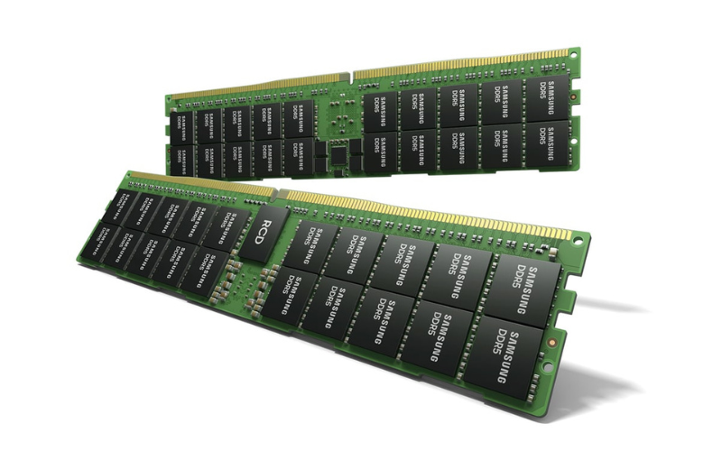
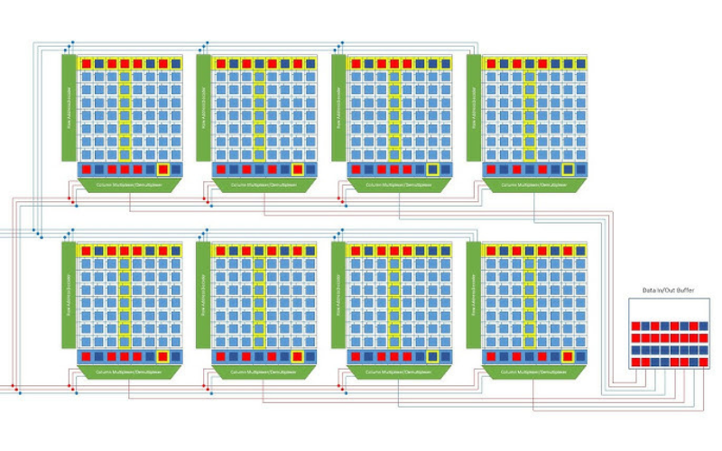
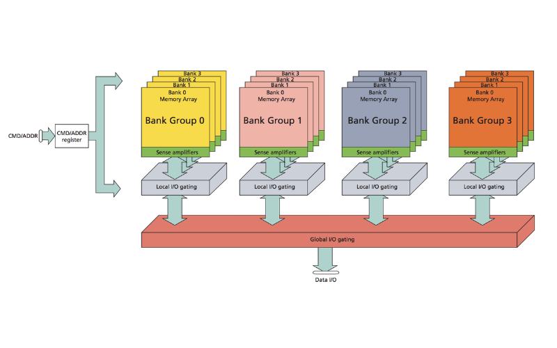

import ArticleHeader from "../../../components/header.astro"; 
import HardwareModule from "../../../components/module.astro"; 
import Step from "../../../components/step.astro"; 
import { Tabs, TabItem } from "@astrojs/starlight/components"; 
import { Card, CardGrid } from "@astrojs/starlight/components"; 

<ArticleHeader tomlPath="articles/Ne-perdons-pas-la-memoire/memory.toml" />

  **Comment votre PC stocke t-il vos données en live ?**

Hello !

J'ai un peu de temps pour un petit (pas si petit sniff) article sur... La RAM !
On la voit partout au coeurs de nos machines, mais on en sait que peu.

Qu'est-ce que c'est ? Que-sont les **MHz** et **CAS** ?

Aller, c'est partiiiiiiiiiiiiiiiiiiii !

## C'est quoi la RAM ?

La RAM, pour Random Access Memory, et parfois traduite en français comme mémoire de travail est une des
nombreuses mémoires du PC, et c'est l'une des plus rapides (après le cache processeur). Elle est utilisée
pour stocker toutes les informations qui doivent être accédée rapidement. Cela peut être : Ton document
Word, ton onglet Chrome, ton monde Minecraft...

Une bonne analogie est donnée par Micron : La RAM peut être comparée au-dessus de ton bureau, tu y trouves
tout ce que tu es en train de faire en ce moment (hein ???). Mais attention, et ça je le rajoute : Quittes
ce bureau et un coup de vent passera tout supprimer !

Pour reprendre l'exemple précédent, ton monde Minecraft, une fois quitté, tu vas vouloir le stocker sur ton
SSD / HDD pour ne pas le perdre, puisque la RAM, une fois le PC éteint tout est perdu !

En règle générale, la RAM ça se présente sous cette forme dans le pc :

Une ou plusieurs barrettes, vertes ou non avec un grand nombre de puces soudées dessus. Chaque puce est
capable de stocker entre 1 et 2 Go de données.

Attention, ces barrettes (DIMM) ne sont pas le format unique, il en existe plein d'autres (SODIMM, CAMM2, 
soudées directement...).

## C'est quoi les MHz et le CAS ??

Jusqu'a présent, c'était simple ! Nous avons des barrettes vertes avec des trucs bizarres collés dessus...
Regardons de plus près !

Une mémoire, c'est un ensemble de cases. Plein de cases. Vraiment beaucoup de cases !

Si nous voulions lire l'ensemble de ces cases en même temps, cela rendrait des systèmes affreusement
complexes et chères ! Pour cela, nous utilisons un système d'adresses. Nous demandons l'adresse n° 17 et la
mémoire nous expose sa valeur.

Ainsi, nous pouvons comprendre les MHz, qui est d'ailleurs une fausse unité. En réalité, on parle de MT/s, 
pour Méga Transferts par secondes. C'est le nombre de cases que la mémoire peut lire ou écrire par seconde !

Et donc les MHz ? où sont-ils ? Et bah, ils sont cachés, et sont en réalité bien inférieurs aux MT/s vendus
comme des MHz.

En DDRx, les MHz valent très exactement la moitié des MT/s. Une barrette de DDR5 6000 MHz tournera à 3000 MHz
en réalité. Cela provient de l'architecture mémoire en elle-même, nommé DDR pour Double Data Rate, ou Double
Débit de Données. En effet, la mémoire transfère deux cases par cycle ! D'où la fréquence divisée par deux !

:::note
C'est donc ça la source d'inquiétudes quand nous voyons notre RAM tourner à 1600 MHz au lieu des 3200
vendus, tout est normal !
:::

## CAS, RAS, etc

Et maintenant, un peu plus compliqué, le… CAS (ou tCAS, tRAS, ou tRCD, tRP...)

Pour comprendre leur origine, nous devons voir comment est organisée une puce RAM :

Il y a, en réalité pas un seul tableau, mais beaucoup de tableaux, organisés dans une logique complexe (que
nous n'aborderons pas ici).

Nous, on veut accéder à une case, qui peut être dans n'importe lequel de ces tableaux. Et le problème, ce n'est
pas de la trouver, ça on sait où elle est placée. Ce qu'on veut, c'est l'avoir en vue !

Pour cela, on peut imaginer un petit elfe qui choisi les bons élements à notre place. Malheureusement, cet
elfe n'a pas encore le don de se téléporter, il prend du temps à réaliser diverses actions !

Par exemple :

* Sélectionner une colonne (dans un tableau) : tCL
* Sélectionner une rangée (dans une colonne) : tRAS
* Préparer une colonne à la lecture (au sein d'une colonne) : tRCP
* Fermer une colonne : tRP
* Changer de tableau vers un proche : tCCD_l ou tCCD_s (selon un cas non explicité ici).

Ces durées (tCL, tRAS, tRCP, tRP...) sont exprimées sans unités, mais pourquoi ? C'est parce qu'il s'agit
d'un nombre de cycles RAM qui doit être attendu afin de s'assurer que la mémoire à correctement agit.

Et, comme le nombre de cycles RAM peut varier, c'est pour cela qu'une barrette de RAM en 3200 MT/s CL16 aura
la même latence qu'une 3600 MT/s CL18 !

On peut reprendre notre exemple de l'elfe qui doit parcourir X tours de terrains pour accomplir son objectif.
Mais il peut aussi varier sa vitesse de course ! Parcourir 16 tours lentement ou 18 tours rapidement, ça peut
revenir au même ! C'est donc 'presque' pareil pour la RAM !

Petite nuance cependant, les autres valeurs du CAS changent aussi, et ont une influence, principalement les
quatre premières :

L'ensemble des valeurs sont parfois annoncées sous la forme de quatre nombres, par exemple : 16-18-18-38, 
respectivement dans l'ordre : tCL, tRCD, tRP, tRAS.

On comprend donc que deux RAM qui répondent en même temps peuvent prendre un temps différent pour les autres
actions. Et ce sont justement ces points qui peuvent influer légèrement sur les performances !

Pour pondérer un peu le tout, il existe un dernier paramètre : Le débit de données, et celui-ci n'est que liée
à la vitesse pure. Une RAM à 3600 MHz produira un débit plus grand qu'une à 3200, même si leur latence est
identique.

## Conclusion

Pour conclure, tout est question de compromis entre débit, latence et... prix. De plus, selon les usages certains
points seront plus importants que d'autres.

Et c'est tout pour cet article, 

À la prochaine !

Tchuss !!
