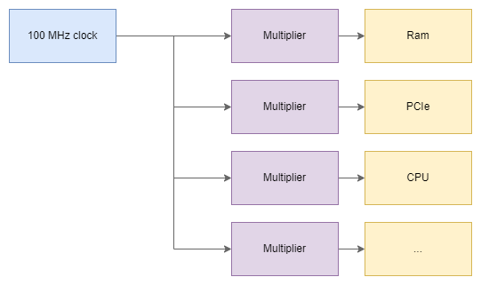
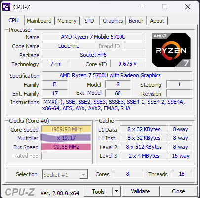
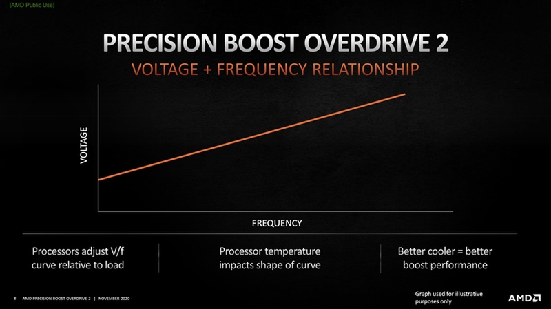

import ArticleHeader from "../../../components/header.astro";
import HardwareModule from "../../../components/module.astro";
import Step from "../../../components/step.astro";
import { Tabs, TabItem } from "@astrojs/starlight/components";
import { Card, CardGrid } from "@astrojs/starlight/components";

<ArticleHeader tomlPath="articles/Overcloking-et-au-delà/overclocking.toml" />

  **On entends souvent parler de l'overclocking, mais en quoi cela consiste t-il
  ?**

Hello !

Et voilà un petit article sur un sujet que l'on voit passer souvent, très souvent !

:::danger
**DISCLAIMER** :
Malgré le fait que l'article parlera en partie d'overclocking / undervolt, il est nécessaire de rappeler que cette pratique
peut présenter des risques pour votre matériel si mal réalisé.

Cet article n'est en aucun cas un encouragement à overclocker / undervolter vos composants. Seule votre responsabilité
est en jeu en cas d'OC.
:::

Passons à l'article !

Sur de nombreux composants, nous voyons dans les spécifications un symbole commun : le Hz, avec une unité avant, donnant ainsi des
kHz, MHz, GHz... Et, quand bien même, il ne serait pas présent, il y est tout de même en interne (sur vos HDD / SSD, carte mère,
ventilateurs...).

Mais que signifie-t-il ?

Le Hertz (Hz) est une unité standard, qui permet de donner une idée de la fréquence d'un événement (soit le nombre de fois qu'il
se produit sur une période de temps donnée). Ainsi, 1 Hz décrit un évènement qui se produit une fois par seconde, 10 Hz = 10 fois
par seconde , 1 MHz = 1 000 000x / seconde...

## Mais dans un PC, ça marche comment ?

Votre carte mère est équipée de circuits électroniques qui permettent de réaliser une horloge à 100 MHz, c'est-à-dire qu'elle
produira un signal électrique qui se répète 100 000 000 de fois par seconde. Ce signal est généralement dit carré.

Cette fréquence est ensuite divisée, ou multipliée selon les besoins pour servir de référence à l'ensemble du PC : Processeur,
Carte graphique, bus PCIe, aRGB, ventilos, USB... Tout y passe\* !

Ça ressemble à un montage comme ceci, nous retrouvons en bleu notre horloge qui sera modifiée au besoin selon les composants.

Pour donner un exemple plus précis, regardons de plus près, avec le logiciel CPU-Z mon processeur : Un processeur de pc portable.

Nous retrouvons donc les différents blocs précédents, surlignés en couleur : En rose, la fréquence de l'horloge de référence,
ici 99.65 MHz, soit très proche des 100 MHz annoncés.

Juste au-dessus, en violet, nous avons le multiplicateur actuel, 19.17.

Et pour finir, en jaune, la fréquence actuelle du processeur, 1,909 GHz, ce qui correspond bien à $99.65 \times 19.17$ (aux arrondis près).

Un peu plus haut dans la capture d'écran, nous retrouvons un champ nommé Core VID, qui vaut à ce moment 0.675V. Cette valeur
correspond à la tension électrique qui alimente le processeur à cet instant présent. Cette valeur est intimement liée à la fréquence,
en effet un processeur a besoin d'énergie pour fonctionner, s'il n'en a pas assez, il calcule faux, entrainant des crashs. Par défaut,
cette tension est gérée automatiquement pour suivre une courbe pré-définie :

Sur la photo ci-dessus, originaire d'AMD, nous voyons clairement que plus la fréquence augmente, plus la tension sera importante.
Cela permet de garantir une stabilité dans le fonctionnement de votre processeur. Un fonctionnement très similaire est aussi
présent chez Intel.

Modifier ce fonctionnement automatique est connu sous deux noms, selon la modification :

- Overclocking : on augmente la fréquence (et donc la tension pour être stable)
- Undervolt : on réduit la fréquence (et donc la tension, devenue inutile pour être stable)

Ce changement peut être réalisé de plusieurs manières : Soit l'on modifie le multiplicateur, et ainsi sur le composant cible
est touché, mais il est aussi possible de toucher à l'horloge principale. Ainsi, TOUS les composants seront affectés. Inutile
de préciser qu'il faut posséder de très bonnes connaissances en informatique avant d'y toucher...

Autrement, vous pourriez ajouter de la tension, la réduire, ou bien en changer la pente !

Cette modification impliquera une modification de la courbe ci-dessous, selon les paramètres / options choisies.

## Performances

Ce changement dans le fonctionnement de votre composant aura une incidence directe sur deux paramètres :

Ses performances, en effet, pour ceux qui ont lu l'article précédent, vous savez qu'un processeur effectue des cycles par
seconde. Augmenter ou réduire ce nombre de cycles (soit sa fréquence) à une incidence directe sur ses performances. Mais
attention : Le gain de performance n'est relatif qu'à l'écart par rapport à la fréquence de base, ajouter 100 MHz à un composant
tournant à 1 GHz apportera 10% de performances, là où ces mêmes 100 MHz à un composant tournant à 5 GHz n'apportera que 2%...
Ainsi, l'overclocking n'apporte plus vraiment de performances aujourd'hui, contrairement, il y a quelques années (oui, vous
n'étiez surement pas né (et moi non plus)), ou le gain pouvait être d'un facteur 2.

Sa chauffe : Consommation.
Un processeur dissipe de la puissance, qui peut être calculée par la relation suivante :

$$
P = \alpha \times F_{\text{CPU}} \times V^2
$$

Ainsi, on voit que plus on monte en fréquence, plus on chauffe, même à tension constante. Mais un autre terme "pèse" encore plus lourd :
La tension. Par le carré ($^2$), une faible augmentation aura de grosse répercutions, bien plus qu'une augmentation de fréquence.
Ainsi, selon le sens de la modification, on ira chauffer (beaucoup) plus, ou (beaucoup) moins !

:::note
le paramètre $\alpha$ est ici laissé flou volontairement. Il dépend directement de constantes physiques trop complexes pour cet article.
:::

## Conclusion

Pour finir, je veux juste compléter une phrase du début qui disait que cette fréquence est partout. C'est bien vrai, mais il n'est
pas obligatoire de se baser sur une référence. Certains fabricants peuvent bien utiliser une autre référence, si les besoins ne se
font pas sentir (ou pour contourner des limitations). Ainsi, votre SSD pourrait utiliser cette horloge, mais ne le fait pas
obligatoirement (SSD 2.5", les NVMe dépendent du PCIe).

Par ailleurs, tout ce qui est lien avec les communications (Wi-Fi, Ethernet) ou vous croiserez aussi ces termes en MHz, voire GHz
cependant ils ne fonctionnent pas du tout comme ça (c'est bien bien bien plus complexe comme fonctionnement).

Et voilà, Tchuss !

A la prochaine !
