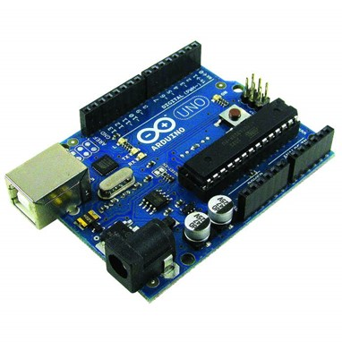
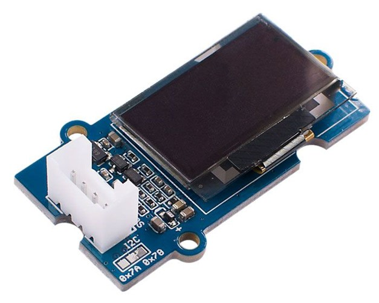
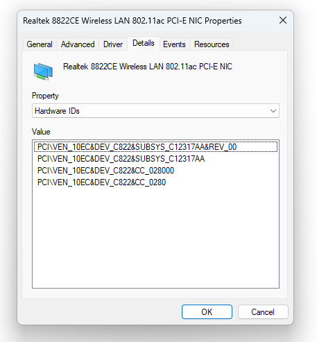
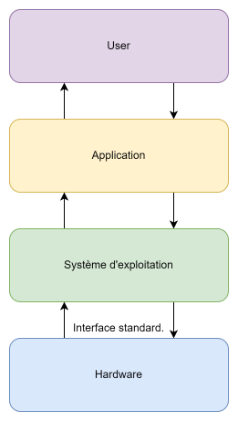

import ArticleHeader from "../../../components/header.astro";
import HardwareModule from "../../../components/module.astro";
import Step from "../../../components/step.astro";
import { Tabs, TabItem } from "@astrojs/starlight/components";
import { Card, CardGrid } from "@astrojs/starlight/components";

<ArticleHeader tomlPath="articles/Pilotes-et-matériel/drivers.toml" />

<p class="article-lead">
  **Quand on dit drivers, on pense à ceux graphique. Mais ils ne sont pas seuls
  !**
</p>

Hey !!!

S'il y a bien sujet qui fait peur aux débutants (après le front panel, je l'avoue), ce sont les drivers. Mais qui sont-ils ?
Pourquoi sont-ils nécessaires ? Aller, on y va !

Pour bien comprendre le pourquoi du comment, on va changer d’échelle :

## Dans le monde de l'embarqué

Pif paf pouf, nous voilà dans l’un des plus petits CPU existants, un Arduino. Son processeur, ou plutôt calculatrice,
devrait-on dire aujourd’hui, est idéal pour comprendre. Ce type de puces, par sa très faible puissance, ne supporte que
peu de périphériques : Dans cet exemple, guère plus d’une dizaine.



Ce principe de périphérique, c'est toujours le même depuis le début. Nous avons un processeur qui sait calculer au milieu
et des périphériques autour, pour intéragir avec le monde. Seules les façons de communiquer et le nombre de périphériques
ont évolués avec le temps.

Le processeur d'un Arduino est capable de physiquement faire quelques actions basiques : Calculer.
Pour tout le reste (par exemple, allumer une led) il doit faire appel à un périphérique.

Ces actions sont réalisées par des blos matériels dédiés, et non le processeur même. Et, ces fameux périphériques ont besoin
d'être configurés avant pour fonctionner.

Cela devient vite fastidieux de le faire à la main, et est source d'erreur. Si seulement nous avions un programme qui nous
faisait ça tout seul... En voici un exemple :

```c
    RCC->AHB1ENR |= (1 << 0);
    GPIOA->MODER &= ~(3 << (5 * 2));
    GPIOA->MODER |=  (1 << (5 * 2));
    GPIOA->ODR |= (1 << 5);
```

Vous n'avez rien compris ? C'est ... normal. Seul un oeil averti est capable d'en comprendre les actions !Pour cela, nous
voulons écrire un petit bout, de sous-programme, qui fera ce boulot à notre place : Nous lui demandons une action, et il
l’exécute, en réalisant les actions nécessaires au fonctionnement. Par exemple, si je demande à l’Arduino d'allumer une led,
j’aimerais que le programme se charge seul de paramétrer la sortie, les actions, etc. Un driver est là pour ça, il masque
les étapes compliquées de la procédure à l’utilisateur.

```c
    set_led(5);
```

C'est mieux non ?

Ce bout de programme, c’est un driver. Certes, très simple et basique, mais il a le mérite d’exister. Ce driver peut se
permettre d’être simple : En effet, il est impossible d’effectuer une modification au processeur. Les commandes resteront
donc TOUJOURS les mêmes. Une fois programmé et testé, il pourra tourner pour toujours.

Deuxième situation, nous allons utiliser un écran : Celui-ci communique au travers d’un bus standard. On pourrait donc
nouveau écrire un driver pour celui-ci, comportant toutes les commandes nécessaires à son bon fonctionnement, tout en étant
simple à appeler.



Pour donner un ordre d'idée, un écran comme celui ci nécessite environ une vingtaine de commandes avant d'afficher sa
première image !

Mais, un GROS problème se pose : Il se passe quoi si je change mon écran ? C'est pourtant facile et rapide à faire. Ce
connecteur est standard, en plus... Eh bien, pas grand-chose. Ce nouvel écran ne comprendra pas les commandes envoyées,
et ne réagira pas. Dommage. Ça serait cool d’avoir la possibilité d’identifier le périphérique branché, et communiquer
avec lui de la bonne façon, et tout cela automatiquement ?

## Retours sur les PC !

Retournons à nos chers PCs... chaque demande du programme maître à des programmes standard, mais chaque fabricant adapte
son programme pour que ça marche avec son matériel. Le système d’exploitation n’aura qu’à choisir le bon programme à
exécuter pour que cela fonctionne ! Simple non ? Eh beh, comment savoir quel programme utiliser si on ne connait pas
la personne à qui l'on parle ?

Ils sont capables, via les bus de communication, d’identifier les périphériques branchés : Sur le bus PCI(e), chaque
gamme de périphériques à un ID qui lui est propre et unique au monde. Par exemple, sur ma carte réseau Wi-Fi : Il s’agit
du PCI\VEN_10EC&DEV_C822. Avec une recherche Google, on tombe immédiatement et uniquement sur la Realtek 8822CE.



:::note
Pour votre culture générale, `VEN_8086`est utilisé par Intel, en référence à son premier processeur, le Intel... 8086 !
:::

Avec cet ID, le système d’exploitation peut identifier le périphérique branché. C’est bien, mais on en fait quoi ?
Eh bien, on installe son driver.

Même, si par défaut le périphérique fonctionne, il n’est pas à son potentiel maximal :

Souvent, les périphériques comprennent deux langages : Celui standard, assurant une fonctionnalité partout, et celui
spécifique au fabricant, assurant les performances maximales.

Ainsi, votre pc marche sans drivers (lors du premier démarrage), mais pour l’utiliser à fond, les drivers spécifiques
sont nécessaires.

:::note
Un bon exemple que vous avez pu remarquer : Les écrans. Pendant votre première installation Windows, vous n'aviez qu'un écran,
même si plusieurs étaient branché ! C'est parce que, par défaut votre carte graphique ne comprends le language que pour un. plus
tard, avec le driver chargé, les autres écrans de son allumés.
:::

Un driver peut se voir de cette façon : Une pile, ou chaque étage, joue un rôle : L’utilisateur demande à l’application,
par exemple, je veux imprimer un document. L’application demande au système d’exploitation d’imprimer, qui lui-même
demande à l’imprimante via son driver. Et comme précisé avant, sans drivers, la feuille sortira, mais sans fioritures,
là où avec, on peut envisager une impression haute qualité. Ensuite, le driver fait son retour jusqu’à l’utilisateur.



## Pourquoi ils posent souvent soucis ?

Si vous êtes arrivés jusque-là, vous vous demanderez surement pourquoi on voit régulièrement avec une catégorie de drivers spécifique : Les drivers graphiques.

La raison est ici bien différente : Ces derniers sont responsables d'une grosse partie des performances de votre PC, contrairement au driver qui contrôle les ventilos !
Les fabricants essaient donc de les optimiser le plus possible, et cela peut inclure divers soucis (contrairement à d'autres drivers conçus pour leur sécurité absolue).

## Conclusion

Et voilà, j'espère que vous avez compris un peu mieux ce qui se cache derrière ce nom barbare de driver…

Tchuss !!
