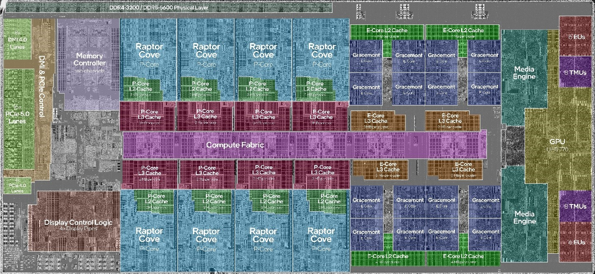
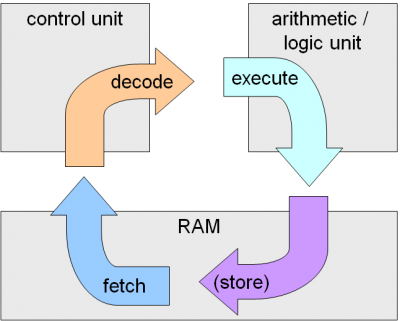
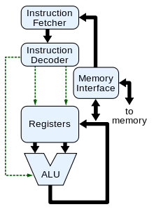

import ArticleHeader from "../../../components/header.astro";
import HardwareModule from "../../../components/module.astro";
import Step from "../../../components/step.astro";
import { Tabs, TabItem } from "@astrojs/starlight/components";
import { Card, CardGrid } from "@astrojs/starlight/components";

<ArticleHeader tomlPath="articles/Processeurs/cpu.toml" />

<p class="article-lead">
  **Un processeur, le coeur de notre PC. Mais il fonctionne comment ?**
</p>

Hello !

Gros article aujourd'hui, sur un sujet demandé lors du sondage (oui, je ne vous ai pas oublié). Il m'a juste fallu
du temps pour produire un article lisible...

Mais bref, aujourd'hui, gros sujet : Quel que soit le PC que vous avez croisé, ils ont un point commun : Ils ont un
CPU / Processeur.

Nous pourrions même élargir cela à presque tous les objets quotidiens connectés (ou pas), beaucoup embarquent un
petit processeur pour agir...

Mais comment ce petit truc arrive à calculer ?

Nous allons voir ça ci-dessous !

## Architectures

Pour commencer, il faut savoir que les processeurs (tous), ont peu les trier selon un paramètre : Leur architecture.

Plusieurs grands noms existent d'architecture, que vous avez pu croiser : ARM, x86, mais aussi d'autres (AVR, RISCV...).

**Mais une architecture, qu'est-ce ?**

Une architecture, c'est une norme qui décrit une façon de faire dans un processeur : Par exemple, l'opération d'ajouter
deux nombres aura un comportement défini, un nom, des opérateurs, etc défini précisément dans cette architecture. Les
fabricants optimisent ensuite cette opération pour aller le plus vite possible, tout en respectant la définition.

Mais retournons à nos grains de sables, un processeur ça ressemble à quoi ?

Comme évoqué dans un article précédent (Cf : Airflow), un processeur, en lui-même, c'est nettement plus petit que le
boitier que vous avez en main. Si on zoome dessus (vraiment beaucoup), on peut apercevoir différentes zones :



Cette image, c'est un 13900k, dont on a coloré les zones. Par défaut, c'est gris (comme sur les bords). Nous y retrouvons
plein de zones : Gestion DDR4 / DDR5, iGPU mais aussi, et surtout en plein milieu : les cœurs. Ce sont eux qui nous
intéressent aujourd'hui.

Malheureusement, nous ne pourrons zoomer plus, cela devient trop petit (et complexe). Pour cela, nous allons regarder un
schéma logique des opérations réalisées, à chaque fois dans le processeur. Pour garder le lien avec la photo ci-dessous,
vous pouvez imaginer le dessin ci-dessous dans chaque case P-Core ou E-Core.

## Un coeur, ça fonctionne comment ?



Un cœur, ça marche de la sorte : En quatre étapes.

1. **Fetch** consiste à identifier la prochaine instruction, et la lire.
2. **Decode** consiste à la décoder (= la comprendre), et configurer le processeur de la bonne manière.
3. **Execute** consiste en exécuter l'opération.
4. **Store**, consiste en écrire la donnée calculée à un emplacement précis.

Nous pourrions faire l'analogie avec un humain qui lit une consigne : Range ta chambre.

Dans un premier temps, il écoute (le parent) (= fetch), comprends la consigne (= identifie ce qu'il a à faire), puis range
la chambre (= execute). La dernière étape n'ayant de comparaison réelle dans cet exemple.

Votre processeur, il fait pareil, mais sur des maths (il ne pourra ranger votre chambre, désolé), et beaucoup plus vite
(on parle de 5 000 000 000 de cycles par secondes sur les derniers modèles).

## Les instructions, c'est quoi ?

Je pense que vous vous en doutez, mais une instruction pour votre processeur, ce n'est pas français : Et vous avez raison !

C'est en réalité un nombre, un code associé à une action. Ce code est standard par l'architecture de votre processeur (oui,
encore elle...).

Pour permettre une compréhension humaine des instructions processeur, on a inventé le langage le plus primaire qui existe :
L'assembleur.

Il associe à un nombre une série de lettres, plus ou moins sensées.

Pour vous donner un aperçu, un code simple comme celui-ci :

```c
int c;
int main() {
    int i, j;

    for (i=0; i<100; i++) {
        for (j=0; j<4; j++) {
            c++;
        }
    }
    return c;
}
```

Se traduit de la façon suivante :

```asm
main:
    mov     i, 0
.label5:
    cmp     i, 99
    jg      .label2
    mov     j, 0
.label4:
    cmp     j, 3
    jg      .label3
    mov     eax, c
    add     eax, 1
    mov     c, eax
    add     j, 1
    jmp     .label4
.label3:
    add     i, 1
    jmp     .label5
.label2:
    mov     eax, c
    ret
```

Il ne s'agit que d'une simple boucle qui ne fait que compter, et le code produit est déjà illisible. Imaginez des outils
logiciels récents...

Pour revenir à nous moutons ou transistors, devrai-je dire :

Le hardware d'un cœur, ça ressemble à quoi ?

Je vous épargne le schéma électrique, certainement illisible. Je vous ais trouvé un petit dessin, chez nous amis de Wikipédia :



Et voilà, ça paraitrait même joli non ?

Nous retrouvons des blocs déjà évoqués avant : Decoder, ALU (unité de calcul), fetcher...

Nous n'y avons qu'ajouté des blocs "Registres" et "Interface Mémoire".

- Registre, ce n'est que le penchant hardware d'une variable, on y stocke une valeur.
- Interface mémoire, c'est ce qui permet de communiquer avec la RAM par exemple. Sur la photo du die en haut, cette
  interface mémoire passe par le Compute Fabric (bus de transfert, dont nous ne parlerons pas ici.)

En noir, nous avons donc le trajet de la donnée : La ou nos nombres / informations passent.
Et en vert, pour les plus fous : Cela représente des cas spéciaux (ex : Overflow : Nous atteignons le maximum possible).

## Evolutions

Pour finir cet article, je vais vous évoquer les évolutions qui sont apparues au cours de l'histoire : (quelques-unes,
pas toutes hein ?)

<Tabs>
    <TabItem label="Extensions">

        Chaque fabricant, en respectant une architecture, peut y ajouter des extensions (= DLC). Cela
        permet de donner des possibilités en plus (par exemple, le calcul sur plusieurs nombres en même temps (= AVX)). Une autre
        extension courante est le AMD64, extension qui permit de passer de 32 bits à 64 bits sur nos processeurs.

    </TabItem>
    <TabItem label="Pipeline">

        Dans les étapes décrites plus haut, au nombre de quatre occupent chacune un coup d'horloge : Un processeur à
        5Ghz ne se retrouverait qu'à 1.25Ghz en réalité...

        Pour cela, nous avons découpé le cœur en petits bout, ou chacun peut faire son travail de son côté : Pendant
        que l'un fetch, l'autre décode, le troisième execute, et le dernier écrit en mémoire. Et après, on tourne
        d'un quart de tour, et hop, à la suite.

    </TabItem>
    <TabItem label="Prédiction">

        Cette évolution a été fortement liée à la Pipeline : En effet, elle posait un souci majeur :

        En ayant de  l'avance dans le décodage des instructions, en cas de branchement (condition), il était possible de se retrouver dans
        une situation ou le code déjà décodé était faux (autre chose devrait être exécutée). Cela provoquait un retard et une
        perte de performance. Les processeurs récents ont un moteur de prédiction qui permet de deviner la situation dans
        laquelle il se trouvera après la condition. Cela pour éviter de se retrouver dans une situation où le code décodé est
        erroné.

        Cette devinette n'est jamais parfaite, en cas d'erreur on perd tout de même du temps. Mais, en cas de prédiction correcte, c'est du
        gain pur !

    </TabItem>
    <TabItem label="Execution dans le désordre">

        Au cours du temps, on s'est rendu compte d'un gros point bloquant : Un code peut contenir des opérations lentes, pouvant
        bloquer l'entièreté du système, même si les suivantes ne dépendent PAS de cette instruction.

        Votre processeur détecte donc des événements, et permet aux instructions suivantes de s'executer en même temps, via un
        réordancement ! Gros gain de performance ici !

    </TabItem>
    <TabItem label="Superscalaire">

        Cette évolution est partie d'un constat : Un ALU (cf schéma) permet de réaliser plusieurs opérations,
        mais une seule est souhaitée. Ainsi, le multithreading permet, en associant un deuxième (voire quatre) cœur logique au
        même hardware, d'exploiter au mieux la capacité de notre ALU. Cela est juste limité par l'opération "principale".

        Les derniers processeurs vont intégrer plusieurs dizaines d'unités, et sont capables d'associer à chaque cycle différentes
        instructions à chacune d'entre-elles !

    </TabItem>

</Tabs>

## Conclusion

Pour finir, j'aimerais ajouter deux phrases sur ARM : C'est une architecture différente par la philosophie du x86, mais
les principes restent les mêmes. Elle est juste optimisée pour les perfs / conso, là où le x86 profite d'une
rétrocompatibilité folle...

:::note
Votre processeur x86 tout neuf est parfaitement capable d'executer du code initialement conçu pour un processeur en 1976 !
A l'opposé, un processeur ARM récent (ARMv8a) n'est pas capable d'executer du code écrit en 2013 (ARMv7a)
:::

Et voilà !

J'espère avoir su rester clair pour dégrossir ce sujet plus que complexe...

Bonne fin d'année, Tchuss !
