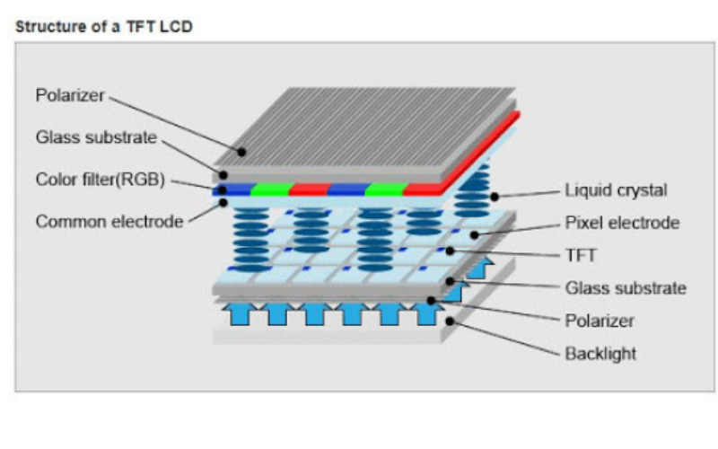
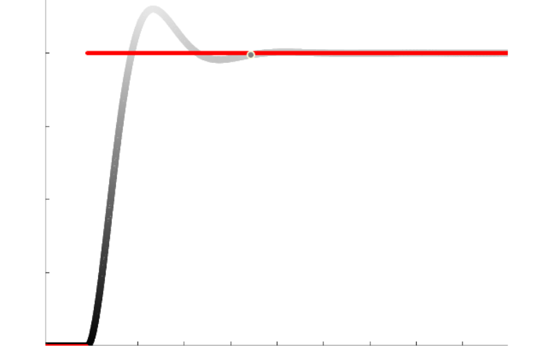
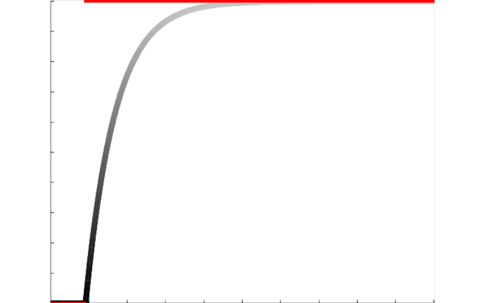

import ArticleHeader from "../../../components/header.astro";
import HardwareModule from "../../../components/module.astro";
import Step from "../../../components/step.astro";
import { Tabs, TabItem } from "@astrojs/starlight/components";
import { Card, CardGrid } from "@astrojs/starlight/components";

<ArticleHeader tomlPath="articles/Quand-vos-pixels-vous-mentent/screen.toml" />

  **Vos écrans ne sont pas aussi parfait que les commerciaux vous le laissent
  penser ...**

Hey !

Pour le sujet du jour, un domaine souvent mal compris et mal détaillé : les écrans.

Que sont les notions d'overshoot ? ghosting ?

Aller, c'est parti !

Premièrement, il va être nécessaire de regarder ce qu'es un écran en pratique, et de près !

Un écran, c'est un périphérique, chargé de l'affichage graphique. Pour cela, on lui apporte de la
donnée (via HDMI, DisplayPort, DVI, VGA...),

il acquiert, traite et affiche cette donnée. La durée nécessaire à ces étapes est appelée Input-Lag
(nous n'en parlerons pas ici).

Et comment l'affiche t-il ? Il contrôle pour cela une matrice de pixels, appelée matrice TFT-LCD.
Oui, ce nom à bien disparu depuis quelques temps, mais la technique reste la même derrière.

L'idée : Nous avons un lumière blanche de fond, polarisée (arrivant donc avec le bon angle) sur une
matrice LCD (cristaux liquides) qui va, selon une commande électronique, plus ou moins laisser passer
la lumière vers des filtres colorés (rouges, bleu et verts), notre fameux RGB !

Diverses couches sont placées encore après pour conditionner la lumière pour l’œil humain.

## Commande des pixels, la réalité !

La commande des pixels, comme expliquée plus haut est faite électroniquement. Or, un pixel n'échappe
pas aux lois de la physique, il n'est donc pas capable de changer instantanément d'un état à l'autre !
Il passe par une phase de transition. Cette phase est souvent rapide, et invisible. Pour donner
une idée, cette phase dure pour un pixel seul environ 20 ms. Soit, 50 Hz ! Et en plus, il se trompe sur
la position finale.

C'est pas comme ça qu'on va arriver à avoir un écran rapide nous...

Mais heureusement pour nous, des physiciens ont conçus des méthodes de contrôle qui permettent d'accélérer
ce processus, et réduire voire supprimer l'erreur. Magique ? Non, pas vraiment. Ces systèmes sont
complexes à mettre en place, et demandent de long calculs et essais pour arriver à un résultat satisfaisant.

Le principe reste cependant facile à comprendre : On considère la position voulue comme une commande, et on
fabrique une seconde commande, appliquée au pixel, différente, et qui permettra de corriger les défauts.
Par exemple, il est possible de décaler cette 2eme commande vers une valeur différente, si on voulait
corriger une erreur fixe. Pour faire l'analogie, on peut comparer ça à rouler en voiture à 84 km/h pour
rouler à 80 km/h en vrai.

Vous compensez une erreur de 4 km/h.

Et pour l'accélération, le principe est similaire. Au lieu de simplement commander le pixel, vous mettez la
commande à fond le temps qu'il arrive là ou vous voulez, avant de la relâcher vers le niveau souhaité (peut être décalé !).
Pour reprendre l'analogie précédente, c'estcomme si après un feu rouge, vous appuyez à fond sur l'accélérateur,
au lieu de simplement appuyer pour arriver à 50 km/h. Vous arriverez nettement plus vite à votre objectif dans le 1er cas !

Cependant, ces méthodes, comme dit avant sont souvent très complexes, et si mal réglées, apportent divers soucis...

## Overshoot et ghosting

Ces deux problèmes sont typiques des commande qui appuient à fond. Le système ayant une inertie (si vous ne lâchez
l'accélérateur qu'a 50 km/h, vous dépasserez votre vitesse cible !). Sur un écran, cela se traduit par une couleur
affichée différente de celle voulue.

Je vous ais tracé pour cela un petit graphique :

La ligne rouge représente la commande, et ce que le pixel devrait faire idéalement : De noir à gris. Sauf, que, problème :
La commande n'étant pas optimale, et notre petit pixel passe par une couleur qui n'est pas sur le trajet normal
(= overshoot). Cela introduit une erreur dans la couleur.

Et en plus, il se permet ensuite de repasser légèrement en dessous (= undershoot) de la réponse souhaitée !

Clairement, cette réponse n'est pas idéale, mais, elle dispose d'un avantage : Le temps nécessaire pour arriver aux environs
de la couleur cycle est court.

A l'opposé, j'ai tracé la réponse d'un pixel parfait sur le plan colorimétrique :

Ici, aucun problème de dépassement. Mais, notre pixel est sensiblement plus lent (attention, les unités ne sont pas \*
strictement les mêmes sur les graphes, il y a presque un facteur 2 en vitesse !).

L’œil n'étant pas parfait, il lui sera impossible de discerner un léger dépassement. Mais, dans certains cas
extrêmes, ce comportement peut devenir visible et clairement négatif. C'est donc quelque chose de positif si cela
permet d'avoir une réponse plus rapide !

Dans tout les cas, le pixel aura fini son changement avant la période demandée (déterminée par la fréquence de rafraichissement),
la couleur sera atteinte (même si une erreur peut exister).

A l'opposé, si votre pixel n'atteint PAS sa valeur demandée pendant le temps imparti, vous obtenez du ghosting. Votre pixel
n'ayant pas changé de couleur complètement, il expose alors des "restes" de la couleur précédente, apportant à l'image une
sorte de "fantôme" de l'image précédente. Et, devinez :
Ce n'est pas une bonne idée non plus, voire même pire !

## Colorimétrie et gamuts :

Second grand aspect des écrans, la colorimétrie. Pour cela, on utilise des "gamuts", une gamme de couleur parmi toutes celles
possibles. En effet, selon la qualité des cristaux liquides et autres éléments, il peut être possible, ou non de reproduire
toutes les couleurs (un pixel de qualité moyenne pourra moins bien reproduire la couleur verte qu'un pixel de très bonne qualité par exemple).

Ces gamuts permettent de réduire l'espace couleur absolus en des standard, afin d'assurer qu'une image filmée par un appareil
ressemblera à peu près à la réalité sur un autre. Ils ont des noms parfois croisés, tels que NTSC, DCI-P3, Adobe, sRGB...

Cet aspect, absolument indispensable pour les usages créatifs (dessin, photo, montage...) permet de s'assurer que l'écran affiche
une couleur juste (= strictement identique à celle qui est / sera dans la réalité). A l'opposé, un écran avec une mauvaise colorimétrie
affichera des couleurs fausses (bien souvent trop brillantes / fades).

Ces différences peuvent être très gênantes si vous aspirez à vendre / diffuser vos créations : Imaginez faire un super montage
chez vous, mais une fois sur YouTube ou un client, toute la vidéo est tellement brillante qu'elle en pique les yeux ? Ou bien toute
fade en terme de couleur ? Ce n'est pas viable !

Pour cela, il suffit de regarder la couverture colorimétrique de votre écran :

- 45% NTSC : Très courant sur les pc portables et écrans vraiment pas chers. Couleurs fades, pas envisageable pour plus qu'un
  travail sur un traitement de texte !
- 100% sRGB : Très courant sur les écrans de meilleure qualité. Couleurs correctes, un travail photo / vidéo est déjà envisageable !
- 100% NTSC / 100% sRGB : Ecrans de graphismes haut de gammes, vous n'êtes probablement pas en train de lire ça ! Idéal pour photo / vidéo !

Bien évidemment, ces valeurs ne sont parfois pas toutes annoncées, et il est très difficile de convertir de l'un à l'autre.
J'ai donc choisi les valeurs communément rencontrées.

## Refresh rate

Pour finir, parlons Hz et fréquence de rafraichissement et ms. Et spoiler : le marketing arrive !

Commençons par définir ce que sont les ms (millisecondes) dans ce contexte. Et, c'est là que ça se complique.
Il n'existe AUCUNE norme sur cette mesure. Il est donc très facile de mesurer dans le cas qui nous arrange pour vendre ce que l'on veut.

Selon les fabricants, certains mesurent :

- La durée demandée au pixel pour atteindre la 1ere fois la couleur, qu'importe de la suite (mesure très courte, même si la durée pour atteindre la couleur sans erreur est 3-5x plus longue !)
- La durée au pic : Un peu mieux, mais toujours faux
- La durée une fois dans la plage de la tolérance de couleur : Là, c'est top.

Mais il y a aussi une autre arnaque : La mesure GtG.

Changez de très peu la couleur (par exemple d'un Gris à Gris), vous mesurez une réponse très rapide, alors que dans un usage réel, cela sera bien différent !

C'est donc comme ça que votre écran gaming 1ms est en réalité un écran 15 ms, mesuré de manière différente !
Et ça, le marketing l'a bien compris : ça se vends mieux avec 1 ms.

Sachant qu'une fréquence, c'est l'inverse d'une durée (F = 1 / T), et bien vous pouvez donc vendre des Hz (en s'assurant une marge pour compenser la phase
de transisition, l'idée n'étant pas de finir de changer de couleur à la fin de la frame). Encore une fois, cette marge ne sera jamais la même
(ex : un écran 1 ms est peut-être un écran 5ms marge déduite !)

## Conclusion

Et voilà, quelques notions importantes d'un écran vulgarisée.

Pour apporter un petit mot final : C'est en usant et abusant de ces effets que l'on peut proposer des écrans avec des caractéristiques
de fous pour un prix cassés. Ils ne tiennent leur fréquence que d'un gris à l'autre, pour l'ensemble des autres usages, vous
n'aurez que du ghosting / overshoot / fréquences inférieures.

Ce n'est pas rare de croiser des écrans "240 Hz" qui peinent à faire plus de 100 Hz en réalité (et en plus produisent une image
de mauvaise qualité). Préférez donc un écran plus modeste, qui assure ses caractéristiques ! Cependant, l'écran "parfait" n'existe pas,
et selon votre usage un compromis doit être trouvé : Couleurs imparfaites mais vitesse, ou couleurs parfaites mais plus lent ?

Et c'est tout pour aujourd'hui,

Tchuss !

## Liens utiles / Sources

En cadeau, quelques liens utiles

### Pour tous :

- Essais d'écrans et recommandations (anglais) : [RTINGS](https://www.rtings.com/monitor) (Update 2026 : Devenu payant)

### Méthodes d'essais du site précédent (pas mal d'infos aussi !)

- Tests de [réponse](https://www.rtings.com/monitor/tests/motion/motion-blur-and-response-time)
- Tests d'[input lag](https://www.rtings.com/monitor/tests/inputs/input-lag)
- Tests de [couleur](https://www.rtings.com/monitor/tests/picture-quality/color-accuracy)

### Pour les meilleurs et habitués de l'électronique :

- Fonctionnement des différentes [techs des écrans](https://display-corner.epfl.ch/index.php/LCD_dynamics) (anglais)
- [Résolution en couleur](https://display-corner.epfl.ch/index.php?title=Measuring_color_resolution) des écrans (anglais)
- [Page globlale](https://display-corner.epfl.ch/index.php?title=Monitor_topics) (anglais)
- Explication sur les [gamuts](https://www.eizo.com/library/basics/lcd_monitor_color_gamut/) de couleur (anglais)
