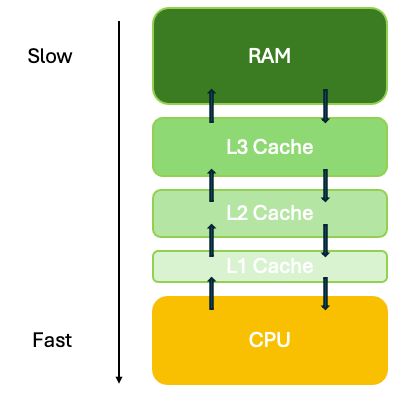
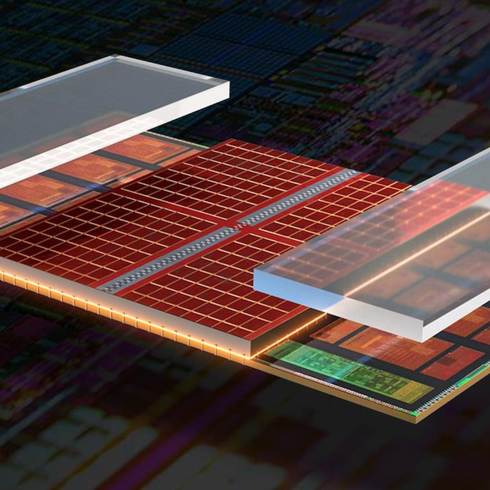
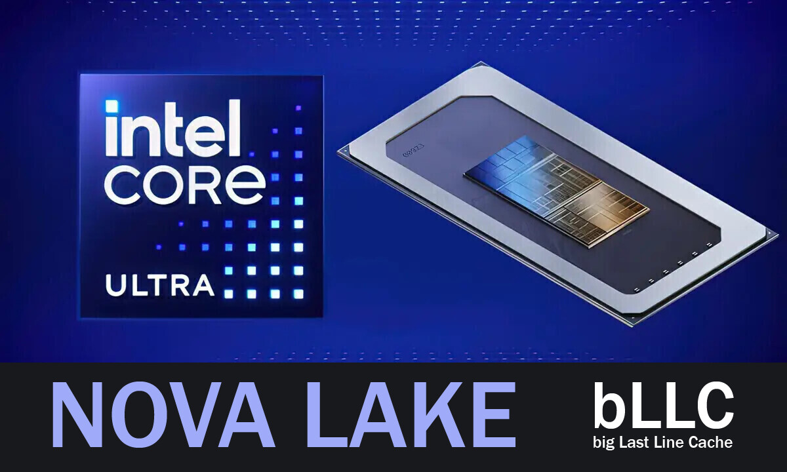

import ArticleHeader from "../../../components/header.astro"; 
import HardwareModule from "../../../components/module.astro"; 
import Step from "../../../components/step.astro"; 
import { Tabs, TabItem } from "@astrojs/starlight/components"; 
import { Card, CardGrid } from "@astrojs/starlight/components"; 

export const files = import.meta.glob('./data/**/*.txt', {
  query: '?url', 
  import: 'default', 
  eager: true, 
}); 

<ArticleHeader tomlPath="articles/Quand-votre-processeur-joue-a-cache-cache/caches.toml" />

	**L1, L2, L3, X3D ... Partons à la découverte des mécanismes de caches dans votre processeur !**

Hello !

On voit régulièrement dans la communauté hardware que pour le gaming, il faut un processeur x3d. Ce conseil est plutôt pertinent
dans son ensemble, mais pourquoi ? Allez, on creuse !

## Contexte

### Accès aux données

Le terme français, issu du dictionnaire nous dit : 

> Lieu secret : Cachette ou refuge où l'on dissimule des objets (comme une cache d'armes), des provisions ou où l'on se cache soi-même.

Et pour le coup, cela colle relativement bien avec nos processeurs ! 
Dans le monde informatique, la majorité des usages consistent en l'interaction entre plusieurs composants, certains plus lents que d'autres.
Le pire cas sera évidemment un accès à Internet à un serveur lointain.

:::note
Un accès internet via les câbles sous-marins vers les USA (ou n'importe quelle autre destination !) vous imposera une latence comprise 
entre 80 et 120 ms. 

Vous pouvez faire le test avec un speedtest, en choisissant un serveur situé loin. Mes résultats sont en l'occurrence de 92 ms vers New-York.
:::

Pour votre processeur, attendre une donnée correspond à une perte sèche : 

| Source                       | Latence moyenne | Nombre de cycles processeurs (@5 GHz) |
| :--------------------------- | :-------------: | :-----------------------------------: |
| Internet (Inter-continental) | ~ 100 ms        | 500 millions                          |
| Internet (Intra-continental) | ~ 10 ms         | 50 millions                           |
| Internet (Réseau local)      | ~ 1 ms          | 5 millions                            |  
| SSD NVMe                     | ~ 300 us        | 1.5 million                           | 

On peut facilement s'en rendre compte dans le tableau ici : À l'échelle de votre processeur, toutes ces latences sont énormes. Et, un processeur qui 
manque de données, ça ne fait pas de miracles : ça se stoppe. Les optimisations les plus récentes permettront de compenser légèrement (*Out of Order Execution*, 
lire [l'article](/articles/articles/processeurs/cpu/) pour en savoir plus !).

Et croyez-moi, vous n'avez pas envie de perdre entre un et 500 millions de cycles parce que vous n'avez rien à faire ! Ce sujet est d'ailleurs au cœur des
optimisations logicielles ces derniers temps : Produire un algorithme correct n'est pas suffisant, il faut aussi prendre en compte les données.

### Et la RAM alors ?

Et là, vous auriez une question pertinente à vous poser : La RAM, elle est passée où ?!? C'est pourtant son rôle non ? 
Et, oui ! C'est même totalement son rôle, à une différence majeure : Elle n'est pas parfaite non plus.

Alors oui, elle répond vite, très vite (pour vous), et avec des gros débits. C'est super cool, mais à l'échelle d'un processeur, ça reste... lent.
Pourquoi ?

Parce que... DDR. Mais si ! La DDR, *Dual Data Rate*, la mémoire que vous avez sous forme de barrettes dans votre PC. C'est cool, c'est pas cher (oui, je sais. Et j'écris ça en 2026 !).
Sauf que la DDR vient avec plein de contraintes diverses et variées : 
* Nécessité d'un contrôleur mémoire dédié (vous ne pouvez pas parler à de la DDR de manière "simple")
* Nécessité de rafraîchir la mémoire (a intervalles régulier, vous devez "rappelez" à la mémoire ce qu'elle stockait, pour… ne pas oublier !)
* Latences d'accès relativement élevées (CAS, RAS, ... Lire l'article sur [la mémoire](/articles/ne-perdons-pas-la-memoire/memory/) pour en savoir plus !)

Et en plus, on arrive à des débits très largement supérieurs à la dizaine de Go par seconde. Ça devrait suffire non ? 
Eh bien, pas tant que ça. 

Si l'on cumule toutes ces latences, nous arrivons rapidement à un délai total d'accès aux alentours de 100 ns (0.0000001 s). Oui c'est petit, mais encore une fois, comparons avec la vitesse
de votre processeur : 

| Source      | Latence moyenne | Nombre de cycles processeurs (@5 GHz) |
| :---------- | :-------------: | :-----------------------------------: |
| SSD NVMe    | ~ 300 us        | 1.5 million                           | 
| RAM         | ~ 100 ns        | 500                                   |  

C'est déjà bien mieux, mais... ça reste 500 cycles quoi. C'est long pour un processeur, il va s'ennuyer. Surtout que ces 500 cycles, ça peut varier... fortement ! Plus d'infos en bas de page.

### Le cache, enfin !

Et c'est maintenant que vous comprendrez la définition que j'introduisais au début de cet article, le cache comme une cachette réservée à soi-même.

C'est exactement le même principe que l'on utilise en informatique, on stocke de manière locale une donnée pour plus tard, au cas où on en aurait besoin.

Ce principe est appliqué partout, à tous les niveaux. Par exemple, discord va stocker sur votre PC vos émojis favoris, et ceux utilisés sur votre serveur 
préféré (/home/hardware évidemment ?!?). Comme ça, quand vous ouvrez l'application, inutile d'aller chercher sur un serveur lointain ces données, elles sont
en accès direct avec une latence nettement plus faible (~ 300 us comparés à plusieurs dizaines de ms !).

Pour votre processeur, ce cache est organisé non plus par du logiciel comme dans l'exemple précédent, mais par du hardware cette fois-ci. Et il prend une
désignation que vous avez probablement déjà croisée : L1(i), L1(d), L2, L3, x3d...

## L'organisation du cache 

Déjà, les désignations L1, L2, L3... font référence aux niveaux (levels) de cache. Usuellement, vos processeurs ont trois niveaux de cache (L1 à L3). Cette
architecture est celle qui marche le mieux, mais ça n'est pas figé : on a vu des processeurs avec uniquement deux niveaux de cache, ou bien des projets (et 
ça semble revenir coté Intel) des processeurs avec un quatrième niveau (L4, appelé bLLC dans les dernières infos). Plus le niveau est petit (L1), plus
vous êtes proches du processeur. Plus vous êtes grand (L3), plus vous êtes proches de la RAM.

### Pourquoi plusieurs niveaux ?

Cela permet aux fabricants d'optimiser leur conception pour répondre au mieux au besoin de ce niveau. Le cache coûte cher, très cher. Pour donner une idée, 
basée uniquement sur des estimations : 

| Type de mémoire / cache | Prix                     |
| :---------------------- | :----------------------: |
| RAM                     | ~ 12€ / GB (prix 2026 !) |
| L3                      | ~ 1500€ / GB             |
| L2                      | ~ 3000€ / GB             |
| L1                      | ~ 15 000€ / GB           |

Voilà, un bon facteur 1000 entre la RAM et le cache L1.

:::note
Pour les plus curieux, le cache utilise une technologie bien différente de la RAM pour stocker les données. La RAM utilise des cellules 1T1C (un transistor avec un condensateur), 
particulièrement compactes. Mais cela se fait au prix de plusieurs inconvénients déjà mentionnés un peu plus haut.

Le cache, à l'opposé utilise une structure de type SRAM 6T (six transistors). Cela occupe une place nettement plus grande, et donc un coût plus grand, mais cela
est aussi bien plus rapide. Entre les différents caches, vous optimiserez le design des transistors pour les performances (L1) ou pour conserver une certaine compacité.
:::

Une information importe à noter : Les caches L1 et L2 sont en général privés par cœur, tandis que le L3 est partagé. Nous en reparlerons plus bas.

### Et au niveau de la vitesse ?

Parlons vitesse, ça donne quoi un cache ? Eh bien, ça bourre fort. Même, très fort.

| Type de mémoire / cache | Vitesse (GB/s) | Latence   | Nombre de cycles processeurs (@5 GHz) |
| :---------------------- | :------------: | :-------: | :-----------------------------------: |
| RAM                     | < 100 GB/s     | ~ 100 ns  | 500                                   |
| L3                      | ~ 1 200 GB/s   | ~ 15 ns   | 75                                    |
| L2                      | ~ 2 500 GB/s   | ~ 3 ns    | 15                                    |
| L1                      | ~ 10 000 GB/s  | ~ 1 ns    | 5                                     |

Voilà, maintenant, on parle : Il y a des débits de fou-furieux, et des latences très faibles. Et, donc, sur mon usage personnel, ça changera... quoi ? 

### Fonctionnement du cache

Un cache, c'est généralement petit. Et, on s'en rend bien compte avec les chiffres suivants : 

| Type de mémoire / cache | Taille        |
| :---------------------- | :-----------: | 
| RAM                     | > 8 Go        | 
| L3                      | 8 Mo - 1 Go\* | 
| L2                      | 1 Mo - 8 Mo   | 
| L1                      | 32 ko - 1 Mo  | 

> *\*Un cache L3 de 1 Go est particulièrement rare et seuls certains processeurs AMD pour serveurs proposent cette option.*

Certes c'est rapide, mais c'est petit, le niveau L1 pouvant... à peine contenir la page source (markdown) de cet article ! Et donc, ça marche comment ? 

Votre processeur, il n'en a pas connaissance. Pour lui, il fait un accès mémoire (je veux la donnée à telle adresse), et les mécanismes se déclenchent, 
les uns après les autres : 

* Le L1 se demande s'il n'a pas la donnée. 
  + Si oui, bingo ! On renvoie au processeur, délai minimal.
  + Sinon, échec, on va demander au suivant, le cache L2.
    - Si oui, petit bingo ! On renvoie au processeur, délai correct.
    - Sinon, échec, on va demander au suivant, le cache L3.
      + ...

Je ne vais pas continuer ainsi, mais le système se répète d'étages en étages, jusqu'à arriver au niveau où vous avez la garantie d'avoir l'information : Internet.
Mais là, c'est la catastrophe au niveau de la latence...

### Comment optimiser le cache ?

On est donc capable d'en déduire quelque chose : On a intérêt à ce que la donnée soit présente DANS le cache, et pas en dehors. Et pour ça, on utilise donc des
*prefetchers*. Ces modules, intégrés à votre processeur (et vous n'avez rien à faire pour en profiter, c'est déjà le cas) vont essayer de prédire vos accès mémoire, 
pour précharger la donnée en cache.

| Accès mémoire       | Action *prefetcher*  |
| :-----------------: | :-----------------:  |
| Accès N             | Rien                 |
| Accès N + 1         | Charger N + 2        |
| Accès N + 2 (bingo) | Charger N + 3, 4 ... |

Plus ces derniers seront efficaces, plus vos latences mémoires vues par le processeur seront faibles. Mais attention, les caches sont des ressources finies : 
Une fois gravées dans votre processeur, c'est fini. Impossible de les agrandir, rendre meilleurs...

Et, comme toute ressource finie, une fois épuisée que faites-vous : vous supprimez de cette zone une donnée susceptible d'être inutilisée. Cette sélection est bien
au delà du sujet de cet article, plus d'infos ici : [wikipedia](https://fr.wikipedia.org/wiki/Algorithme_de_mise_en_cache).

Autre aspect limitant : si vous faites des accès parfaitement aléatoires, vos *prefetchers* seront bien incapables de vous aider, puisque dans l'incapacité de prédire
le prochain accès mémoire.

Ainsi, les performances de votre cache seront directement influencées par la qualité de vos accès mémoire : prédictibilité aussi bien que taille.

## En pratique

Aller, maintenant qu'on a posé la théorie, faisons différents essais pour mesurer tout ça !

On va utiliser plusieurs outils :

* [Intel MLC](https://www.intel.com/content/www/us/en/download/736633/intel-memory-latency-checker-intel-mlc.html)
* [Core to Core Latency](https://github.com/nviennot/core-to-core-latency)
* [Tinymembench](https://github.com/ssvb/tinymembench)

Vous pourrez les essayer chez vous pour comparer ! On pourra même en discuter sur le serveur [discord](https://discord.gg/R9HNVnBs6s), au plaisir !

:::note[disclaimer]
J'ai réalisé ces différents tests sur deux machines différentes : 
* Mon PC principal, équipé d'un i9 14900 et de 64 Go de DDR5 6000 MHz.
* Mon PC portable, équipé d'un Ryzen 7 5700U et de 16 Go de DDR4 3200 MHz.

L'idée étant de donner une comparaison entre deux processeurs différents. Cependant, je vous prie de ne pas utiliser ces essais pour 
argumenter pour ou contre une quelconque marque, étant bien trop différents (Portable vs Tour, Architecture Intel 14th vs Zen 2, DDR4 vs DDR5 ...).

Dans l'ensemble de ces tests, une référence à AMD fera mention de MON processeur R7 5700U, et une référence à Intel sera mention de MON processeur i9 14900.
:::

### Latences mémoire

L'utilitaire Intel MLC permet de mesurer les latences d'accès à la RAM en fonction d'un "trafic" virtuel ajouté, afin de mesurer
le stress imposé au contrôleur mémoire de votre processeur. Il génère des accès "parasites" à un intervalle donné, et mesure le temps
d'accès à la mémoire sur un cœur de référence.

Je vous donne le tableau simplifié ici : 

| Intervalle de stress | Latence AMD | Latence Intel |
| :------------------: | :---------: | :-----------: |
| 00000                | 565 ns      | 327 ns        |
| 00015                | 612 ns      | 274 ns        | 
| 00200                | 157 ns      | 198 ns        |
| 00500                | 118 ns      | 93 ns         |
| 20000                | 112 ns      | 85 ns         |

> *L'intervalle de stress correspond au temps mort entre deux requêtes parasites. Plus il est court, plus le système mémoire est bombardé de requêtes.*
> *Le niveau de stress augmente donc, et avec la latence du système (ou : ce qui fait exploser la latence)..*

Les données brutes ne pouvant être comparées sans biais évident vers Intel tel quels, regardons la différence relative : 
* Le processeur Intel ne ralentit que d'un facteur 3.84 entre un test à vide et un test très chargé.
* Le processeur AMD ralentit lui d'un facteur 5.0 entre un test à vide et un test très chargé.

Cette différence s'explique par la différence générationnelle (DDR4 vs DDR5), mais aussi par le paradigme utilisé par les deux fabricants : 

> Intel propose un processeur die unique, AMD utilise une conception avec plusieurs CCX (Complexes de Cœurs).
> Cela impose une latence "supplémentaire" fixe pour les processeurs AMD, et notamment sur ces générations relativement anciennes. D'importantes
> évolutions ont été faites sur ce sujet en particulier depuis.

D'une manière plus globale, on se rend compte de quelque chose : Plus haut, je donnais une latence d'environ 100 ns pour la RAM. C'est bien vrai, 
en moyenne, nous y sommes... au repos ! Dès que nous sommes en usage chargé, nous avons une latence nettement plus importante, et cela va fausser nos calculs.

> Cela s'explique par le fait que nous avons un seul (ou deux pour du Dual Channel) contrôleur(s) mémoire, ce qui rend cette
> ressource partagée, et donc dépendante de l'usage des autres cœur. 

Pour la suite, passons à la latence de nos caches !

--- 

> **Tests complets** :
> * <a href={files['./data/mlc/intel.txt']} download="intel.txt">mlc_intel</a>
> * <a href={files['./data/mlc/amd.txt']} download="amd.txt">mlc_amd</a>

### Latences caches

Mesurer la latence du cache est relativement complexe, puisque cette fois-ci, nous nous battons contre nos *prefetchers* : On veut mesurer la latence réelle, et non pas
celle que notre matériel veut bien nous montrer.

On réalise donc une grande série d'accès mémoire aléatoire, sur des plages variées, permettant de balayer les différentes gammes de caches. 
J'ai trié les résultats pour différentes plages intéressantes, qui représentent des seuils dans le comportement afin d'en montrer les variations.

| Plage d'accès | Cible Intel | Latence Intel | Cible AMD | Latence AMD |
| :-----------: | :---------: | :-----------: | :-------: | :---------: |
| 1 ko          | L1          | 1 ns          | L1        | 1 ns        |
| 64 ko         | L1          | 1.5 ns        | L1        | 1.9 ns      |
| 128 ko        | L1-L2       | 2.2 ns        | L1-L2     | 2.4 ns      |
| 512 ko        | L2          | 3.1 ns        | L2        | 3.8 ns      |
| 2 Mo          | L2          | 5.1 ns        | L3        | 4.2 ns      |
| 4 Mo          | L2-L3       | 9.4 ns        | L3        | 16.9 ns     |
| 8 Mo          | L3          | 12.7 ns       | RAM       | 57.2 ns     |
| 64 Mo         | RAM         | 57.9 ns       | RAM       | 100.3 ns    |

> *Le test utilisé mesure une différence entre un accès L1 et un accès sur la cible. Il affiche donc 0 ns pour les mesures en L1, bien que ce dernier prenne 1 ns en réalité. Pour des raisons de simplicité, j'ai calculé la valeur absolue en ajoutant 1 ns à chaque mesure.*

Cette fois-ci, les résultats sont nettement plus serrés que l'on aurait pu le prédire ! Les deux processeurs se tiennent très proches tant que nous restons dans le cache L2. L'avantage
au processeur Intel réside en un design nettement plus avancé et différent.

La grosse différence se creuse dès que le processeur AMD, limité par sa faible quantité de cache s'en remet à utiliser la RAM, augmentant alors drastiquement la latence.

Dans tous les cas, nous pouvons noter que la latence moyenne dans ce cas reste bien souvent inférieure à celle de la RAM, pour la raison exacte du fait que le cache avait en stock
la cible voulue. Cela est notamment le cas pour le processeur AMD pour des accès de 8 Mo, soit deux fois la taille de son cache L3 (\*) : dès lors, nous avons en moyenne 50% des accès étant tombés en cache, et 50% en dehors.

> *\*Ces processeurs partageant un bloc de 4 Mo de cache L3 par CCX (groupe de quatre cœurs), bien qu'AMD indique 8 Mo de cache L3, vous ne pourrez jamais exploiter plus de 4 Mo depuis un seul cœur.*

Ce test est donc particulièrement intéressant, puisque montrant le réel effet des caches sur des accès aléatoires, avec parfois un gain de performances massif !

:::note
Le design et réalisation de SRAM est un sujet particulièrement complexe. Les technologies de gravure récentes (inférieures à 100 nm) ne profitent que peu à
ces derniers, à l'opposé de la partie calculatoire.
:::

---

> **Tests complets** :
> * <a href={files['./data/tinybench/intel.txt']} download="intel.txt">tinybench_intel</a>
> * <a href={files['./data/tinybench/amd.txt']} download="amd.txt">tinybench_amd</a>

## Tendances actuelles et futures

Pour terminer cet article, regardons un peu les tendances chez les différents fabricants !

### Le cache x3d

AMD de son côté a misé beaucoup sur une technologie jusque-là jamais utilisée sur des circuits grand public : l'assemblage de plusieurs die (= pièces de silicium gravées) entre eux.

Cela a donné naissance aux processeurs x3d, dont le principe réside en l'extension du cache L3 via une puce externe, soudée sur la première ! Ils passent donc de 32 Mo à un massif 96 Mo de cache L3.
Cet ajout permet de gains de performance massifs (puisque latence mémoire presque nulle) tant que les données restent dans la plage mémoire. Cela cible particulièrement les jeux vidéos (d'où leur réputation
totalement méritée), mais aussi sur certains logiciels !

AMD continue de développer la technologie activement, les derniers en date (les Ryzen 9000) ont déjà apporté une révolution : Avez-vous remarqué le gain de fréquence max de plus de 500 MHz !

Cela est dû à une reprise complète du système, en changeant l'ordre de montage : Jusqu'au Ryzen 7000 inclus, le cache 3D était monté par-dessus le cœur (nuisant alors au refroidissement et à l'OC\*). Depuis
les ryzen 9000, c'est l'inverse : Le CPU est monté au-dessus du cache 3D (et donc à l'inverse de ce qu'AMD publie dans ses graphiques). 
Sources : [High Yield](https://www.youtube.com/watch?v=bPLKa4crk8A) / [High Yield](https://www.youtube.com/watch?v=OlRLuajAgIc)

> *\*L'overclocking étant même désactivé sur les premiers 5800x3d !*

Dans un futur plus lointain, AMD cherche même à passer non plus en cache L3 externe, mais aussi le cache L2 (ainsi qu'une série d'autres blocs collés les uns aux autres). Cela pourrait débloquer encore
des gains de performances impressionnants, affaire à suivre !

### Le bLLC

Intel lui conserve une approche plus traditionnelle, avec une puce monolithique. Mais attention, l'absence de cache x3d ne veut pas dire "petit" cache, loin de là. Il n'est pas rare de croiser des processeurs 
étant équipé de 30 Mo de cache L3, et 36 Mo de cache L2 ! On se retrouve aussi avec plusieurs dizaines de Mo de cache, donnant aussi des performances parfaitement honorables.

Dans un futur proche, Intel est prévu (rumeurs !) de sortir une génération avec un cache bLLC, qui serait une extension du cache L3 comparable au x3d, mais avec une approche bien différente sur le plan
technique. Des capacités allant jusqu'à 144 Mo par groupe de cœurs sont imaginées, affaires à suivre aussi ! 

## Conclusion

Et voilà, le dossier technique sur le cache est terminé, en espérant que vous ayez bien compris ce que j'ai raconté !
On se dit à la prochaine, 

Tchousse !

*Comme d'habitude, et si tu as survécu jusque-là, passe me faire un coucou sur le discord pour me donner ton avis, et éventuellement des idées d'articles !*
