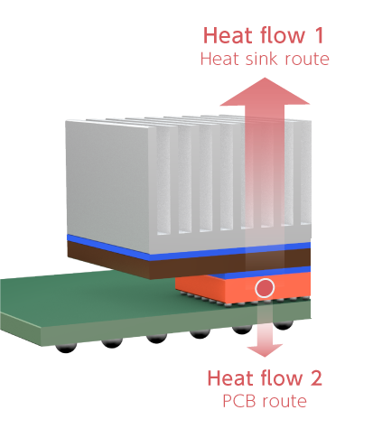
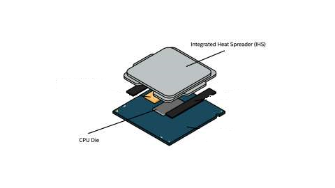
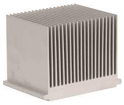
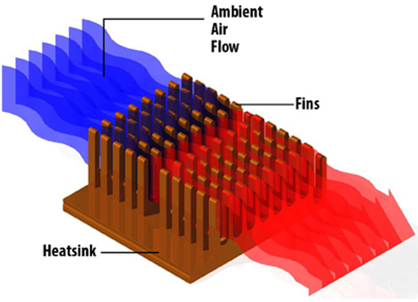

import ArticleHeader from "../../../components/header.astro";
import HardwareModule from "../../../components/module.astro";
import Step from "../../../components/step.astro";
import { Tabs, TabItem } from "@astrojs/starlight/components";
import { Card, CardGrid } from "@astrojs/starlight/components";

<ArticleHeader tomlPath="articles/Refroidissement:-airflow-et-tdp/airflow.toml" />

  **La chaleur est régulièrement source de stress, mais d'ou vient-elle ?
  Pourquoi ?**

Hello !

Deuxième article dans lequel on va un peu plus rentrer dans le détail du hardware, et cette fois-ci cet article traitera
d'un sujet sensible aux idées préconçues : Le refroidissement, et le fameux Airflow.

Mais refroidir quoi ? Comment ? Avec quels chiffres peut-on dire si on est efficace ?

On va retracer le parcours de la chaleur depuis sa création jusqu'à son évacuation, toujours dans le thème des PCs. Aller, c'est parti !

## Premier sujet : Refroidir quoi ?

Chaque composant de votre pc, même le plus petit qu'on a pu voir dans le dernier article, chauffent. Tous à des niveaux différents et
seuls certains nécessitent une solution de refroidissement. Cette chauffe provient directement de la consommation électrique du dit
composant, qui exploite cette énergie pour calculer et communiquer.

Cette chauffe, elle a une unité : Le Watt, qui est exprimé sous un nom très connu, et mal compris : le TDP (Thermal Dissipation Power).
Cette valeur à un sens physique : La puissance moyenne que doit être capable d'absorber le refroidissement pour assurer le fonctionnement
du composant en dessous. Mais ça, c'est chez les Bisounours... En réalité, le calcul est moins doté de sens :

<Tabs>
    <TabItem label="En clair">

        Chaque composant de votre pc, même le plus petit qu'on a pu voir dans le dernier article, chauffent. Tous à des niveaux différents et
        seuls certains nécessitent une solution de refroidissement. Cette chauffe provient directement de la consommation électrique du dit
        composant, qui exploite cette énergie pour calculer et communiquer.

        Cette chauffe, elle a une unité : Le Watt, qui est exprimé sous un nom très connu, et mal compris : le TDP (Thermal Dissipation Power).
        Cette valeur à un sens physique : La puissance moyenne que doit être capable d'absorber le refroidissement pour assurer le fonctionnement
        du composant en dessous. Mais ça, c'est chez les Bisounours... En réalité, le calcul est moins doté de sens puisqu'il n'est pas universel.

        D'autres marques, par exemple Intel, utilise une autre méthode : Cette fois-ci, le TDP est bel et bien une valeur thermique, celle définie
        ci-dessus. Le hic ? Cette valeur est mesurée à la fréquence de base. Pour un 13900K, le TDP a été mesuré à 3 GHz, soit un peu plus de la
        moitié de son boost nominale !

    </TabItem>
    <TabItem label="Pour les plus matheux ...">

        Chaque composant de votre pc, même le plus petit qu'on a pu voir dans le dernier article, chauffent. Tous à des niveaux différents et
        seuls certains nécessitent une solution de refroidissement. Cette chauffe provient directement de la consommation électrique du dit
        composant, qui exploite cette énergie pour calculer et communiquer.

        Cette chauffe, elle a une unité : Le Watt, qui est exprimé sous un nom très connu, et mal compris : le TDP (Thermal Dissipation Power).
        Cette valeur à un sens physique : La puissance moyenne que doit être capable d'absorber le refroidissement pour assurer le fonctionnement
        du composant en dessous. Mais ça, c'est chez les Bisounours... En réalité, le calcul est moins doté de sens.

        Sa formule mathématique est :

        $$
        TDP = \frac{T_{\text{case}} - T_{\text{Ambient}}}{\Theta_{\text{CA}}}
        $$

        Avec $T_{\text{case}}$ la température de jonction de votre processeur, $\Theta_{\text{CA}}$ l'efficacité du refroidissement, et
        $T_{\text{Ambient}}$ la température ambiante autour de la mesure. Nous ne retrouvons aucune notion de consommation électrique,
        pourtant très proche de la chauffe réelle du processeur grâce à l'absence d'autres pertes énergétiques (aucune pièces en mouvement).
        Le plus matheux d'entre vous aurons remarqué quelque chose : Il est possible de faire varier le TDP de votre composant en ne
        modifiant que la température ambiante, en l'augmentant. Vous montez le chauffage et votre processeur dissipe moins, magique !
        C'est pour cette raison que le TDP ne DOIT PAS être utilisé pour calculer une consommation.

        Cette formule, c'est bien joli, mais ce n'est pas universel. D'autres marques, par exemple Intel, utilise une autre méthode :
        Cette fois-ci, le TDP est bel et bien une valeur thermique, celle définie ci-dessus. Le hic ? Cette valeur est mesurée à la
        fréquence de base. Pour un 13900K, le TDP a été mesuré à 3 GHz, soit un peu plus de la moitié de son boost nominale ! Et ce paramètre
        il est très important, en électronique pour calculer la puissance dissipée on utilise la formule suivante :

        $$
        P_{\text{dissipe}} = \alpha \times V^2 \times F_{\text{\text{CPU}}}
        $$

        Autant dire, ce pauvre i9 il dissipe approximativement la moitié du votre ! D'autres calculs existent pour le TDP, selon les fabricants,
        tous aussi farfelus les uns que les autres.

        Pour l'anecdote, le TDP est aussi exprimé sous le nom TBP par moment : Il s'agit alors du TDP d'une carte complète, par exemple une
        carte graphique ou la VRAM par sa consommation doit aussi être refroidie. Ainsi, il a du sens de l'inclure dans les calculs thermiques.

    </TabItem>

</Tabs>

## Deuxième sujet : Par où passe la chaleur ?

Retour à nos composants, comment refroidir un composant ? Pour votre culture générale, cette étude porte le nom de thermique, et est
un métier à part. Cette discipline consiste en l'étude des matériaux lorsque chauffés pour définir entre autres la meilleure solution
pour refroidir un composant.

Mais, pour commencer, on a un souci : Un processeur, c'est bien trop petit pour dissiper suffisamment de chaleur pour se refroidir seul.
Par exemple, pour un 13900K consommant plusieurs centaines de watts, et ne disposant que d'une surface de quelques centaines de mm²
(~250 mm²), il lui faudrait être capable de dissiper une puissance supérieure à 1W / mm². Cela reviendrait à dissiper une puissance 10x
supérieure à celle d'un radiateur électrique de maison. Autant dire, c'est la surchauffe assurée.

:::note
**Petit aparté** : Des sécurités contre la surchauffe assurent un fonctionnement jusqu'à environ 105 degrés. Cependant, le processeur
est capable de fonctionner sans souci jusqu'à une température de 150 degrés, ne moyennant qu'une réduction de ses fréquences et de
sa durée de vie (de toute façon trop longue pour en voir le bout en usage réel). Le silicum, quant à lui, ne fond qu'à 1414 degrés,
aucuns risques donc.
:::

Retour à notre petit i9 : Comment lui éviter une surchauffe assurée ? Étant donné que l'on ne sait pas dissiper une telle puissance sur
une si petite surface, nous n'avons d'autre choix que d'augmenter la surface. Et pour cela, diverses interfaces existent, toutes pour
agrandir peu à peu la surface.

La première, l'IHS joue un double rôle : Protéger la puce en elle-même, et conduire la chaleur vers l'extérieur. Elle est reliée au
processeur via une interface thermique, généralement de la pâte thermique de qualité ou une soudure sur le processeur directement.
Mais, cette surface, quoique plus grande, reste insuffisante pour assurer le refroidissement : Pour rester dans l'exemple précédent,
on est toujours à environ 2x notre radiateur électrique. Cela reste trop élevé pour assurer un usage normal.

Après cette IHS, vient l'élément réellement en charge de la dissipation : Le radiateur.

Cet élément, produit à partir d'un matériau bon conducteur de chaleur comme le cuivre ou l'aluminium, joue un rôle de dissipation :
Par sa grande surface exposée (via les ailettes), il devient capable d'assurer le refroidissement d'un composant (bon, peut-être que
celui en photo ne suffira pas...).

Mais avant ce radiateur, se trouve un élément : La pâte thermique. Et cette dernière à un rôle plus qu'inattendu : Elle ne sert pas
à conduire la chaleur.

:::note
Les surfaces de l'IHS et du radiateur ne sont jamais parfaitement plates. La pâte thermique est là pour boucher ces aspérités,
et donc améliorer la conduction. Cependant, le gros de la conduction est réalisé entre l'IHS et le radiateur directement, sans
passer par la pâte. Cette dernière est en effet 20 à 25 fois moins performante que le contact entre les deux métaux. C'est pour
cette raison que certains modifient leur IHS, radiateurs, voire démontent l'IHS : Ils veulent réduire le nombre d'étapes thermiques.
:::

Un radiateur comme présenté ci-dessus peut amplement convenir pour un chipset (c'est d'ailleurs ce qui est intégré sur votre carte
mère), autant il peut se montrer insuffisant pour de plus gros composants (processeurs, GPU...). Cette insuffisance peut venir d'un
facteur : La capacité à conduire la chaleur du matériau qui est limité, il n'arrive ainsi pas à diffuser jusqu'à ailettes le plus
éloignées pour refroidir. Pour ce problème, il existe des solutions très simples : On ajoute des éléments chargés de déplacer la
chaleur, et non la dissiper.

<Tabs>
  <TabItem label="Les caloducs">
    Ces tubes en cuivres, très présents dans les ventirads, GPU ou pc portables,
    ont un rôle simple : Déplacer la chaleur. À l'intérieur se trouve un liquide
    porteur de chaleur qui va circuler du côté chaud vers le côté froid, et
    inversement. Seul un effet physique est ici moteur, ce qui explique leur
    silence et leur fiabilité.
  </TabItem>
  <TabItem label="Eau">
    Ce liquide est bon porteur de chaleur. En utilisant un système à base de
    pompe, il devient facile de déplacer la chaleur d'un point vers un autre.
    C'est ce principe qui est utilisé dans le watercooling (avec des additifs).
    Le watercooling custom est aussi basé sur cette solution, en utilisant des
    éléments choisis séparément au lieu d'un ensemble.
  </TabItem>
  <TabItem label="Huile">
    Ce liquide particulièrement porteur est tellement efficace que son contact
    seul à la surface de l'IHS suffit à maintenir le processeur à une
    température acceptable. C'est une solution utilisée souvent dans les
    serveurs, puisque permettant une densité de composants bien supérieurs.
    Cependant, l'huile ne se refroidit pas seule : Il est nécessaire d'y ajouter
    un système de radiateurs externes. Cette solution peut être vue comme placer
    son PC DANS son watercooling. Elle présente l'avantage de pouvoir être
    mutualisé avec d'autres serveurs, et donc économiser de la place et des
    couts.
  </TabItem>
</Tabs>

Quelle que soit la solution, un radiateur sera l'élément final et s'assurera de dissiper la chaleur dans l'air.

## Dernier sujet : Que faire de la chaleur dissipée ?

C'est bien beau, maintenant, on sait d'où vient la chaleur, et comment est déplacée. Une dernière problématique apparait donc :
Que faire de cet air chaud ?

Naturellement, l'air chaud se déplace par convection, c'est-à-dire que l'air chaud monte et l'air froid descend. Cet effet est
relativement faible, et très vite une bulle d'air chaud va se créer autour du radiateur. Si le radiateur est assez grand, il ne sera
pas gênant puisque limité, et le radiateur sera capable de refroidir n'importe quel processeur, mais l'on parle alors d'un radiateur
de presque 10 Kg...

Pour se débarrasser de cette bulle d'air chaud, si la solution naturelle ne suffit pas, on peut la forcer. Avec l'aide d'un ventilateur,
on va pousser l'air chaud plus loin, essayant donc de maintenir une température autour des ailettes la plus constante possible pour
conserver les performances de votre système. Avec suffisament d'air frais qui passe au travers d'un radiateur, il devient possible
d'en réduire sa taille tout en conservant un refroidissement similaire. Par exemple, dans les serveurs on refroidi un processeur
consommant beaucoup avec un petit radiateur, mais un débit d'air extrèmement important !

Cependant, votre ventilation pour se montrer efficace doit respecter quelques astuces :

- Pensez à ne pas pousser de l'air chaud dans votre radiateur, cela aura un effet contreproductif

Partant de ce fait, on arrive sur un thème très vague :

## L'airflow.

Ce dernier consiste en la conception d'un boitier, le placement des ventilateurs et ouvertures de façon à optimiser le refroidissement.
Quelques astuces peuvent être données pour faire son airflow de la meilleure de façon possible :

<Tabs>
  <TabItem label="Entrées">
    Une entrée d'air frais doit être accessible pour chaque composant sensible.
    Cette entrée doit se trouver là où l'air frais se place naturellement, soit
    en bas. À défaut, on évite les entrées proches d'un mur, plus susceptible
    d'être chauds, donc sur l'avant du boitier (exposé à l'intérieur de la pièce
    donc).
  </TabItem>
  <TabItem label="Sorties">
    Les sorties d'air chaud doivent être placées de manière à expulser l'air
    chaud au plus vite, sans perturber les flux d'air frais : Ainsi, il faut les
    placer sur le haut du boitier, et sur l'arrière du boitier (généralement
    placées en haut).
  </TabItem>
  <TabItem label="Ouvertures">
    Chaque entrée / sortie doit être dégagée : Essayer d'aspirer de l'air à
    travers une vitre ne marche pas bien. Cela réduit fortement l'airflow
    global.
  </TabItem>
  <TabItem label="Equilibre">
    Il devrait y avoir environ autant d'entrée que de sorties. Ne faire que
    entrer de l'air, ou sortir est contre productif : Avec aucun accès, ou
    aucune sorties, l'airflow est mauvais.
  </TabItem>
</Tabs>

Sur l'image, on a un exemple d'air flow correct : Deux entrées sur l'avant, et des sorties en haut et sur l'arrière. Certes, il n'y a
pas autant d'entrées que de sorties, et cela pourrait le rendre meilleur.

Il n'existe aucune manière de quantifier l'airflow : On peut le considerer réussi si les températures sont satisfaisantes,
et qu'aucun composant ne se limite.

Est ce que l'airflow est important ?

OUI ! C'est même primordial. Un bon airflow compense sans soucis des ventilateurs moins performants, mais l'inverse ne sera pas vrai. Prenez plutot
des ventilateurs qui vous plaisent avec un bon boitier que l'inverse.

Un bon airflow peut sans soucis vous réduire la température de fonctionnement de votre pc, de plusieurs degrés voire dizaines de degrés !

C'est (déjà) la fin de l'article, à la prochaine !

Tchuss !
