import ArticleHeader from "../../../components/header.astro";
import HardwareModule from "../../../components/module.astro";
import Step from "../../../components/step.astro";
import { Tabs, TabItem } from "@astrojs/starlight/components";
import { Card, CardGrid } from "@astrojs/starlight/components";

<ArticleHeader tomlPath="articles/Stockage-et-bits/stockage.toml" />

**Comment est-ce qu'un PC stocke de la donnée ?**

Hello !

On continue la série du hardware technique, et aujourd'hui petit (non) dossier sur le stockage informatique.

Comment, en l'espace de 70 ans, nous sommes passés du HDD de 5 Mo au SSD de 100 To ?

Aller, petit tour historique avec explications !

Toute cette histoire de bits, elle a commencé avec les débuts de l'informatique, dans les années 50, et depuis évolue...

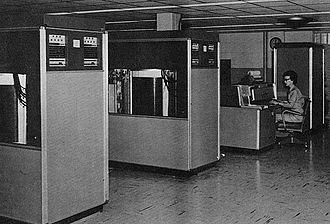
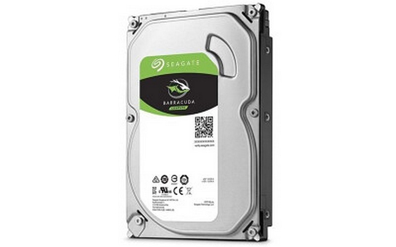
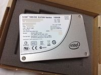

N'est-ce pas beau, 70 ans d'évolution ?

Et non, vous ne rêvez pas, les deux armoires d'une tonne chacune au premier plan sont deux disques sûrs, de 5 Mo chacun !
Capables de débiter... 8.8 Ko/s au maximum, il faut être patient... Au centre, on y voit un HDD, puis un SSD... De
plus en plus de stockage dans de moins en moins de place

Depuis, nous avons augmenté la capacité d'un facteur 8 000 000, réduits la taille d'un facteur 56 000, ou réduis le prix
d'un facteur 6 800 000 000 ! (et c'est le cas pour bien d'autres facteurs encore !)

## Mais comment que ça marche un HDD ?

Le principe est assez simple, la réalisation un peu moins.

HDD, ça veut dire Hard Drive Disk, connu chez nous sous le nom de Disque Dur. Et ils ne portent pas leur nom aux hasards,
en effet l'information est stockée sur des disques, qui sont... bah durs.

Ces disques sont en réalité magnétiques, et ils stockent l'information en modifiant le champ magnétique de ces disques.
Et ensuite, il "suffit" de le mesurer pour lire. Facile !

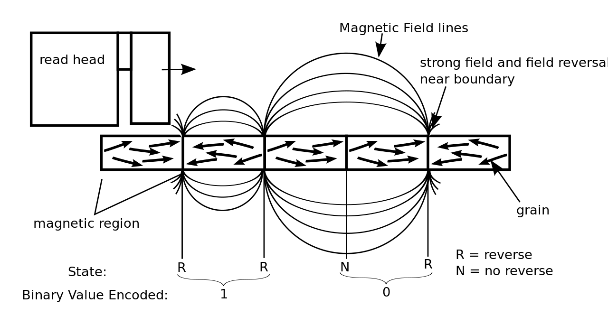

Selon le sens de plusieurs aimants contigus (= côte à côte), nous avons donc un 1 ou un 0 (les aimants dans le même sens
se cumulent et à l'opposé, ils s'annulent).

Afin d'augmenter le nombre de ces aimants, on les place sur une grande surface, en 2D. Et pour être capable d'y accéder
partout facilement, on boucle cette surface sur elle-même. Et paf, ça fait (non, pas des chocapics), mais un disque !

Ce dernier étant en rotation, en ne déplaçant la tête de lecture que sur un seul axe, nous pouvons parcourir l'entièreté
de la surface.

Depuis toujours, afin de donner une capacité suffisante, plusieurs disques ont été superposés.

Et ces disques, pour y accéder au plus vite (c'est souvent ça l'impression de fluidité, plus que le débit brut), on a
commencé par dupliquer les têtes ! À l'origine, une seule tête se promenait entre plusieurs disques, sur trois axes.
Désormais, elles ne bougent plus que sur une seule dimension.

Et pour améliorer (encore) les performances, on a essayé d'accélérer les disques (latence plus faible et débit supérieur)
mais il a pour cela fallu les réduire en taille. Eh oui, faire tourner un disque de 60 cm de diamètre pour les premiers HDD
à +1000 tours par minute, c'est complexe. Au cours de l'histoire, les disques se sont donc montrés de plus en plus petits (jusqu'à 1.8 pouce),
et de plus en plus rapides (+ 10 000 tours par minutes).

Pour finir, d'autres technologies sont apparues, notamment vis-à-vis des matériaux ou du placement des têtes. Ces disques
sont pour certains encore en développement (Double tête ou disques à l'hélium pour d'autres).

Pour finir, il faut ajouter qu'une grosse partie électronique est associée à ces mécanismes pour assurer la mesure, le
positionnement des têtes de lecture, ainsi que le traitement des données et la communication avec le reste du PC.

## Mais tout ça, c'est nul à côté d'un SSD !

Eh oui, depuis longtemps (fin des années 80), on sait produire des mémoires électroniques pures, nommées NAND et NOR. Et
attention, le monde de la mémoire Flash (tout ce qui n'est pas disque dur), ce n'est pas forcément meilleur !

Cette mémoire flash, on la croise communément sous le nom SSD, pour Solid State Drive. Ce nom vient de l'absence d'éléments
mécaniques notamment.

En voici un petit exemplaire de mémoire Flash. Technologiquement proche d'un SSD, mais en performances... Oula ! N'en rêvez
pas, ce petit truc est sacrément lent...

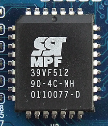

## Mais comment que ça marche, de la mémoire Flash ?

Tout est basé sur des transistors (eh oui, ces démons) de technologie MOS. Pour ici, pas besoin de tout savoir (ouuuf),
mais voilà la base : Un transistor agit comme un interrupteur, commandable électriquement. Là où ça devient rigolo, c'est
que selon la force d'activation, il va laisser passer plus ou moins (de manière grossière, ce n'est pas le comportement
exact décris ici).

Stocker de l'information dans de la Flash, ça revient à activer cet interrupteur, et faire en sorte qu'il mémorise une
partie de cet état. Et à la prochaine lecture, on va activer moyennement l'interrupteur, et selon son état stocké additionné
à l'état intermédiaire, il va être activé plus ou moins par rapport à la référence.

Et voilà, notre 0 ou 1 !

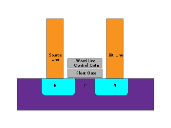

La zone de mesure est entre les bornes en orange, et la zone de mémorisation est celle en gris au milieu (la plus basse).
Le contrôle est la zone grise supérieure.

Pour comparaison, un SSD peut accéder à n'importe quelle position très rapidement sans devoir se déplacer physiquement
(rotation + têtes de lecture). Il présente ainsi un gros avantage face aux HDD. Mais ce n'est pas tout, coté consommation
et résistance mécanique, il est aussi très largement avantagé par l'absence de pièces mécaniques notamment.

**Mais ça, c'est le monde des bisounours...**

Eh oui, un SSD ça peut être conçu de plein de manières différentes, complexifiant ainsi le choix. La gamme de stockage
flash, ça va de votre carte SD douteuse aux SSD ultra-rapides en NVMe ...

Voici quelques points d'attention :

Les niveaux par cellule : Afin d'augmenter le nombre d'informations stockées dans une même puce, on a eu l'idée de stocker
plusieurs bits par cellule. On est passé de l'interrupteur et ouvert ou fermé à mesurer à combien de pourcents est-il ouvert ?

Cela complexifie la mesure, et ralentis généralement le stockage.

Le nombre de bits est présenté sous la forme d'une appelation : xLC.

- SLC = Single Level Cell, soit le système présenté.
- MLC Multi\* Level Cell (2 bits / 4 niveaux)
- TLC (Triple Level Cell) (3 bits / 8 niveaux)
- QLC (Quad Level Cell) (4 bits / 16 niveaux)
- PLC (Penta Level Cell) (5 bits / 32 niveaux)

:::note
Notez le petit \* après Multi de MLC, en effet MLC est souvent utilisé pour designer deux bits par cellule, cependant,
certains constructeurs (coucou Samsung) utilisent une tournure de phrase pour désigner tout ce qui n'est pas SLC. Et plus
il y a de bits par cellule, moins cette dernière est fiable et rapide. Attention donc !
:::

Vitesse vs réactivité : On voit de plus en plus de fabricant vendre des SSD capables de +2 go/s, à des prix dérisoires.
Attention ici aussi !

Un SSD, ça a plusieurs caractéristiques : La vitesse et la réactivité. Le premier est généralement mis en avant, puisque
facile à concevoir. Lire ~250 000 000 de cellules côte à côte, c'est simple et rapide. Lire 100 cellules, puis passer à
l'autre côté du SSD, lire 1000 cellules, puis revenir au point de départ tout en garantissant une bonne vitesse, c'est
nettement plus compliqué !

La ou le premier se mesure en MB/s, le deuxième se mesure en IOPS (Nombre d'opérations aléatoires par secondes). Le deuxième
n'est presque jamais mis en avant (sauf sur modèles haut de gamme), mais est pourtant responsable de la majorité des
performances dans un usage quotidien... Combien de fois installerez-vous des jeux de 100 Go et plus ? Et combien de fois
démarrerez-vous Windows ? Combien de fois lancerez-vous vos launcher et logiciels favoris ? Ces deux usages se montrent
très gourmant en IOPS, mais peu en débit. Attention donc !

Ainsi, si le budget ne vous le permet pas les deux, privilégiez un SSD bon en aléatoire par rapport à un SSD qui sort 5 Go/s,
mais ne tient pas la cadence en aléatoire.

## Capacités : vendues vs affichées

N'avez-vous jamais acheté de SSD de 1 To, pour vous retrouver avec un modèle de 931 Go ? Vous vous êtes senti arnaqués ?

Tout cela est parfaitement normal et dû à une incompréhension des unités informatiques : Eh oui, 1 Go =/= 1 Gio...

Nous avons l'habitude de compter en base 10, c'est-à-dire que pour vous 1000 Mo = 1 Go. Sauf que l'informatique, c'est un
monde binaire, de 0 et de 1. Et 1000 n'est pas un nombre binaire qui tombe directement sur une puissance de deux.
La plus proche, c'est 1024, soit 2E10. Et c'est exactement de là que vient cet écart. (1 Go = 1000 Mo ; 1 Gio = 1024 Mo ...)

Windows, il affiche juste la capacité réelle en Kio, sous l'unité KB. Cela est parfaitement logique, mais notre cerveau
d'humain s'attends à une base 10 et non 2.

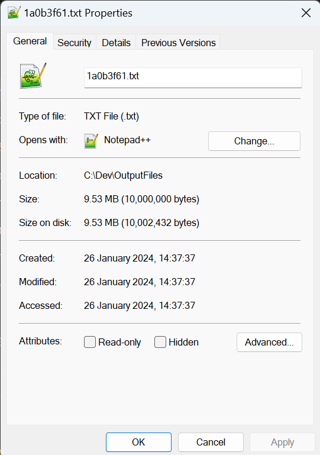

Pour vous en convaincre, regardez mon fichier ci-dessus : 10 000 000 d'octets, tout rond ! Mais 9.53 Mo, ou 9766 Ko...
(affichés dans l'explorateur de fichiers) Pourquoi ?

10 000 000 / 1024 = 9765.625, à un arrondi près, vous y êtes à ce 9 766 KB. Et divisiez encore par 1024 ? 9.5367 Mo, idem
à un arrondi près !

Et ça marche pareil pour un stockage de 1 000 000 000 000 d'octets… Divisez-trois fois par 1024, et vous obtiendrez 931 Go.

Pour, vous rassurez, ceci n'est que représentation numérique, vous avez bel et bien votre capacité payée. Tout est proportionnel,
vos fichiers seront, eux aussi, affichés plus petits qu'ils ne le sont en vrai.

:::note
Ce comportement est propre à Windows, sur Linux vous verriez bien la taille annonée.
:::

## Photo de famille

Pour finir, un petit tour des stockages selon le temps et leurs technologies majeures :

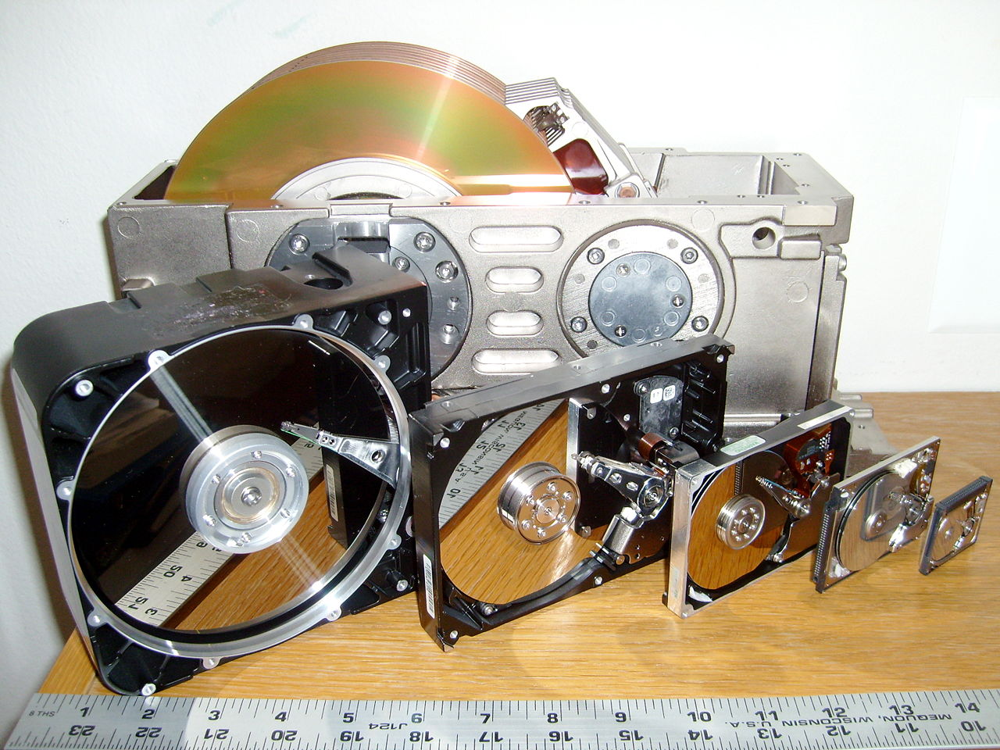

Et voilà une photo de famille ! Ne sont-ils pas mignons ces HDD ?

Ils représentent globalement l'évolution au cours des années : De plus en plus petits, mais stockent de plus en plus !

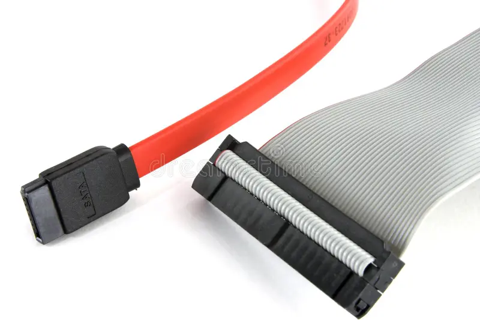

Ah, une photo avec un ancêtre, et un (futur ancêtre)... Nos deux PATA et SATA, quelles beautés. Ils permettent de brancher
un stockage à un système maître, par exemple une carte mère. Le gros, large et gris (moche) Parallel-ATA (PATA ou IDE) a été
remplacé par le petit rouge, connu sous le nom de Serial-ATA. (SATA). Ce dernier est lui aussi en voie de disparition, au
profit du PCIe, via les SSD NVMe...

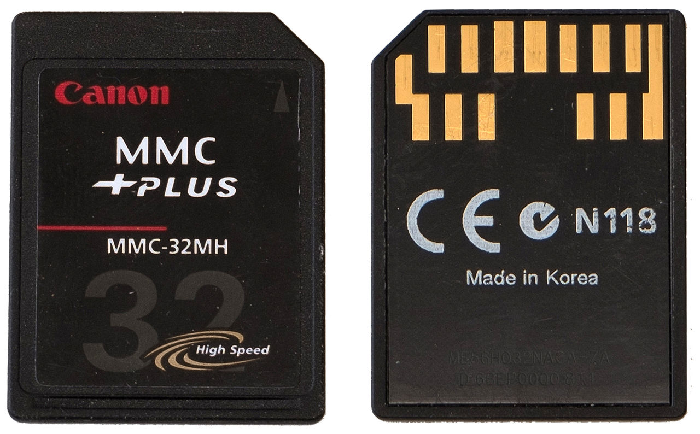

Ah, la carte MMC ! Attention, malgré le fait que ça soit proche technologiquement d'un SSD, plusieurs raisons (dont le bus
et les interfaces) les rendent lentes... Celles en photos ne vous donneront guère plus de 10 Mo/s. Et si vous pensiez ça
disparu, raté !
On retrouve beaucoup de cette mémoire, en version embarquée (eMMC) dans des pc portables pas chers. Certes, ça va plus vite,
mais avec un maximum annoncé à 600 Mo/s (donc un aléatoire nettement inférieur), ne vous attendez pas à des performances folles...

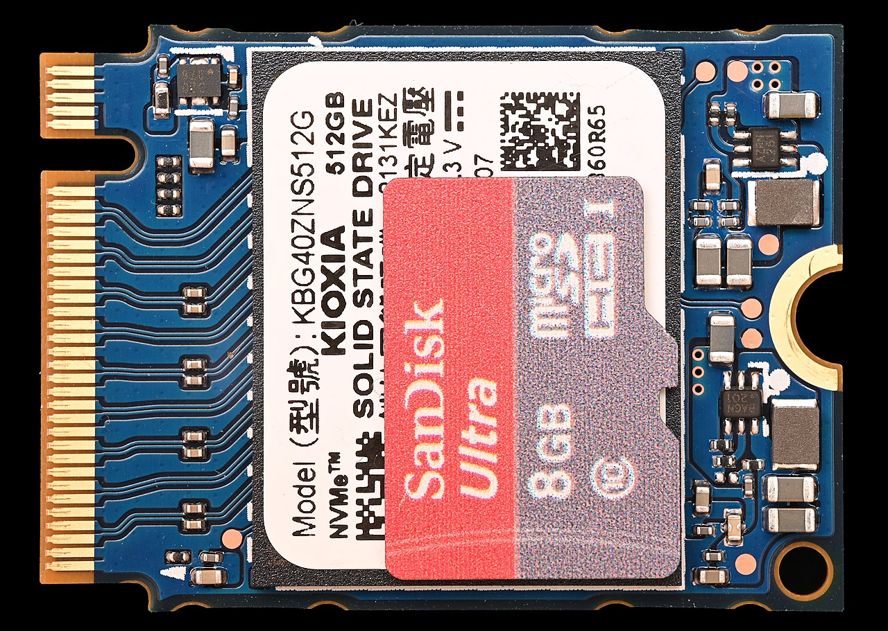

Le NVMe. Le roi de la vitesse ! Avec une interface dédiée à haute vitesse (PCIe), il permet de battre des records de vitesse.
Mais attention, le port M2 peut-être utilisé pour plusieurs autres choses, vérifiez bien vos compatibilités pour en tirer le meilleur...

En plus, il est petit (photo d'une carte MicroSD au dessus) donc très interessant pour une grosse densité de stockage !

## Conclusion

Et voilà pour ce grand tour du stockage informatique, à la prochaine !

Tchuss !
