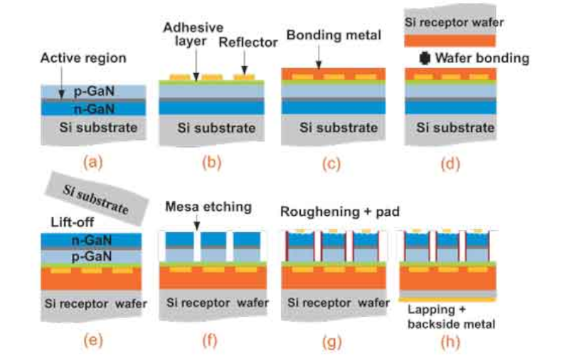
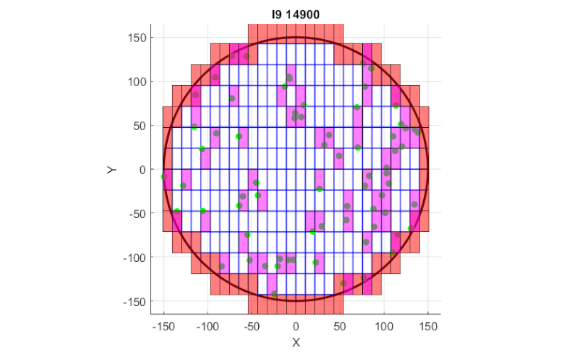
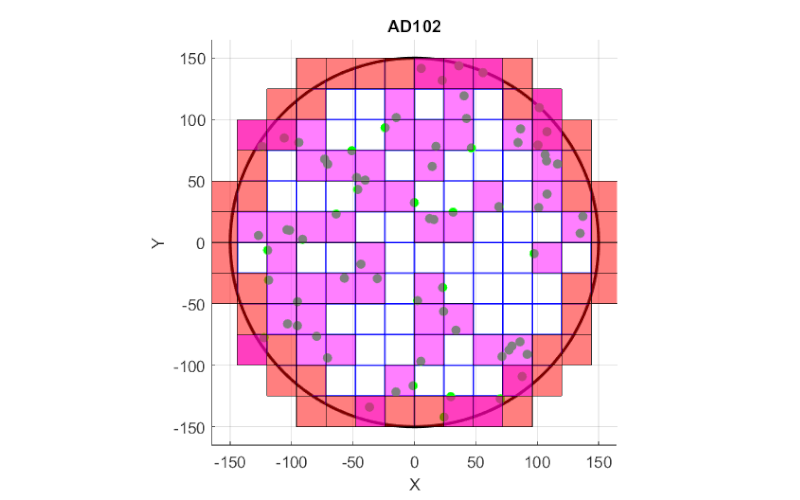
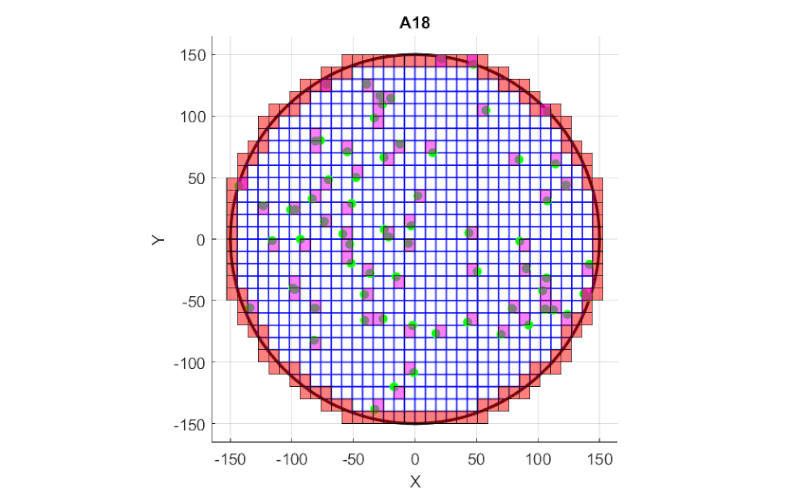
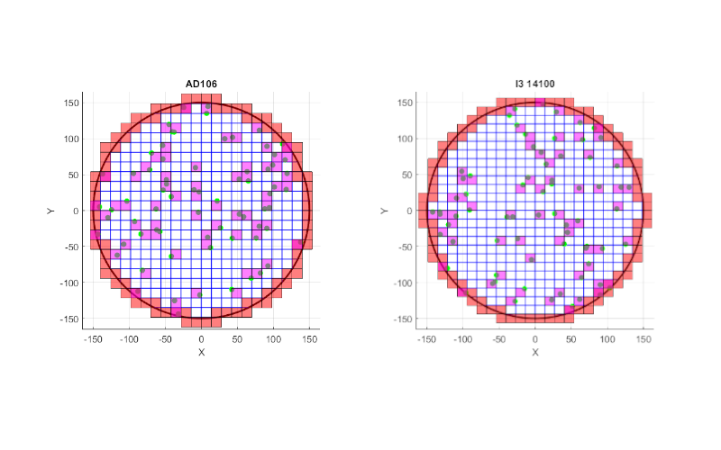
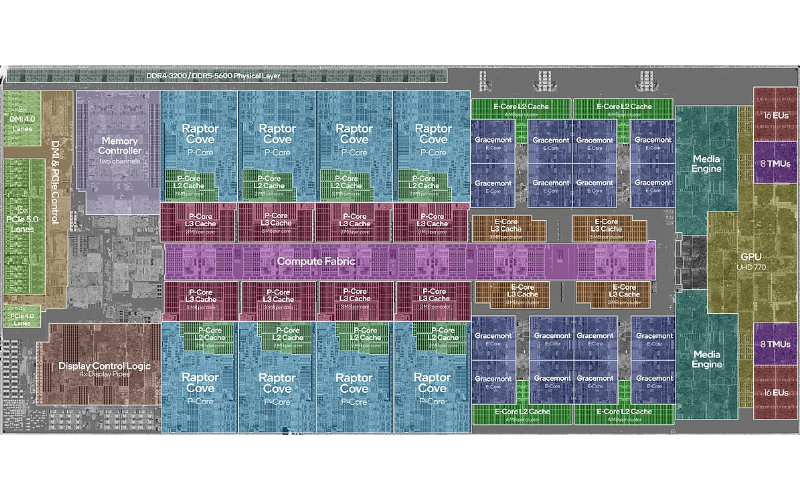

import ArticleHeader from "../../../components/header.astro"; 
import HardwareModule from "../../../components/module.astro"; 
import Step from "../../../components/step.astro"; 
import { Tabs, TabItem } from "@astrojs/starlight/components"; 
import { Card, CardGrid } from "@astrojs/starlight/components"; 

<ArticleHeader tomlPath="articles/Un-i5-est-un-i9-rate/binning.toml" />

  **La légende n'est pas fausse, un i5 est bien un i9 raté !**

Hey ! Aujourd'hui, article très technique, accrochez-vous ! On va blablater du yield rate, 
ou de pourquoi vos i5 sont en réalité des i9 ratés...

Mais avant, cherchons à comprendre comment un processeur, GPU ou n'importe quel autre composant est
fabriqué ! (Petit disclaimer : Seul un passage rapide sera fait ici, je vous link des liens en bas pour
les plus intéressés).

## Comment on fabrique une puce ?

Tout commence par du silicium en fusion, que l'on va faire cristalliser de manière parfaite (pureté très
proche de 100% (en règle générale, 99.999999999%)), et à haute température ! En ressort de gros cristaux
cylindriques de 300 mm de diamètre, qui seront découpés en tranches, les fameux Wafers !

Ensuite, nous allons graver dans ce silicium les éléments pour en faire un semi-conducteur, en y ajoutant
des éléments chimiques (Bore ou Phosphore en l'occurrence). Cet ajout est… brutal pour le coup, puisqu'on vient
les projeter à grande vitesse pour les insérer dans un cristal de silicium. Ils viennent casser des liaisons
existantes pour s'incruster dans la matière.

Pour donner ses propriétés de semi-conducteur, il est nécessaire de ne pas polluer avec ces éléments l'ensemble
de la surface, c'est donc pour ça que l'on va protéger certaines zones avec un masque, qui aura été déposé auparavant.
(On parle ici de motifs de la taille de vos transistors, donc quelques nm. C'est à ce moment que l'on retrouve les
acronymes UV / EUV ...).

On répète l'opération autant que nécessaire afin de former les composants nécessaires, puis pour finir, nous ajoutons
diverses couches de métal qui permettent de connecter ces transistors entre eux (si l'option de rester dans le
silicium n'était pas possible).

Voilà une petite image qui explique en graphique le process, de manière très simplifiée (On y applique des couches, 
puis creuse, etc jusqu'à la fin du process).

Au total, il s'agit d'un très grand nombre d'opérations, toutes très complexes et demandant une précision extrême.

## Quand la réalité arrive, le monde n'est plus parfait...

Naturellement, on peut s'imaginer que des défauts seront présents. Ils peuvent venir d'une impureté dans le cristal
en entrée, ou bien d'un déplacement d'un élément chimique qui n'a pas été contrôlé.

Cela entraîne toujours un dysfonctionnement dans la puce finale. En général, on peut considérer que les défauts sont
répartis uniformément avec une moyenne de 0.1 défaut / cm² pour un process maîtrisé.

Un défaut, qu'est-ce que c'est ? ça peut être un transistor mal formé, une connexion mal faite...

Un défaut, une fois présent ne peut pas être corrigé, et peut entraîner des erreurs, des instabilités... Bref, beaucoup
de choses pas souhaitables dans un PC !

Heureusement, on sait parfaitement les détecter : Grâce à des technologies de tests automatiques (JTAG), on est capable
de vérifier presque 100$ de la puce en quelques secondes. Mais donc, pourquoi je parlais au début de binning ? Quel est
l'objectif si on peut arriver à 100% de réussite en sortie de l'usine ?

Et bien, c'est une raison financière. Un wafer, ça coûte extrêmement cher ! Pour donner une idée, on parle d'environ
18 000$ en janvier 2025 pour une technologie récente...

## Les défauts, en images !

Maintenant, pour mieux comprendre, quelques images (que j'ai générées moi-même, avec un logiciel) :

:::note[disclaimer]
Les tailles des puces pourraient ne pas être exactes. Par le secret industriel, ces informations sont
souvent confidentielles. Il est cependant possible de les estimer en connaissant leur surface (elle, publique) et en
utilisant une référence de taille connue si la puce est visible. L'ensemble des images ci-dessous ont une surface précise
à 1%.
:::

Pour chaque image, le principe est le même :

Nous y retrouvons un cercle, qui représente le wafer en lui-même (ici 300 mm, le standard dans l'industrie de pointe !).

Sauf que nous, on grave... des carrés / rectangle, donc immédiatement, les bords sont inutilisables... Ces puces sont donc
coloriées en rouge.

Et ensuite, chaque point vert représente un défaut (générés aléatoirement), qui rend donc sa puce inutilisable.

:::note[disclaimer 2]
Je parlerai dans les paragraphes suivants d'un prix, ce dernier est bien évidemment théorique à 100%, 
et pourrait ne pas refléter la réalité. Il permet cependant de s'imaginer l'impact sur le coût final du produit. D'autant
plus que ce dernier représente le prix matériel, et non celui qui inclut : La recherche et développement, la mise en boîtier, 
l'emballage, et toutes les charges associées ! Il est inutile s'essayer de le comparer au prix payé pour ces composants.
:::

En voici un exemple, pour l'Intel Core i9 14900(K) :

A première vue, le résultat semble plutôt bon, il y a un bon nombre de puces réussies ! (très exactement 179 !). Il existe
cependant un problème : les 61 puces touchées par un défaut sur une surface exploitable.

Et cela se voit sur le coût final par puces : Pour 179 puces, nous sommes à environ 100$ unité, tandis que si nous arrivions
à ne produire aucun défaut, le coût chuterait à ~75$ ! 25% de différence, en n'ayant fait rien de plus ! Cela n'est pas négligeable.

Comparant maintenant à une autre puce, bien plus grande : La AD102, qui équipe les RTX 4090 !

On remarque assez vite : Plus la taille de la puce est grosse, plus les défauts l'affecteront ! Il suffit de regarder la AD102, 
ou seules 39 GPU sont fonctionnels à 100%, comparés aux 53 défectueux ! Cela fait exploser le prix à plus de 450$ la puce seule !
Pour donner une idée, réussir 100% des GPU ferait baisser le coût à 195$ ! La différence est ici énorme 42% !

On continue vu que je trouvais joli, je vous laisse les autres images d'autres puces (i3 14100, AD106 (RTX 4060) et Apple A18), 
mais de manière plus dense...

Et les quelques infos en brut :

<Tabs>

    <TabItem label="Apple A18">

        - 697 OK
        - 128 en dehors - 67 puces ratées
        - Soit un coût par puce  de : 25.8250 (~23.5 avec 100%)
        

    </TabItem>

    <TabItem label="Nvidia AD106">

        - 265 OK
        - 88 en dehors - 67 puces ratées
        - Soit un coût par puce  de : 67.9245 (~55$ avec 100%)
        

    </TabItem>

    <TabItem label="Intel i3 14100">

        - 327 OK
        - 96 en dehors - 65 puces ratées
        - Soit un coût par puce  de : 55.0459 (~45$ avec 100%)
        

    </TabItem>

</Tabs>

On utilise le terme yield rate dans l'industrie afin de donner un chiffre, en % du nombre de puces réussies. Cet indicateur
dépend fortement d'un paramètre : La taille de la puce. : un défaut, c'est très localisé. Si la puce est petite, j'ai pu en
mettre plus sur mon wafer, et donc en perdre moins sur le total ! Cela peut être vu avec les images précédentes, 
il y a très exactement le même nombre de défauts sur l'ensemble des graphiques, seule la taille change.

Maintenant, regardons à nouveaux ces défauts, et pour cela, utilisons une photo d'une puce de silicium : Ici, un 14900k.

Nous retrouvons plusieurs cœurs (eh bah, c'est un scoop ça sur un i9 ?!?). Si un défaut se produisait sur l'un deux, quelle en
est la conséquence ? Comme expliqué précédemment, cela risque d'entraîner des erreurs de calculs et / ou des instabilités. Mais, 
ce défaut n'est que sur un seul cœur !

Ce principe peut s'appliquer à la majorité des puces désignées en ce moment, nous retrouvons plusieurs dizaines, voire milliers
de blocs identiques dupliqués (cœurs, cuda...).

C'est donc à ce moment que nous arrivons au binning :

## Le binning, enfin !

L'idée du binning, elle est très simple. C'est de désactiver des fonctions ou parties ratées pour en récupérer une puce, certes
incomplète, mais fonctionnelle, et donc la vendre comme un modèle plus petit ! Cette désactivation est généralement faite via des
fusibles, qui sont fondus dans la puce afin de garantir leur désactivation.

Pour reprendre l'exemple avec le i9 précédent, si un ou deux cœurs se voyaient être ratés, on peut simplement les désactiver et
vendre le processeur comme un i7 ! Si d'autres encore se voyaient, eux aussi, ratés, on pourrait le vendre comme un i5, …

Cela profite à tout le monde :

* Au fabricant qui peut vendre des puces perdues pour un prix inférieur, mais tout de même en tirer un bénéfice. -
* Au client qui lui pourra acheter une puce moins chère, qui peut répondre à ses besoins s'ils ne sont pas particulièrement poussés.

Et contrairement à ce que l'on voit passer, non ce n'est pas une pratique scandaleuse. L'ensemble des puces sont testées rigoureusement, 
et vérifient des critères précis, Quelle que soit la gamme. Ce n'est pas parce que le i5 est un i9 raté qui ne restera pas un i5, il
répond parfaitement aux critères pour être un i5 ! Vous aurez juste quelques transistors inertes en plus dans votre puce.

Pour finir, quelques petites précisions sont à apporter :

* Certains fabricants décident volontairement de définir la puce maximale vendue comme déjà incomplète. Cela permet de s'accommoder
  de défauts mineurs (ex : RTX 4090, la conception comporte plus de cœurs que ceux activés dans celles vendues)
* Certains fabricants (AMD notamment) utilisent une stratégie MCM, ou plusieurs puces sont utilisées. Il est donc plus facile de
  faire le tri, et le binning réalisé est moins agressif (ayant un découpage plus large).

De plus, à titre informatif : C'est un sujet très complexe, certains chercheurs ne font que ça, optimiser et mesurer cette pratique !

## Conclusion

Et voilà, c'est tout (et déjà assez pour aujourd'hui, pfiouu) !

Tchuss !

Et les petits liens comme promis (anglais)

[From Sand to Silicon: The Making of a Microchip | Intel](https://www.youtube.com/watch?v=_VMYPLXnd7E)
[Extreme_ultraviolet_lithography](https://en.wikipedia.org/wiki/Extreme_ultraviolet_lithography)
