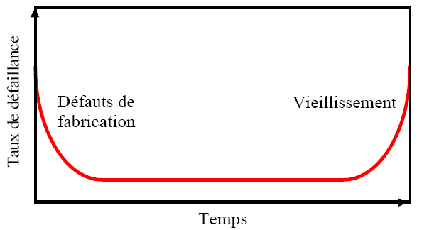

import ArticleHeader from "../../../components/header.astro"; 
import HardwareModule from "../../../components/module.astro"; 
import Step from "../../../components/step.astro"; 
import { Tabs, TabItem } from "@astrojs/starlight/components"; 
import { Card, CardGrid } from "@astrojs/starlight/components"; 

<ArticleHeader tomlPath="commu/Garanties-menteuses/garantie.toml" />

	**Ou pourquoi l'extension de garantie est une arnaque**

On voit souvent sur les sites d'e-commerce des extensions de garantie après deux ans... Pourquoi ces dernières sont-elles les plus rentables pour eux ? 
Parce que statistiquement, c'est là où votre PC sont les plus fiables !

Il faudrait que ton produit casse après deux ans et avant trois ans (je ne te souhaite pas ça !).
Et c'est là que se cache l'anguille, c'est qu'en moyenne, tu as deux périodes où un produit casse (en général). On appelle ça la courbe en baignoire, 3 zones : 

<Tabs>

    <TabItem label="0-1 an">

        **Jeunesse** : Le système n'est pas encore fiable, sensible aux défauts de fabrication. 
        La garantie de deux ans obligatoire est justement là pour ça, te couvrir de ces défauts parfois indétectables !

    </TabItem>

    <TabItem label="1-10 ans">

        **Maturité** : Le produit est fiable et éprouvé. Très peu de probabilité de casse seule 
        (sauf si maltraitance / Entretien absent (pas/peu valable en électronique))

    </TabItem>

    <TabItem label="> 10 ans">

        **Vieillesse** : Le produit fatigue, et une casse est de plus en plus probable. Aucune couverture de garantie ici.

    </TabItem>

</Tabs>

Mais donc extensions de garantie, tu payes pour pas grand-chose. La probabilité d'une casse prise en garantie est 
minime pendant cette période facturée à prix d'or !

Tchuss !
