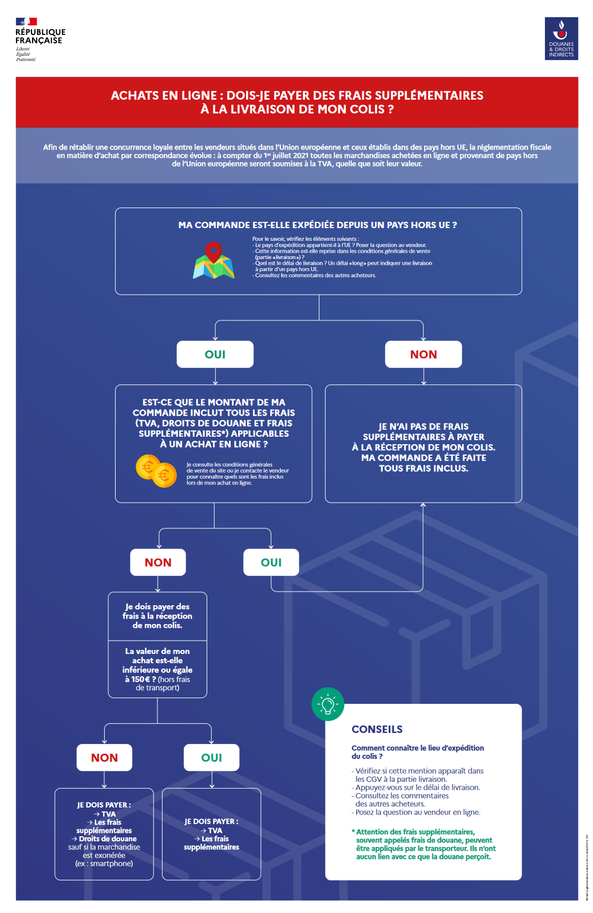

import ArticleHeader from "../../../components/header.astro";
import HardwareModule from "../../../components/module.astro";
import Step from "../../../components/step.astro";
import { Tabs, TabItem } from "@astrojs/starlight/components";
import { Card, CardGrid } from "@astrojs/starlight/components";

<ArticleHeader tomlPath="tutorials/Attention-a-a-la-douane/Douanes.toml" />

  Acheter à l'étranger peut-être très intéressant, mais aussi risqué. Faites
  bien attention à certains points !

Pour tout ceux qui voudraient commander sur Aliexpress, lisez ceci avant de vous faire avoir par la douane

Comme le montre le petit dessin de la douane, dans le cas de processeurs de valeur supérieure à 150€ (expédiée hors UE !)(hors frais de port),
on s'expose à des taxes douanières.

Aliexpress ne compte que la TVA, les frais supplémentaires ne sont pas payés, et risquent d'etre demandés. Ils peuvent etre payés à la
commande, ou à la réception.
Ces frais peuvent être des frais supplémentaires / Droits de douane.

En règle générale, en passant par des sites reconnus, il n'y a aucun soucis. Moneyant une livraison relativement couteuse (15/20€ pour 100€),
le transporteur s'occupe de tout au niveau douane, et aucune mauvaise suprise n'est possible. C'est le mieux !

Sauf que Aliexpress regorge de vendeurs relativement douteux pour certains, proposants des livraisons pas forcément très légales.
Par exemple, EMS achète vos achats à son nom, et vous les envoient à domicile par la poste chinoise. Ces achats, étant alors considéré comme
de particuliers à particuliers, sont normalement détaxés (tu as le droit de faire un cadeau !). Sauf que ces pratiques sont connues des
douaniers, et des cadeaux trop réguliers sont carrément douteux.
De la même façon, certains vendeurs aliexpress proposent de ne déclarer une valeur pour le processeur de 40€, quand bien même il en
couterait beaucoup plus. Ceci permet d'echapper à la douane, mais idem, c'est bien connu. La douane à des indicatifs de prix pour les
produits, et le dernier ryzen 9 à 40€, bah ça ne passe simplement pas.

Dans les deux cas, c'est au petit bohneur la chance :
Votre colis n'est pas fouillé, comme des millions par jours, et tout va bien, super affaire
Votre colis est fouillé, et la supercherie découverte : Vous vous exposez à des très grosses amendes pour fraudes douanières et / ou
import camouflé. Et là, on parle de minimum 300€ d'amende, et ça peut monter à 3700€ !

[Source](https://www.legifrance.gouv.fr/codes/section_lc/LEGITEXT000006071570/LEGISCTA000006138934/)

- Toute fausse déclaration dans l'espèce, la valeur ou l'origine des marchandises importées, exportées ou placées sous un régime suspensif
  lorsqu'un droit de douane ou une taxe quelconque se trouve éludé ou compromis par cette fausse déclaration --> 3700€ max
- Toute omission ou inexactitude portant sur l'une des indications que les déclarations doivent contenir lorsque l'irrégularité n'a aucune
  influence sur l'application des droits ou des prohibitions --> 3000€ max
- Est passible d'une amende comprise entre une et deux fois le montant des droits et taxes éludés ou compromis toute infraction aux dispositions
  des lois et règlements que l'administration des douanes est chargée d'appliquer lorsque cette irrégularité a pour résultat d'éluder ou de
  compromettre le recouvrement d'un droit ou d'une taxe quelconque et qu'elle n'est pas spécialement réprimée par le présent code. --> Quelques
  centaines d'euros ici, pour toute fraude non listée...

Bref, autant dire : Je recommande VIVEMENT de passer par un transporteur correct, et de payer le montant demandé pour la livraison, plutot
que d'exploiter diverses stratégies pour s'éviter la douane et risquer TRES gros.

Parmis ces livraisons : FedEx, DHL...

On est clairement dans un monde ou on ne peut pas acheter les yeux fermés comme on le ferait sur Amazon ou autres sites européens par exemple...

En l'état, je ne peux pas conseiller ou déconseiller ces plateformes, au vu de leur diversité de vendeurs.
Je soulève des points importants,
à vérifier avant tout achat. Si tout est vert, profitez bien des chouettes prix :drakeyes: Sinon, vous aurez été prévenus...

Avant tout achat, il faut donc check :
Valeur
Pays d'origine
Service de livraison

Tchuss
