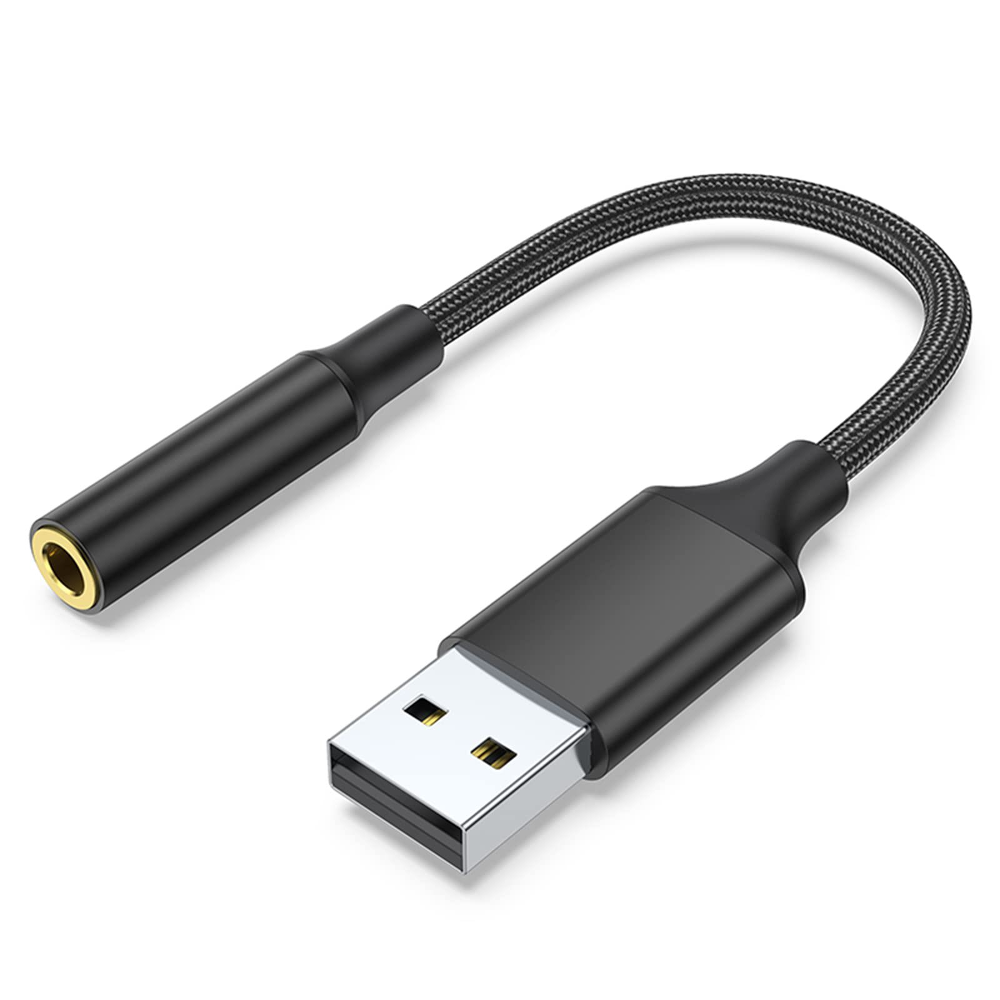
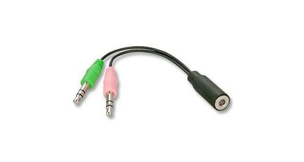

import ArticleHeader from "../../../components/header.astro";
import HardwareModule from "../../../components/module.astro";
import Step from "../../../components/step.astro";
import { Tabs, TabItem } from "@astrojs/starlight/components";
import { Card, CardGrid } from "@astrojs/starlight/components";

<ArticleHeader tomlPath="tutorials/Casques-micro-gaming/mics.toml" />

	**Entre 3 et 4 pôles, on ne perds pas le nord !**

Casques-micro "gaming" : 

Note : Si votre casque utilise un jack 4 pôles, qui est un jack capable de fournir au casque le son, 
mais aussi d'envoyer le son du micro du casque. Pour pouvoir faire les deux, il faut impérativement 
un port jack 4 pôles lui aussi. Les manettes de console en ont un, les ordinateurs pas forcément, il 
faut vérifier sur le votre. Si un ordinateur n'en a pas et n'a que des ports 3 pôles, en branchant 
le casque, vous aurez soit le son dans le casque mais votre micro n'émettra pas de son, soit l'inverse. 

Dans ce cas, pour avoir le son dans le casque et le son du micro, il faudra un adaptateur, à savoir : 

Soit branché en USB (ce que je recommande), sur lequel vous brancherez votre Jack, dans ce cas, 
l'adaptateur USB fera office de DAC (convertisseur numérique -> analogique, pour convertir le signal 
de votre ordinateur en son que vous entendrez dans le casque) et d'ADC (convertisseur analogique -> 
numérique pour convertir le son de votre voix en infos numériques au PC). Si l'adaptateur est pas mauvais, 
il fera ce travail mieux que la carte mère en général.

Soit 2 jacks 3 pôles avec un port jack 4 pôles, que vous branchez en généralement à l'arrière du PC, 
un sur la prise micro, et un sur la prise casque. Il va s'occuper de séparer en 2 le signal, dans ce 
cas, la conversion mentionnée plus haut se fera normalement sur votre carte mère.

Et voilà !

