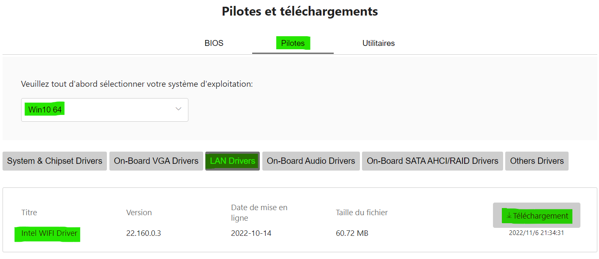

import ArticleHeader from "../../../components/header.astro";
import HardwareModule from "../../../components/module.astro";
import Step from "../../../components/step.astro";
import { Tabs, TabItem } from "@astrojs/starlight/components";
import { Card, CardGrid } from "@astrojs/starlight/components";

<ArticleHeader tomlPath="tutorials/Pas-de-connexion-internet-pendant-l'installation/connexion.toml" />

  Ton PC n'a pas internet pendant ta première installation ?

PC qui ne veut pas se connecter à internet :

Juste après le montage il se peut que votre PC ne puisse pas se connecter au réseau en Wifi et/ou Ethernet ou qu’il soit bridé.
Dans ce cas il faut mettre à jour vos driver réseau.

Pour ça il faut vous rendre sur la page officielle de votre carte mère/carte wifi et aller dans la catégorie driver ou pilote
puis sélectionner votre système d’exploitation et aller dans « LAN » où vous trouverez le driver Wifi.
Il faut le télécharger puis l’exécuter en ouvrant le .exe/ setup / application. Vous pouvez le faire via Ethernet ou Wifi si les
deux ne sont pas hors service ou alors faire un partage de connexion avec votre téléphone via un câble USB. Sinon vous pouvez
télécharger le driver sur une clé USB depuis un autre PC et ensuite la brancher et l’exécuter sur le bon PC.

Une fois connecté vous pouvez installer tous les autres driver présents sur la page de votre carte mère car ils sont tous aussi
importants, ils font le lien entre la partie matérielle et logicielle de votre ordinateur !
