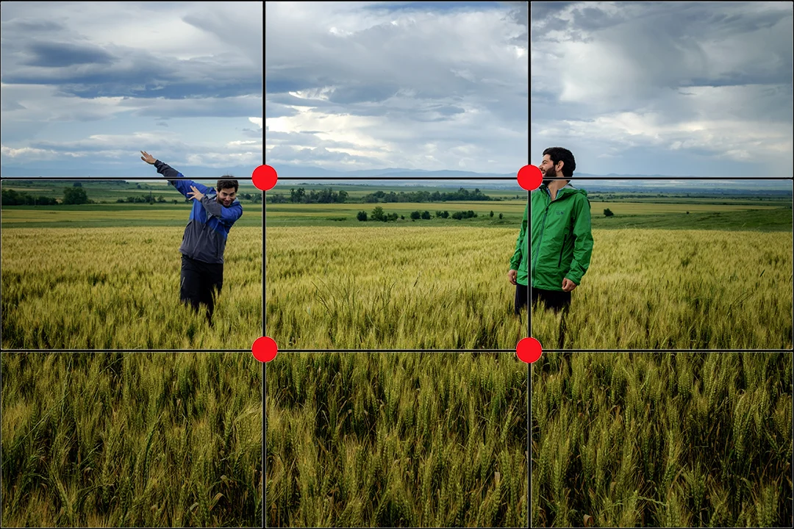

import ArticleHeader from "../../../components/header.astro";
import HardwareModule from "../../../components/module.astro";
import Step from "../../../components/step.astro";
import { Tabs, TabItem } from "@astrojs/starlight/components";
import { Card, CardGrid } from "@astrojs/starlight/components";

<ArticleHeader tomlPath="tutorials/Prendre-de-belles-photos/photos.toml" />

	**Pour ne pas faire comme tata Corinne**

Yo, petit tuto pour prendre de jolies photos avec un smartphone (se débrouiller, 
vous serez pas photographe hein)

## Orientation
Prenez vos photos en mode paysage, et non portrait ! Pensez aussi à privilégier un format
standard tel que le 4:3 ou le 16:9.

Les téléphones ont tendance à utiliser le format de leur écran (~20:9), rendant l'exploitation de la 
photo plus complexe par la suite.

## Règle des tiers
La règle des tiers consiste à tracer deux lignes horizontales et deux lignes verticales 
sur les tiers de l’image pour diviser le cadre en neuf rectangles égaux. Les éléments 
importants de l’image sont alors placés sur les lignes ou aux points d’intersection.

## Exposition / Mise en point
Il est possible de modifier le point de focus en touchant l'écran, et de modifier l'exposition 
en retouchant cet endroit (un petit sélecteur apparaît alors)

## Exploitez votre téléphone
Presque tous les téléphones actuels possèdent plusieurs objectifs et différents modes, utilisez 
les ! Pensez au modes nuits, portraits, macros, zoom, large...

Ils vous permettront de jouer avec la lumière, les flous de mouvement pour les modes avec une exposition
longue, ou bien encore d'autres !

## Capture du mouvement 
Sur une scène fixe, pensez au mode nocturne. Ce dernier rendra flou les objects en mouvement, tout 
en maintenant propre le reste de la photo. (très utile pour les photos de rivières par exemple). 
Pour une photo sportive, pensez au mode rafale, en maintenant le bouton photo appuyé ! 

## Osez !
N'hésitez pas à tenter des photos insolites, dans le pire des cas elles seront moches ...

:::note
PS : le mode manuel n'est à utiliser que rarement, les algorithmes font bien souvent mieux 
que nous... 
:::

Voilà, en espérant que ça va vous aider un peu à prendre de jolies photos ! 

## Sources : 
- [Bien débuter](https://www.lesnumeriques.com/telephone-portable/photographier-avec-un-smartphone-les-bonnes-bases-pour-debuter-en-10-points-cles-a162529.html)
- [Règle des tiers](http://vivre-de-la-photo.fr/la-regle-des-tiers/)

